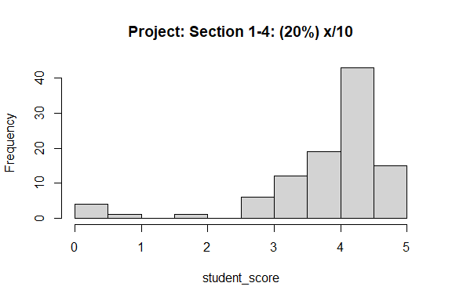
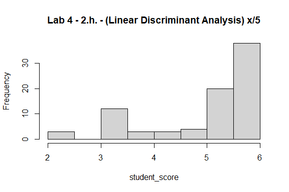
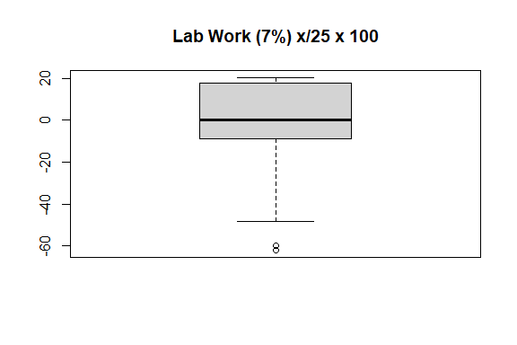

Business Intelligence Project
================
Business Inteligent
10/16/2023

- [Student Details](#student-details)
- [Setup Chunk](#setup-chunk)
- [Understanding the Dataset (Exploratory Data Analysis
  (EDA))](#understanding-the-dataset-exploratory-data-analysis-eda)
  - [Loading the Dataset](#loading-the-dataset)
    - [Source:](#source)
    - [Reference:](#reference)
  - [STEP 1. Install and Load the Required Packages
    —-](#step-1-install-and-load-the-required-packages--)
  - [STEP 2. Customize the Visualizations, Tables, and Colour Scheme
    —-](#step-2-customize-the-visualizations-tables-and-colour-scheme--)
  - [STEP 3. Load the Dataset —-](#step-3-load-the-dataset--)
  - [STEP 3b. Apply a Scale Data Transform
    —-](#step-3b-apply-a-scale-data-transform--)
  - [STEP 4. Apply a Centre Data Transform
    —-](#step-4-apply-a-centre-data-transform--)
  - [STEP 5. Apply a Standardize Data Transform
    —-](#step-5-apply-a-standardize-data-transform--)
  - [STEP 6. Apply a Normalize Data Transform
    —-](#step-6-apply-a-normalize-data-transform--)
  - [STEP 7. Apply a Box-Cox Power Transform
    —-](#step-7-apply-a-box-cox-power-transform--)
  - [STEP 8. Apply a Yeo-Johnson Power Transform
    —-](#step-8-apply-a-yeo-johnson-power-transform--)
  - [STEP 9.a. PCA Linear Algebra Transform for Dimensionality Reduction
    —-](#step-9a-pca-linear-algebra-transform-for-dimensionality-reduction--)
  - [STEP 9.b. PCA Linear Algebra Transform for Feature Extraction
    —-](#step-9b-pca-linear-algebra-transform-for-feature-extraction--)
  - [STEP 10. ICA Linear Algebra Transform for Dimensionality Reduction
    —-](#step-10-ica-linear-algebra-transform-for-dimensionality-reduction--)

# Student Details

<table style="width:97%;">
<colgroup>
<col style="width: 65%" />
<col style="width: 31%" />
</colgroup>
<tbody>
<tr class="odd">
<td><strong>Student ID Number</strong></td>
<td><p>136346</p>
<p>127559</p>
<p>134775</p>
<p>135863</p>
<p>134141</p></td>
</tr>
<tr class="even">
<td><strong>Student Name</strong></td>
<td><p>Ngumi Joshua</p>
<p>Joseph Watunu</p>
<p>Hakeem Alavi</p>
<p>Muema Ian</p>
<p>Aicha Mbongo</p></td>
</tr>
<tr class="odd">
<td><strong>BBIT 4.2 Group</strong></td>
<td>C</td>
</tr>
<tr class="even">
<td><strong>BI Project Group Name/ID (if applicable)</strong></td>
<td>Business Intelligent</td>
</tr>
</tbody>
</table>

# Setup Chunk

**Note:** the following KnitR options have been set as the global
defaults: <BR>
`knitr::opts_chunk$set(echo = TRUE, warning = FALSE, eval = TRUE, collapse = FALSE, tidy = TRUE)`.

More KnitR options are documented here
<https://bookdown.org/yihui/rmarkdown-cookbook/chunk-options.html> and
here <https://yihui.org/knitr/options/>.

# Understanding the Dataset (Exploratory Data Analysis (EDA))

## Loading the Dataset

### Source:

The dataset that was used can be downloaded here:
*data/20230412-20230719-BI1-BBIT4-1-StudentPerformanceDataset.CSV*

### Reference:

*\<Cite the dataset here using APA\>  
Refer to the APA 7th edition manual for rules on how to cite datasets:
<https://apastyle.apa.org/style-grammar-guidelines/references/examples/data-set-references>*

``` r
library(readr)

# Provide the executable R code inside the various code chunks as guided by the
# lab work.
```

## STEP 1. Install and Load the Required Packages —-

``` r
# STEP 1. Install and Load the Required Packages ----

## readr ----
if (require("readr")) {
  require("readr")
} else {
  install.packages("readr", dependencies = TRUE,
                   repos = "https://cloud.r-project.org")
}

## caret ----
if (require("caret")) {
  require("caret")
} else {
  install.packages("caret", dependencies = TRUE,
                   repos = "https://cloud.r-project.org")
}

## e1071 ----
if (require("e1071")) {
  require("e1071")
} else {
  install.packages("e1071", dependencies = TRUE,
                   repos = "https://cloud.r-project.org")
}

## factoextra ----
if (require("factoextra")) {
  require("factoextra")
} else {
  install.packages("factoextra", dependencies = TRUE,
                   repos = "https://cloud.r-project.org")
}

## FactoMineR ----
if (require("FactoMineR")) {
  require("FactoMineR")
} else {
  install.packages("FactoMineR", dependencies = TRUE,
                   repos = "https://cloud.r-project.org")
}
```

## STEP 2. Customize the Visualizations, Tables, and Colour Scheme —-

``` r
# STEP 2. Customize the Visualizations, Tables, and Colour Scheme ----
# The following defines a blue-grey colour scheme for the visualizations:
## shades of blue and shades of grey
blue_grey_colours_11 <- c("#27408E", "#304FAF", "#536CB5", "#6981c7", "#8da0db",
                          "#dde5ec", "#c8c9ca", "#B9BCC2", "#A7AAAF", "#888A8E",
                          "#636569")

blue_grey_colours_6 <- c("#27408E", "#304FAF", "#536CB5",
                         "#B9BCC2", "#A7AAAF", "#888A8E")

blue_grey_colours_4 <- c("#27408E", "#536CB5",
                         "#B9BCC2", "#888A8E")

blue_grey_colours_3 <- c("#6981c7", "#304FAF", "#888A8E")

blue_grey_colours_2 <- c("#27408E",
                         "#888A8E")

blue_grey_colours_1 <- c("#6981c7")

# Custom theme for visualizations
blue_grey_theme <- function() {
  theme(
    axis.ticks = element_line(
      linewidth = 1, linetype = "dashed",
      lineend = NULL, color = "#dfdede",
      arrow = NULL, inherit.blank = FALSE),
    axis.text = element_text(
      face = "bold", color = "#3f3f41",
      size = 12, hjust = 0.5),
    axis.title = element_text(face = "bold", color = "#3f3f41",
                              size = 14, hjust = 0.5),
    plot.title = element_text(face = "bold", color = "#3f3f41",
                              size = 16, hjust = 0.5),
    panel.grid = element_line(
      linewidth = 0.1, linetype = "dashed",
      lineend = NULL, color = "#dfdede",
      arrow = NULL, inherit.blank = FALSE),
    panel.background = element_rect(fill = "#f3eeee"),
    legend.title = element_text(face = "plain", color = "#3f3f41",
                                size = 12, hjust = 0),
    legend.position = "right"
  )
}

# Customize the text tables for consistency using HTML formatting
kable_theme <- function(dat, caption) {
  kable(dat, "html", escape = FALSE, caption = caption) %>%
    kable_styling(bootstrap_options = c("striped", "condensed", "bordered"),
                  full_width = FALSE)
}
```

## STEP 3. Load the Dataset —-

``` r
# STEP 3. Load the Dataset ----
student_performance_dataset <-
  readr::read_csv(
    "../data/20230412-20230719-BI1-BBIT4-1-StudentPerformanceDataset.CSV", # nolint
    col_types =
      readr::cols(
        class_group =
          readr::col_factor(levels = c("A", "B", "C")),
        gender = readr::col_factor(levels = c("1", "0")),
        YOB = readr::col_date(format = "%Y"),
        regret_choosing_bi =
          readr::col_factor(levels = c("1", "0")),
        drop_bi_now =
          readr::col_factor(levels = c("1", "0")),
        motivator =
          readr::col_factor(levels = c("1", "0")),
        read_content_before_lecture =
          readr::col_factor(levels =
                              c("1", "2", "3", "4", "5")),
        anticipate_test_questions =
          readr::col_factor(levels =
                              c("1", "2", "3", "4", "5")),
        answer_rhetorical_questions =
          readr::col_factor(levels =
                              c("1", "2", "3", "4", "5")),
        find_terms_I_do_not_know =
          readr::col_factor(levels =
                              c("1", "2", "3", "4", "5")),
        copy_new_terms_in_reading_notebook =
          readr::col_factor(levels =
                              c("1", "2", "3", "4", "5")),
        take_quizzes_and_use_results =
          readr::col_factor(levels =
                              c("1", "2", "3", "4", "5")),
        reorganise_course_outline =
          readr::col_factor(levels =
                              c("1", "2", "3", "4", "5")),
        write_down_important_points =
          readr::col_factor(levels =
                              c("1", "2", "3", "4", "5")),
        space_out_revision =
          readr::col_factor(levels =
                              c("1", "2", "3", "4", "5")),
        studying_in_study_group =
          readr::col_factor(levels =
                              c("1", "2", "3", "4", "5")),
        schedule_appointments =
          readr::col_factor(levels =
                              c("1", "2", "3", "4", "5")),
        goal_oriented =
          readr::col_factor(levels =
                              c("1", "0")),
        spaced_repetition =
          readr::col_factor(levels =
                              c("1", "2", "3", "4")),
        testing_and_active_recall =
          readr::col_factor(levels =
                              c("1", "2", "3", "4")),
        interleaving =
          readr::col_factor(levels =
                              c("1", "2", "3", "4")),
        categorizing =
          readr::col_factor(levels =
                              c("1", "2", "3", "4")),
        retrospective_timetable =
          readr::col_factor(levels =
                              c("1", "2", "3", "4")),
        cornell_notes =
          readr::col_factor(levels =
                              c("1", "2", "3", "4")),
        sq3r = readr::col_factor(levels =
                                   c("1", "2", "3", "4")),
        commute = readr::col_factor(levels =
                                      c("1", "2",
                                        "3", "4")),
        study_time = readr::col_factor(levels =
                                         c("1", "2",
                                           "3", "4")),
        repeats_since_Y1 = readr::col_integer(),
        paid_tuition = readr::col_factor(levels =
                                           c("0", "1")),
        free_tuition = readr::col_factor(levels =
                                           c("0", "1")),
        extra_curricular = readr::col_factor(levels =
                                               c("0", "1")),
        sports_extra_curricular =
          readr::col_factor(levels = c("0", "1")),
        exercise_per_week = readr::col_factor(levels =
                                                c("0", "1",
                                                  "2",
                                                  "3")),
        meditate = readr::col_factor(levels =
                                       c("0", "1",
                                         "2", "3")),
        pray = readr::col_factor(levels =
                                   c("0", "1",
                                     "2", "3")),
        internet = readr::col_factor(levels =
                                       c("0", "1")),
        laptop = readr::col_factor(levels = c("0", "1")),
        family_relationships =
          readr::col_factor(levels =
                              c("1", "2", "3", "4", "5")),
        friendships = readr::col_factor(levels =
                                          c("1", "2", "3",
                                            "4", "5")),
        romantic_relationships =
          readr::col_factor(levels =
                              c("0", "1", "2", "3", "4")),
        spiritual_wellnes =
          readr::col_factor(levels = c("1", "2", "3",
                                       "4", "5")),
        financial_wellness =
          readr::col_factor(levels = c("1", "2", "3",
                                       "4", "5")),
        health = readr::col_factor(levels = c("1", "2",
                                              "3", "4",
                                              "5")),
        day_out = readr::col_factor(levels = c("0", "1",
                                               "2", "3")),
        night_out = readr::col_factor(levels = c("0",
                                                 "1", "2",
                                                 "3")),
        alcohol_or_narcotics =
          readr::col_factor(levels = c("0", "1", "2", "3")),
        mentor = readr::col_factor(levels = c("0", "1")),
        mentor_meetings = readr::col_factor(levels =
                                              c("0", "1",
                                                "2", "3")),
        `Attendance Waiver Granted: 1 = Yes, 0 = No` =
          readr::col_factor(levels = c("0", "1")),
        GRADE = readr::col_factor(levels =
                                    c("A", "B", "C", "D",
                                      "E"))),
    locale = readr::locale())

View(student_performance_dataset)

# Dimensions
dim(student_performance_dataset)
```

    ## [1] 101 100

## STEP 3b. Apply a Scale Data Transform —-

``` r
# Assuming 'student_data_avg' is defined somewhere in your document

# BEFORE
for (col_num in 75:99) {
  col_name <- names(student_performance_dataset)[col_num]
  student_score <- as.numeric(unlist(student_performance_dataset[, col_num]))
  hist(student_score, main = col_name)
}
```

<!-- --><!-- --><!-- --><!-- --><!-- --><!-- --><!-- --><!-- --><!-- --><!-- --><!-- --><!-- --><!-- --><!-- --><!-- --><!-- --><!-- --><!-- --><!-- --><!-- --><!-- --><!-- --><!-- --><!-- --><!-- -->

``` r
model_of_the_transform <- preProcess(student_performance_dataset, method = c("scale"))
print(model_of_the_transform)
```

    ## Created from 51 samples and 100 variables
    ## 
    ## Pre-processing:
    ##   - ignored (51)
    ##   - scaled (49)

``` r
student_performance_scale_transform <- predict(model_of_the_transform, student_performance_dataset)

# AFTER
for (col_num in 75:99) {
  col_name <- names(student_performance_scale_transform)[col_num]
  student_score <- as.numeric(unlist(student_performance_scale_transform[, col_num]))
  hist(student_score, main = col_name)
}
```

<!-- --><!-- --><!-- --><!-- --><!-- --><!-- --><!-- --><!-- --><!-- --><!-- --><!-- --><!-- --><!-- --><!-- --><!-- --><!-- --><!-- --><!-- --><!-- --><!-- --><!-- --><!-- --><!-- --><!-- --><!-- -->

``` r
# Check if 'student_data_avg' is defined
if (exists("student_data_avg")) {
  # Apply the same transformation to 'student_data_avg'
  student_data_avg_scale_transform <- predict(model_of_the_transform, student_data_avg)

  # Display histogram
  hist(as.numeric(unlist(student_data_avg_scale_transform[, 75])),
       main = names(student_data_avg_scale_transform)[75])
} else {
  print("Warning: 'student_data_avg' not found.")
}
```

    ## [1] "Warning: 'student_data_avg' not found."

## STEP 4. Apply a Centre Data Transform —-

``` r
## STEP 4. Apply a Centre Data Transform ----

# BEFORE

student_average_rating <- as.numeric( unlist(student_performance_dataset [, 75]))
boxplot(student_average_rating, main = names(student_performance_dataset)[75])
```

<!-- -->

``` r
student_average_rating <- as.numeric( unlist(student_performance_dataset [, 76]))
boxplot(student_average_rating, main = names(student_performance_dataset)[76])
```

<!-- -->

``` r
student_average_rating <- as.numeric( unlist(student_performance_dataset [, 77]))
boxplot(student_average_rating, main = names(student_performance_dataset)[77])
```

<!-- -->

``` r
student_score <- as.numeric( unlist(student_performance_dataset [, 78]))
boxplot(student_score, main = names(student_performance_dataset)[78])
```

<!-- -->

``` r
student_score<- as.numeric( unlist(student_performance_dataset [, 79]))
boxplot(student_score, main = names(student_performance_dataset)[79])
```

<!-- -->

``` r
student_score <- as.numeric( unlist(student_performance_dataset [, 80]))
boxplot(student_score, main = names(student_performance_dataset)[80])
```

<!-- -->

``` r
student_score <- as.numeric( unlist(student_performance_dataset [, 81]))
boxplot(student_score, main = names(student_performance_dataset)[81])
```

<!-- -->

``` r
student_score <- as.numeric( unlist(student_performance_dataset [, 82]))
boxplot(student_score, main = names(student_performance_dataset)[82])
```

<!-- -->

``` r
student_score <- as.numeric( unlist(student_performance_dataset [, 83]))
boxplot(student_score, main = names(student_performance_dataset)[83])
```

<!-- -->

``` r
student_score <- as.numeric( unlist(student_performance_dataset [, 84]))
boxplot(student_score, main = names(student_performance_dataset)[84])
```

<!-- -->

``` r
student_score <- as.numeric( unlist(student_performance_dataset [, 85]))
boxplot(student_score, main = names(student_performance_dataset)[85])
```

<!-- -->

``` r
student_score <- as.numeric( unlist(student_performance_dataset [, 86]))
boxplot(student_score, main = names(student_performance_dataset)[86])
```

<!-- -->

``` r
student_score <- as.numeric( unlist(student_performance_dataset [, 87]))
boxplot(student_score, main = names(student_performance_dataset)[87])
```

<!-- -->

``` r
student_score <- as.numeric( unlist(student_performance_dataset [, 88]))
boxplot(student_score, main = names(student_performance_dataset)[88])
```

<!-- -->

``` r
student_score <- as.numeric( unlist(student_performance_dataset [, 89]))
boxplot(student_score, main = names(student_performance_dataset)[89])
```

<!-- -->

``` r
student_score <- as.numeric( unlist(student_performance_dataset [, 90]))
boxplot(student_score, main = names(student_performance_dataset)[90])
```

<!-- -->

``` r
student_score <- as.numeric( unlist(student_performance_dataset [, 91]))
boxplot(student_score, main = names(student_performance_dataset)[91])
```

<!-- -->

``` r
student_score <- as.numeric( unlist(student_performance_dataset [, 92]))
boxplot(student_score, main = names(student_performance_dataset)[92])
```

<!-- -->

``` r
student_score <- as.numeric( unlist(student_performance_dataset [, 93]))
boxplot(student_score, main = names(student_performance_dataset)[93])
```

<!-- -->

``` r
student_score <- as.numeric( unlist(student_performance_dataset [, 94]))
boxplot(student_score, main = names(student_performance_dataset)[94])
```

<!-- -->

``` r
student_score <- as.numeric( unlist(student_performance_dataset [, 95]))
boxplot(student_score, main = names(student_performance_dataset)[95])
```

<!-- -->

``` r
student_score <- as.numeric( unlist(student_performance_dataset [, 96]))
boxplot(student_score, main = names(student_performance_dataset)[96])
```

<!-- -->

``` r
student_score <- as.numeric( unlist(student_performance_dataset [, 97]))
boxplot(student_score, main = names(student_performance_dataset)[97])
```

<!-- -->

``` r
student_score <- as.numeric( unlist(student_performance_dataset [, 98]))
boxplot(student_score, main = names(student_performance_dataset)[98])
```

<!-- -->

``` r
student_score <- as.numeric( unlist(student_performance_dataset [, 99]))
boxplot(student_score, main = names(student_performance_dataset)[99])
```

<!-- -->

``` r
model_of_the_transform <- preProcess(student_performance_dataset, method = c("center"))
print(model_of_the_transform)
```

    ## Created from 51 samples and 100 variables
    ## 
    ## Pre-processing:
    ##   - centered (49)
    ##   - ignored (51)

``` r
student_performance_center_transform <- predict(model_of_the_transform,
                                               student_performance_dataset)


# AFTER

student_average_rating <- as.numeric( unlist(student_performance_center_transform [, 75]))
boxplot(student_average_rating, main = names(student_performance_center_transform)[75])
```

<!-- -->

``` r
student_average_rating <- as.numeric( unlist(student_performance_center_transform [, 76]))
boxplot(student_average_rating, main = names(student_performance_center_transform)[76])
```

<!-- -->

``` r
student_average_rating <- as.numeric( unlist(student_performance_center_transform [, 77]))
boxplot(student_average_rating, main = names(student_performance_center_transform)[77])
```

<!-- -->

``` r
student_score <- as.numeric( unlist(student_performance_center_transform [, 78]))
boxplot(student_score, main = names(student_performance_center_transform)[78])
```

<!-- -->

``` r
student_score<- as.numeric( unlist(student_performance_center_transform [, 79]))
boxplot(student_score, main = names(student_performance_center_transform)[79])
```

<!-- -->

``` r
student_score <- as.numeric( unlist(student_performance_center_transform [, 80]))
boxplot(student_score, main = names(student_performance_center_transform)[80])
```

<!-- -->

``` r
student_score <- as.numeric( unlist(student_performance_center_transform [, 81]))
boxplot(student_score, main = names(student_performance_center_transform)[81])
```

<!-- -->

``` r
student_score <- as.numeric( unlist(student_performance_center_transform [, 82]))
boxplot(student_score, main = names(student_performance_center_transform)[82])
```

<!-- -->

``` r
student_score <- as.numeric( unlist(student_performance_center_transform [, 83]))
boxplot(student_score, main = names(student_performance_center_transform)[83])
```

<!-- -->

``` r
student_score <- as.numeric( unlist(student_performance_center_transform [, 84]))
boxplot(student_score, main = names(student_performance_center_transform)[84])
```

<!-- -->

``` r
student_score <- as.numeric( unlist(student_performance_center_transform [, 85]))
boxplot(student_score, main = names(student_performance_center_transform)[85])
```

<!-- -->

``` r
student_score <- as.numeric( unlist(student_performance_center_transform [, 86]))
boxplot(student_score, main = names(student_performance_center_transform)[86])
```

<!-- -->

``` r
student_score <- as.numeric( unlist(student_performance_center_transform [, 87]))
boxplot(student_score, main = names(student_performance_center_transform)[87])
```

<!-- -->

``` r
student_score <- as.numeric( unlist(student_performance_center_transform [, 88]))
boxplot(student_score, main = names(student_performance_center_transform)[88])
```

<!-- -->

``` r
student_score <- as.numeric( unlist(student_performance_center_transform [, 89]))
boxplot(student_score, main = names(student_performance_center_transform)[89])
```

<!-- -->

``` r
student_score <- as.numeric( unlist(student_performance_center_transform [, 90]))
boxplot(student_score, main = names(student_performance_center_transform)[90])
```

<!-- -->

``` r
student_score <- as.numeric( unlist(student_performance_center_transform [, 91]))
boxplot(student_score, main = names(student_performance_center_transform)[91])
```

<!-- -->

``` r
student_score <- as.numeric( unlist(student_performance_center_transform [, 92]))
boxplot(student_score, main = names(student_performance_center_transform)[92])
```

<!-- -->

``` r
student_score <- as.numeric( unlist(student_performance_center_transform [, 93]))
boxplot(student_score, main = names(student_performance_center_transform)[93])
```

<!-- -->

``` r
student_score <- as.numeric( unlist(student_performance_center_transform [, 94]))
boxplot(student_score, main = names(student_performance_center_transform)[94])
```

<!-- -->

``` r
student_score <- as.numeric( unlist(student_performance_center_transform [, 95]))
boxplot(student_score, main = names(student_performance_center_transform)[95])
```

<!-- -->

``` r
student_score <- as.numeric( unlist(student_performance_center_transform [, 96]))
boxplot(student_score, main = names(student_performance_center_transform)[96])
```

<!-- -->

``` r
student_score <- as.numeric( unlist(student_performance_center_transform [, 97]))
boxplot(student_score, main = names(student_performance_center_transform)[97])
```

<!-- -->

``` r
student_score <- as.numeric( unlist(student_performance_center_transform [, 98]))
boxplot(student_score, main = names(student_performance_center_transform)[98])
```

<!-- -->

``` r
student_score <- as.numeric( unlist(student_performance_center_transform [, 99]))
boxplot(student_score, main = names(student_performance_center_transform)[99])
```

<!-- -->

## STEP 5. Apply a Standardize Data Transform —-

``` r
# Standardize Data Transform ----
## STEP 5. Apply a Standardize Data Transform ----
# BEFORE
summary(student_performance_dataset)
```

    ##  class_group gender      YOB             regret_choosing_bi drop_bi_now
    ##  A:23        1:58   Min.   :1998-01-01   1: 2               1: 2       
    ##  B:37        0:43   1st Qu.:2000-01-01   0:99               0:99       
    ##  C:41               Median :2001-01-01                                 
    ##                     Mean   :2000-11-25                                 
    ##                     3rd Qu.:2002-01-01                                 
    ##                     Max.   :2003-01-01                                 
    ##                                                                        
    ##  motivator read_content_before_lecture anticipate_test_questions
    ##  1:76      1:11                        1: 5                     
    ##  0:25      2:25                        2: 6                     
    ##            3:47                        3:31                     
    ##            4:14                        4:43                     
    ##            5: 4                        5:16                     
    ##                                                                 
    ##                                                                 
    ##  answer_rhetorical_questions find_terms_I_do_not_know
    ##  1: 3                        1: 6                    
    ##  2:15                        2: 2                    
    ##  3:32                        3:30                    
    ##  4:38                        4:37                    
    ##  5:13                        5:26                    
    ##                                                      
    ##                                                      
    ##  copy_new_terms_in_reading_notebook take_quizzes_and_use_results
    ##  1: 5                               1: 4                        
    ##  2:10                               2: 5                        
    ##  3:24                               3:22                        
    ##  4:37                               4:32                        
    ##  5:25                               5:38                        
    ##                                                                 
    ##                                                                 
    ##  reorganise_course_outline write_down_important_points space_out_revision
    ##  1: 7                      1: 4                        1: 8              
    ##  2:16                      2: 8                        2:17              
    ##  3:28                      3:20                        3:34              
    ##  4:32                      4:38                        4:28              
    ##  5:18                      5:31                        5:14              
    ##                                                                          
    ##                                                                          
    ##  studying_in_study_group schedule_appointments goal_oriented spaced_repetition
    ##  1:34                    1:42                  1:20          1:12             
    ##  2:21                    2:35                  0:81          2:31             
    ##  3:21                    3:16                                3:48             
    ##  4:16                    4: 5                                4:10             
    ##  5: 9                    5: 3                                                 
    ##                                                                               
    ##                                                                               
    ##  testing_and_active_recall interleaving categorizing retrospective_timetable
    ##  1: 2                      1:14         1: 6         1:17                   
    ##  2:17                      2:51         2:28         2:36                   
    ##  3:55                      3:32         3:56         3:38                   
    ##  4:27                      4: 4         4:11         4:10                   
    ##                                                                             
    ##                                                                             
    ##                                                                             
    ##  cornell_notes sq3r   commute   study_time repeats_since_Y1 paid_tuition
    ##  1:19          1:18   1   :16   1   :45    Min.   : 0.00    0   :89     
    ##  2:26          2:28   2   :23   2   :39    1st Qu.: 0.00    1   :11     
    ##  3:38          3:30   3   :33   3   :12    Median : 2.00    NA's: 1     
    ##  4:18          4:25   4   :28   4   : 4    Mean   : 2.05                
    ##                       NA's: 1   NA's: 1    3rd Qu.: 3.00                
    ##                                            Max.   :10.00                
    ##                                            NA's   :1                    
    ##  free_tuition extra_curricular sports_extra_curricular exercise_per_week
    ##  0   :73      0   :47          0   :64                 0   :23          
    ##  1   :27      1   :53          1   :36                 1   :49          
    ##  NA's: 1      NA's: 1          NA's: 1                 2   :23          
    ##                                                        3   : 5          
    ##                                                        NA's: 1          
    ##                                                                         
    ##                                                                         
    ##  meditate    pray    internet   laptop    family_relationships friendships
    ##  0   :49   0   : 8   0   :13   0   :  0   1   : 0              1   : 0    
    ##  1   :35   1   :24   1   :87   1   :100   2   : 2              2   : 3    
    ##  2   : 7   2   :19   NA's: 1   NA's:  1   3   :18              3   :17    
    ##  3   : 9   3   :49                        4   :39              4   :56    
    ##  NA's: 1   NA's: 1                        5   :41              5   :24    
    ##                                           NA's: 1              NA's: 1    
    ##                                                                           
    ##  romantic_relationships spiritual_wellnes financial_wellness  health  
    ##  0   :56                1   : 1           1   :10            1   : 2  
    ##  1   : 0                2   : 8           2   :18            2   : 3  
    ##  2   : 6                3   :37           3   :41            3   :22  
    ##  3   :27                4   :33           4   :21            4   :35  
    ##  4   :11                5   :21           5   :10            5   :38  
    ##  NA's: 1                NA's: 1           NA's: 1            NA's: 1  
    ##                                                                       
    ##  day_out   night_out alcohol_or_narcotics  mentor   mentor_meetings
    ##  0   :27   0   :55   0   :68              0   :59   0   :53        
    ##  1   :67   1   :41   1   :30              1   :41   1   :29        
    ##  2   : 5   2   : 2   2   : 1              NA's: 1   2   :15        
    ##  3   : 1   3   : 2   3   : 1                        3   : 3        
    ##  NA's: 1   NA's: 1   NA's: 1                        NA's: 1        
    ##                                                                    
    ##                                                                    
    ##  A - 1. I am enjoying the subject A - 2. Classes start and end on time
    ##  Min.   :3.00                     Min.   :3.00                        
    ##  1st Qu.:4.00                     1st Qu.:4.00                        
    ##  Median :5.00                     Median :5.00                        
    ##  Mean   :4.49                     Mean   :4.68                        
    ##  3rd Qu.:5.00                     3rd Qu.:5.00                        
    ##  Max.   :5.00                     Max.   :5.00                        
    ##  NA's   :1                        NA's   :1                           
    ##  A - 3. The learning environment is participative, involves learning by doing and is group-based
    ##  Min.   :3.00                                                                                   
    ##  1st Qu.:4.00                                                                                   
    ##  Median :4.00                                                                                   
    ##  Mean   :4.35                                                                                   
    ##  3rd Qu.:5.00                                                                                   
    ##  Max.   :5.00                                                                                   
    ##  NA's   :1                                                                                      
    ##  A - 4. The subject content is delivered according to the course outline and meets my expectations
    ##  Min.   :3.00                                                                                     
    ##  1st Qu.:4.75                                                                                     
    ##  Median :5.00                                                                                     
    ##  Mean   :4.74                                                                                     
    ##  3rd Qu.:5.00                                                                                     
    ##  Max.   :5.00                                                                                     
    ##  NA's   :1                                                                                        
    ##  A - 5. The topics are clear and logically developed
    ##  Min.   :2.00                                       
    ##  1st Qu.:4.00                                       
    ##  Median :5.00                                       
    ##  Mean   :4.65                                       
    ##  3rd Qu.:5.00                                       
    ##  Max.   :5.00                                       
    ##  NA's   :1                                          
    ##  A - 6. I am developing my oral and writing skills
    ##  Min.   :1.00                                     
    ##  1st Qu.:4.00                                     
    ##  Median :4.00                                     
    ##  Mean   :4.11                                     
    ##  3rd Qu.:5.00                                     
    ##  Max.   :5.00                                     
    ##  NA's   :1                                        
    ##  A - 7. I am developing my reflective and critical reasoning skills
    ##  Min.   :2.00                                                      
    ##  1st Qu.:4.00                                                      
    ##  Median :4.00                                                      
    ##  Mean   :4.38                                                      
    ##  3rd Qu.:5.00                                                      
    ##  Max.   :5.00                                                      
    ##  NA's   :1                                                         
    ##  A - 8. The assessment methods are assisting me to learn
    ##  Min.   :1.00                                           
    ##  1st Qu.:4.00                                           
    ##  Median :5.00                                           
    ##  Mean   :4.61                                           
    ##  3rd Qu.:5.00                                           
    ##  Max.   :5.00                                           
    ##  NA's   :1                                              
    ##  A - 9. I receive relevant feedback
    ##  Min.   :3.00                      
    ##  1st Qu.:4.00                      
    ##  Median :5.00                      
    ##  Mean   :4.58                      
    ##  3rd Qu.:5.00                      
    ##  Max.   :5.00                      
    ##  NA's   :1                         
    ##  A - 10. I read the recommended readings and notes
    ##  Min.   :3.00                                     
    ##  1st Qu.:4.00                                     
    ##  Median :5.00                                     
    ##  Mean   :4.55                                     
    ##  3rd Qu.:5.00                                     
    ##  Max.   :5.00                                     
    ##  NA's   :1                                        
    ##  A - 11. I use the eLearning material posted
    ##  Min.   :3.0                                
    ##  1st Qu.:4.0                                
    ##  Median :5.0                                
    ##  Mean   :4.7                                
    ##  3rd Qu.:5.0                                
    ##  Max.   :5.0                                
    ##  NA's   :1                                  
    ##  B - 1. Concept 1 of 6: Principles of Business Intelligence and the DataOps Philosophy
    ##  Min.   :1.00                                                                         
    ##  1st Qu.:4.00                                                                         
    ##  Median :4.00                                                                         
    ##  Mean   :4.25                                                                         
    ##  3rd Qu.:5.00                                                                         
    ##  Max.   :5.00                                                                         
    ##  NA's   :1                                                                            
    ##  B - 2. Concept 3 of 6: Linear Algorithms for Predictive Analytics
    ##  Min.   :2.00                                                     
    ##  1st Qu.:3.00                                                     
    ##  Median :4.00                                                     
    ##  Mean   :3.94                                                     
    ##  3rd Qu.:5.00                                                     
    ##  Max.   :5.00                                                     
    ##  NA's   :1                                                        
    ##  C - 2. Quizzes at the end of each concept
    ##  Min.   :2.00                             
    ##  1st Qu.:4.00                             
    ##  Median :5.00                             
    ##  Mean   :4.59                             
    ##  3rd Qu.:5.00                             
    ##  Max.   :5.00                             
    ##  NA's   :1                                
    ##  C - 3. Lab manuals that outline the steps to follow during the labs
    ##  Min.   :3.00                                                       
    ##  1st Qu.:4.00                                                       
    ##  Median :5.00                                                       
    ##  Mean   :4.61                                                       
    ##  3rd Qu.:5.00                                                       
    ##  Max.   :5.00                                                       
    ##  NA's   :1                                                          
    ##  C - 4. Required lab work submissions at the end of each lab manual that outline the activity to be done on your own
    ##  Min.   :3.00                                                                                                       
    ##  1st Qu.:4.00                                                                                                       
    ##  Median :5.00                                                                                                       
    ##  Mean   :4.55                                                                                                       
    ##  3rd Qu.:5.00                                                                                                       
    ##  Max.   :5.00                                                                                                       
    ##  NA's   :1                                                                                                          
    ##  C - 5. Supplementary videos to watch
    ##  Min.   :1.00                        
    ##  1st Qu.:4.00                        
    ##  Median :4.00                        
    ##  Mean   :4.19                        
    ##  3rd Qu.:5.00                        
    ##  Max.   :5.00                        
    ##  NA's   :1                           
    ##  C - 6. Supplementary podcasts to listen to
    ##  Min.   :1.00                              
    ##  1st Qu.:4.00                              
    ##  Median :4.00                              
    ##  Mean   :4.08                              
    ##  3rd Qu.:5.00                              
    ##  Max.   :5.00                              
    ##  NA's   :1                                 
    ##  C - 7. Supplementary content to read C - 8. Lectures slides
    ##  Min.   :1.00                         Min.   :2.0           
    ##  1st Qu.:4.00                         1st Qu.:4.0           
    ##  Median :4.00                         Median :5.0           
    ##  Mean   :4.17                         Mean   :4.6           
    ##  3rd Qu.:5.00                         3rd Qu.:5.0           
    ##  Max.   :5.00                         Max.   :5.0           
    ##  NA's   :1                            NA's   :1             
    ##  C - 9. Lecture notes on some of the lecture slides
    ##  Min.   :2.0                                       
    ##  1st Qu.:4.0                                       
    ##  Median :5.0                                       
    ##  Mean   :4.6                                       
    ##  3rd Qu.:5.0                                       
    ##  Max.   :5.0                                       
    ##  NA's   :1                                         
    ##  C - 10. The quality of the lectures given (quality measured by the breadth (the full span of knowledge of a subject) and depth (the extent to which specific topics are focused upon, amplified, and explored) of learning - NOT quality measured by how fun/comical/lively the lectures are)
    ##  Min.   :2.00                                                                                                                                                                                                                                                                                 
    ##  1st Qu.:4.00                                                                                                                                                                                                                                                                                 
    ##  Median :5.00                                                                                                                                                                                                                                                                                 
    ##  Mean   :4.54                                                                                                                                                                                                                                                                                 
    ##  3rd Qu.:5.00                                                                                                                                                                                                                                                                                 
    ##  Max.   :5.00                                                                                                                                                                                                                                                                                 
    ##  NA's   :1                                                                                                                                                                                                                                                                                    
    ##  C - 11. The division of theory and practice such that most of the theory is done during the recorded online classes and most of the practice is done during the physical classes
    ##  Min.   :2.00                                                                                                                                                                    
    ##  1st Qu.:4.00                                                                                                                                                                    
    ##  Median :5.00                                                                                                                                                                    
    ##  Mean   :4.49                                                                                                                                                                    
    ##  3rd Qu.:5.00                                                                                                                                                                    
    ##  Max.   :5.00                                                                                                                                                                    
    ##  NA's   :1                                                                                                                                                                       
    ##  C - 12. The recordings of online classes
    ##  Min.   :2.00                            
    ##  1st Qu.:4.00                            
    ##  Median :5.00                            
    ##  Mean   :4.33                            
    ##  3rd Qu.:5.00                            
    ##  Max.   :5.00                            
    ##  NA's   :1                               
    ##  D - 1. \nWrite two things you like about the teaching and learning in this unit so far.
    ##  Length:101                                                                             
    ##  Class :character                                                                       
    ##  Mode  :character                                                                       
    ##                                                                                         
    ##                                                                                         
    ##                                                                                         
    ##                                                                                         
    ##  D - 2. Write at least one recommendation to improve the teaching and learning in this unit (for the remaining weeks in the semester)
    ##  Length:101                                                                                                                          
    ##  Class :character                                                                                                                    
    ##  Mode  :character                                                                                                                    
    ##                                                                                                                                      
    ##                                                                                                                                      
    ##                                                                                                                                      
    ##                                                                                                                                      
    ##  Average Course Evaluation Rating Average Level of Learning Attained Rating
    ##  Min.   :2.909                    Min.   :2.000                            
    ##  1st Qu.:4.273                    1st Qu.:3.500                            
    ##  Median :4.545                    Median :4.000                            
    ##  Mean   :4.531                    Mean   :4.095                            
    ##  3rd Qu.:4.909                    3rd Qu.:4.500                            
    ##  Max.   :5.000                    Max.   :5.000                            
    ##  NA's   :1                        NA's   :1                                
    ##  Average Pedagogical Strategy Effectiveness Rating
    ##  Min.   :3.182                                    
    ##  1st Qu.:4.068                                    
    ##  Median :4.545                                    
    ##  Mean   :4.432                                    
    ##  3rd Qu.:4.909                                    
    ##  Max.   :5.000                                    
    ##  NA's   :1                                        
    ##  Project: Section 1-4: (20%) x/10 Project: Section 5-11: (50%) x/10
    ##  Min.   : 0.000                   Min.   : 0.000                   
    ##  1st Qu.: 7.400                   1st Qu.: 6.000                   
    ##  Median : 8.500                   Median : 7.800                   
    ##  Mean   : 8.011                   Mean   : 6.582                   
    ##  3rd Qu.: 9.000                   3rd Qu.: 8.300                   
    ##  Max.   :10.000                   Max.   :10.000                   
    ##                                                                    
    ##  Project: Section 12: (30%) x/5 Project: (10%): x/30 x 100 TOTAL
    ##  Min.   :0.000                  Min.   :  0.00                  
    ##  1st Qu.:0.000                  1st Qu.: 56.00                  
    ##  Median :0.000                  Median : 66.40                  
    ##  Mean   :1.015                  Mean   : 62.39                  
    ##  3rd Qu.:1.250                  3rd Qu.: 71.60                  
    ##  Max.   :5.000                  Max.   :100.00                  
    ##  NA's   :1                                                      
    ##  Quiz 1 on Concept 1 (Introduction) x/32 Quiz 3 on Concept 3 (Linear) x/15
    ##  Min.   : 4.75                           Min.   : 3.00                    
    ##  1st Qu.:11.53                           1st Qu.: 7.00                    
    ##  Median :15.33                           Median : 9.00                    
    ##  Mean   :16.36                           Mean   : 9.53                    
    ##  3rd Qu.:19.63                           3rd Qu.:12.00                    
    ##  Max.   :31.25                           Max.   :15.00                    
    ##                                          NA's   :2                        
    ##  Quiz 4 on Concept 4 (Non-Linear) x/22 Quiz 5 on Concept 5 (Dashboarding) x/10
    ##  Min.   : 3.00                         Min.   : 0.000                         
    ##  1st Qu.:10.91                         1st Qu.: 5.000                         
    ##  Median :13.50                         Median : 6.330                         
    ##  Mean   :13.94                         Mean   : 6.367                         
    ##  3rd Qu.:17.50                         3rd Qu.: 8.000                         
    ##  Max.   :22.00                         Max.   :12.670                         
    ##  NA's   :6                             NA's   :12                             
    ##  Quizzes and  Bonus Marks (7%): x/79 x 100 TOTAL
    ##  Min.   :26.26                                  
    ##  1st Qu.:43.82                                  
    ##  Median :55.31                                  
    ##  Mean   :56.22                                  
    ##  3rd Qu.:65.16                                  
    ##  Max.   :95.25                                  
    ##                                                 
    ##  Lab 1 - 2.c. - (Simple Linear Regression) x/5
    ##  Min.   :3.000                                
    ##  1st Qu.:5.000                                
    ##  Median :5.000                                
    ##  Mean   :4.898                                
    ##  3rd Qu.:5.000                                
    ##  Max.   :5.000                                
    ##  NA's   :3                                    
    ##  Lab 2 - 2.e. -  (Linear Regression using Gradient Descent) x/5
    ##  Min.   :2.150                                                 
    ##  1st Qu.:3.150                                                 
    ##  Median :4.850                                                 
    ##  Mean   :4.166                                                 
    ##  3rd Qu.:5.000                                                 
    ##  Max.   :5.000                                                 
    ##  NA's   :6                                                     
    ##  Lab 3 - 2.g. - (Logistic Regression using Gradient Descent) x/5
    ##  Min.   :2.85                                                   
    ##  1st Qu.:4.85                                                   
    ##  Median :4.85                                                   
    ##  Mean   :4.63                                                   
    ##  3rd Qu.:4.85                                                   
    ##  Max.   :5.00                                                   
    ##  NA's   :9                                                      
    ##  Lab 4 - 2.h. - (Linear Discriminant Analysis) x/5
    ##  Min.   :1.850                                    
    ##  1st Qu.:4.100                                    
    ##  Median :4.850                                    
    ##  Mean   :4.425                                    
    ##  3rd Qu.:5.000                                    
    ##  Max.   :5.000                                    
    ##  NA's   :18                                       
    ##  Lab 5 - Chart JS Dashboard Setup x/5 Lab Work (7%) x/25 x 100
    ##  Min.   :0.000                        Min.   : 17.80          
    ##  1st Qu.:0.000                        1st Qu.: 70.80          
    ##  Median :5.000                        Median : 80.00          
    ##  Mean   :3.404                        Mean   : 79.72          
    ##  3rd Qu.:5.000                        3rd Qu.: 97.20          
    ##  Max.   :5.000                        Max.   :100.00          
    ##                                                               
    ##  CAT 1 (8%): x/38 x 100 CAT 2 (8%): x/100 x 100
    ##  Min.   :32.89          Min.   :  0.00         
    ##  1st Qu.:59.21          1st Qu.: 51.00         
    ##  Median :69.73          Median : 63.50         
    ##  Mean   :69.39          Mean   : 62.13         
    ##  3rd Qu.:82.89          3rd Qu.: 81.75         
    ##  Max.   :97.36          Max.   :100.00         
    ##  NA's   :4              NA's   :31             
    ##  Attendance Waiver Granted: 1 = Yes, 0 = No Absenteeism Percentage
    ##  0:96                                       Min.   : 0.00         
    ##  1: 5                                       1st Qu.: 7.41         
    ##                                             Median :14.81         
    ##                                             Mean   :15.42         
    ##                                             3rd Qu.:22.22         
    ##                                             Max.   :51.85         
    ##                                                                   
    ##  Coursework TOTAL: x/40 (40%) EXAM: x/60 (60%)
    ##  Min.   : 7.47                Min.   : 5.00   
    ##  1st Qu.:20.44                1st Qu.:26.00   
    ##  Median :24.58                Median :34.00   
    ##  Mean   :24.53                Mean   :33.94   
    ##  3rd Qu.:29.31                3rd Qu.:42.00   
    ##  Max.   :35.08                Max.   :56.00   
    ##                               NA's   :4       
    ##  TOTAL = Coursework TOTAL + EXAM (100%) GRADE 
    ##  Min.   : 7.47                          A:23  
    ##  1st Qu.:45.54                          B:25  
    ##  Median :58.69                          C:22  
    ##  Mean   :57.12                          D:25  
    ##  3rd Qu.:68.83                          E: 6  
    ##  Max.   :87.72                                
    ## 

``` r
sapply(student_performance_dataset[, 75:99], function(x) sd(as.numeric(as.character(x))))
```

    ##                                Average Course Evaluation Rating 
    ##                                                              NA 
    ##                       Average Level of Learning Attained Rating 
    ##                                                              NA 
    ##               Average Pedagogical Strategy Effectiveness Rating 
    ##                                                              NA 
    ##                                Project: Section 1-4: (20%) x/10 
    ##                                                       2.1018040 
    ##                               Project: Section 5-11: (50%) x/10 
    ##                                                       2.7890284 
    ##                                  Project: Section 12: (30%) x/5 
    ##                                                              NA 
    ##                                Project: (10%): x/30 x 100 TOTAL 
    ##                                                      20.1517428 
    ##                         Quiz 1 on Concept 1 (Introduction) x/32 
    ##                                                       6.5052771 
    ##                               Quiz 3 on Concept 3 (Linear) x/15 
    ##                                                              NA 
    ##                           Quiz 4 on Concept 4 (Non-Linear) x/22 
    ##                                                              NA 
    ##                         Quiz 5 on Concept 5 (Dashboarding) x/10 
    ##                                                              NA 
    ##                 Quizzes and  Bonus Marks (7%): x/79 x 100 TOTAL 
    ##                                                      16.4938796 
    ##                   Lab 1 - 2.c. - (Simple Linear Regression) x/5 
    ##                                                              NA 
    ##  Lab 2 - 2.e. -  (Linear Regression using Gradient Descent) x/5 
    ##                                                              NA 
    ## Lab 3 - 2.g. - (Logistic Regression using Gradient Descent) x/5 
    ##                                                              NA 
    ##               Lab 4 - 2.h. - (Linear Discriminant Analysis) x/5 
    ##                                                              NA 
    ##                            Lab 5 - Chart JS Dashboard Setup x/5 
    ##                                                       2.3327203 
    ##                                        Lab Work (7%) x/25 x 100 
    ##                                                      19.3031268 
    ##                                          CAT 1 (8%): x/38 x 100 
    ##                                                              NA 
    ##                                         CAT 2 (8%): x/100 x 100 
    ##                                                              NA 
    ##                      Attendance Waiver Granted: 1 = Yes, 0 = No 
    ##                                                       0.2180017 
    ##                                          Absenteeism Percentage 
    ##                                                       9.0886796 
    ##                                    Coursework TOTAL: x/40 (40%) 
    ##                                                       6.2240076 
    ##                                                EXAM: x/60 (60%) 
    ##                                                              NA 
    ##                          TOTAL = Coursework TOTAL + EXAM (100%) 
    ##                                                      15.7253295

``` r
model_of_the_transform <- preProcess(student_performance_dataset,
                                     method = c("scale", "center"))
print(model_of_the_transform)
```

    ## Created from 51 samples and 100 variables
    ## 
    ## Pre-processing:
    ##   - centered (49)
    ##   - ignored (51)
    ##   - scaled (49)

``` r
student_performance_standardize_transform <- predict(model_of_the_transform,
                                                      student_performance_dataset)

# AFTER
summary(student_performance_standardize_transform)
```

    ##  class_group gender      YOB             regret_choosing_bi drop_bi_now
    ##  A:23        1:58   Min.   :1998-01-01   1: 2               1: 2       
    ##  B:37        0:43   1st Qu.:2000-01-01   0:99               0:99       
    ##  C:41               Median :2001-01-01                                 
    ##                     Mean   :2000-11-25                                 
    ##                     3rd Qu.:2002-01-01                                 
    ##                     Max.   :2003-01-01                                 
    ##                                                                        
    ##  motivator read_content_before_lecture anticipate_test_questions
    ##  1:76      1:11                        1: 5                     
    ##  0:25      2:25                        2: 6                     
    ##            3:47                        3:31                     
    ##            4:14                        4:43                     
    ##            5: 4                        5:16                     
    ##                                                                 
    ##                                                                 
    ##  answer_rhetorical_questions find_terms_I_do_not_know
    ##  1: 3                        1: 6                    
    ##  2:15                        2: 2                    
    ##  3:32                        3:30                    
    ##  4:38                        4:37                    
    ##  5:13                        5:26                    
    ##                                                      
    ##                                                      
    ##  copy_new_terms_in_reading_notebook take_quizzes_and_use_results
    ##  1: 5                               1: 4                        
    ##  2:10                               2: 5                        
    ##  3:24                               3:22                        
    ##  4:37                               4:32                        
    ##  5:25                               5:38                        
    ##                                                                 
    ##                                                                 
    ##  reorganise_course_outline write_down_important_points space_out_revision
    ##  1: 7                      1: 4                        1: 8              
    ##  2:16                      2: 8                        2:17              
    ##  3:28                      3:20                        3:34              
    ##  4:32                      4:38                        4:28              
    ##  5:18                      5:31                        5:14              
    ##                                                                          
    ##                                                                          
    ##  studying_in_study_group schedule_appointments goal_oriented spaced_repetition
    ##  1:34                    1:42                  1:20          1:12             
    ##  2:21                    2:35                  0:81          2:31             
    ##  3:21                    3:16                                3:48             
    ##  4:16                    4: 5                                4:10             
    ##  5: 9                    5: 3                                                 
    ##                                                                               
    ##                                                                               
    ##  testing_and_active_recall interleaving categorizing retrospective_timetable
    ##  1: 2                      1:14         1: 6         1:17                   
    ##  2:17                      2:51         2:28         2:36                   
    ##  3:55                      3:32         3:56         3:38                   
    ##  4:27                      4: 4         4:11         4:10                   
    ##                                                                             
    ##                                                                             
    ##                                                                             
    ##  cornell_notes sq3r   commute   study_time repeats_since_Y1  paid_tuition
    ##  1:19          1:18   1   :16   1   :45    Min.   :-0.9716   0   :89     
    ##  2:26          2:28   2   :23   2   :39    1st Qu.:-0.9716   1   :11     
    ##  3:38          3:30   3   :33   3   :12    Median :-0.0237   NA's: 1     
    ##  4:18          4:25   4   :28   4   : 4    Mean   : 0.0000               
    ##                       NA's: 1   NA's: 1    3rd Qu.: 0.4502               
    ##                                            Max.   : 3.7678               
    ##                                            NA's   :1                     
    ##  free_tuition extra_curricular sports_extra_curricular exercise_per_week
    ##  0   :73      0   :47          0   :64                 0   :23          
    ##  1   :27      1   :53          1   :36                 1   :49          
    ##  NA's: 1      NA's: 1          NA's: 1                 2   :23          
    ##                                                        3   : 5          
    ##                                                        NA's: 1          
    ##                                                                         
    ##                                                                         
    ##  meditate    pray    internet   laptop    family_relationships friendships
    ##  0   :49   0   : 8   0   :13   0   :  0   1   : 0              1   : 0    
    ##  1   :35   1   :24   1   :87   1   :100   2   : 2              2   : 3    
    ##  2   : 7   2   :19   NA's: 1   NA's:  1   3   :18              3   :17    
    ##  3   : 9   3   :49                        4   :39              4   :56    
    ##  NA's: 1   NA's: 1                        5   :41              5   :24    
    ##                                           NA's: 1              NA's: 1    
    ##                                                                           
    ##  romantic_relationships spiritual_wellnes financial_wellness  health  
    ##  0   :56                1   : 1           1   :10            1   : 2  
    ##  1   : 0                2   : 8           2   :18            2   : 3  
    ##  2   : 6                3   :37           3   :41            3   :22  
    ##  3   :27                4   :33           4   :21            4   :35  
    ##  4   :11                5   :21           5   :10            5   :38  
    ##  NA's: 1                NA's: 1           NA's: 1            NA's: 1  
    ##                                                                       
    ##  day_out   night_out alcohol_or_narcotics  mentor   mentor_meetings
    ##  0   :27   0   :55   0   :68              0   :59   0   :53        
    ##  1   :67   1   :41   1   :30              1   :41   1   :29        
    ##  2   : 5   2   : 2   2   : 1              NA's: 1   2   :15        
    ##  3   : 1   3   : 2   3   : 1                        3   : 3        
    ##  NA's: 1   NA's: 1   NA's: 1                        NA's: 1        
    ##                                                                    
    ##                                                                    
    ##  A - 1. I am enjoying the subject A - 2. Classes start and end on time
    ##  Min.   :-2.5063                  Min.   :-3.4293                     
    ##  1st Qu.:-0.8242                  1st Qu.:-1.3880                     
    ##  Median : 0.8579                  Median : 0.6532                     
    ##  Mean   : 0.0000                  Mean   : 0.0000                     
    ##  3rd Qu.: 0.8579                  3rd Qu.: 0.6532                     
    ##  Max.   : 0.8579                  Max.   : 0.6532                     
    ##  NA's   :1                        NA's   :1                           
    ##  A - 3. The learning environment is participative, involves learning by doing and is group-based
    ##  Min.   :-2.0544                                                                                
    ##  1st Qu.:-0.5326                                                                                
    ##  Median :-0.5326                                                                                
    ##  Mean   : 0.0000                                                                                
    ##  3rd Qu.: 0.9892                                                                                
    ##  Max.   : 0.9892                                                                                
    ##  NA's   :1                                                                                      
    ##  A - 4. The subject content is delivered according to the course outline and meets my expectations
    ##  Min.   :-3.75655                                                                                 
    ##  1st Qu.: 0.02159                                                                                 
    ##  Median : 0.56132                                                                                 
    ##  Mean   : 0.00000                                                                                 
    ##  3rd Qu.: 0.56132                                                                                 
    ##  Max.   : 0.56132                                                                                 
    ##  NA's   :1                                                                                        
    ##  A - 5. The topics are clear and logically developed
    ##  Min.   :-4.6074                                    
    ##  1st Qu.:-1.1301                                    
    ##  Median : 0.6085                                    
    ##  Mean   : 0.0000                                    
    ##  3rd Qu.: 0.6085                                    
    ##  Max.   : 0.6085                                    
    ##  NA's   :1                                          
    ##  A - 6. I am developing my oral and writing skills
    ##  Min.   :-3.5544                                  
    ##  1st Qu.:-0.1257                                  
    ##  Median :-0.1257                                  
    ##  Mean   : 0.0000                                  
    ##  3rd Qu.: 1.0172                                  
    ##  Max.   : 1.0172                                  
    ##  NA's   :1                                        
    ##  A - 7. I am developing my reflective and critical reasoning skills
    ##  Min.   :-3.4338                                                   
    ##  1st Qu.:-0.5483                                                   
    ##  Median :-0.5483                                                   
    ##  Mean   : 0.0000                                                   
    ##  3rd Qu.: 0.8945                                                   
    ##  Max.   : 0.8945                                                   
    ##  NA's   :1                                                         
    ##  A - 8. The assessment methods are assisting me to learn
    ##  Min.   :-5.5563                                        
    ##  1st Qu.:-0.9389                                        
    ##  Median : 0.6003                                        
    ##  Mean   : 0.0000                                        
    ##  3rd Qu.: 0.6003                                        
    ##  Max.   : 0.6003                                        
    ##  NA's   :1                                              
    ##  A - 9. I receive relevant feedback
    ##  Min.   :-2.8531                   
    ##  1st Qu.:-1.0474                   
    ##  Median : 0.7584                   
    ##  Mean   : 0.0000                   
    ##  3rd Qu.: 0.7584                   
    ##  Max.   : 0.7584                   
    ##  NA's   :1                         
    ##  A - 10. I read the recommended readings and notes
    ##  Min.   :-2.4775                                  
    ##  1st Qu.:-0.8791                                  
    ##  Median : 0.7193                                  
    ##  Mean   : 0.0000                                  
    ##  3rd Qu.: 0.7193                                  
    ##  Max.   : 0.7193                                  
    ##  NA's   :1                                        
    ##  A - 11. I use the eLearning material posted
    ##  Min.   :-3.2553                            
    ##  1st Qu.:-1.3404                            
    ##  Median : 0.5745                            
    ##  Mean   : 0.0000                            
    ##  3rd Qu.: 0.5745                            
    ##  Max.   : 0.5745                            
    ##  NA's   :1                                  
    ##  B - 1. Concept 1 of 6: Principles of Business Intelligence and the DataOps Philosophy
    ##  Min.   :-4.1489                                                                      
    ##  1st Qu.:-0.3191                                                                      
    ##  Median :-0.3191                                                                      
    ##  Mean   : 0.0000                                                                      
    ##  3rd Qu.: 0.9574                                                                      
    ##  Max.   : 0.9574                                                                      
    ##  NA's   :1                                                                            
    ##  B - 2. Concept 3 of 6: Linear Algorithms for Predictive Analytics
    ##  Min.   :-2.24938                                                 
    ##  1st Qu.:-1.08990                                                 
    ##  Median : 0.06957                                                 
    ##  Mean   : 0.00000                                                 
    ##  3rd Qu.: 1.22904                                                 
    ##  Max.   : 1.22904                                                 
    ##  NA's   :1                                                        
    ##  C - 2. Quizzes at the end of each concept
    ##  Min.   :-4.1701                          
    ##  1st Qu.:-0.9499                          
    ##  Median : 0.6601                          
    ##  Mean   : 0.0000                          
    ##  3rd Qu.: 0.6601                          
    ##  Max.   : 0.6601                          
    ##  NA's   :1                                
    ##  C - 3. Lab manuals that outline the steps to follow during the labs
    ##  Min.   :-2.6777                                                    
    ##  1st Qu.:-1.0145                                                    
    ##  Median : 0.6486                                                    
    ##  Mean   : 0.0000                                                    
    ##  3rd Qu.: 0.6486                                                    
    ##  Max.   : 0.6486                                                    
    ##  NA's   :1                                                          
    ##  C - 4. Required lab work submissions at the end of each lab manual that outline the activity to be done on your own
    ##  Min.   :-2.5440                                                                                                    
    ##  1st Qu.:-0.9027                                                                                                    
    ##  Median : 0.7386                                                                                                    
    ##  Mean   : 0.0000                                                                                                    
    ##  3rd Qu.: 0.7386                                                                                                    
    ##  Max.   : 0.7386                                                                                                    
    ##  NA's   :1                                                                                                          
    ##  C - 5. Supplementary videos to watch
    ##  Min.   :-3.6080                     
    ##  1st Qu.:-0.2149                     
    ##  Median :-0.2149                     
    ##  Mean   : 0.0000                     
    ##  3rd Qu.: 0.9161                     
    ##  Max.   : 0.9161                     
    ##  NA's   :1                           
    ##  C - 6. Supplementary podcasts to listen to
    ##  Min.   :-3.10583                          
    ##  1st Qu.:-0.08067                          
    ##  Median :-0.08067                          
    ##  Mean   : 0.00000                          
    ##  3rd Qu.: 0.92772                          
    ##  Max.   : 0.92772                          
    ##  NA's   :1                                 
    ##  C - 7. Supplementary content to read C - 8. Lectures slides
    ##  Min.   :-3.2864                      Min.   :-3.5875       
    ##  1st Qu.:-0.1762                      1st Qu.:-0.8279       
    ##  Median :-0.1762                      Median : 0.5519       
    ##  Mean   : 0.0000                      Mean   : 0.0000       
    ##  3rd Qu.: 0.8605                      3rd Qu.: 0.5519       
    ##  Max.   : 0.8605                      Max.   : 0.5519       
    ##  NA's   :1                            NA's   :1             
    ##  C - 9. Lecture notes on some of the lecture slides
    ##  Min.   :-4.0904                                   
    ##  1st Qu.:-0.9439                                   
    ##  Median : 0.6293                                   
    ##  Mean   : 0.0000                                   
    ##  3rd Qu.: 0.6293                                   
    ##  Max.   : 0.6293                                   
    ##  NA's   :1                                         
    ##  C - 10. The quality of the lectures given (quality measured by the breadth (the full span of knowledge of a subject) and depth (the extent to which specific topics are focused upon, amplified, and explored) of learning - NOT quality measured by how fun/comical/lively the lectures are)
    ##  Min.   :-3.8612                                                                                                                                                                                                                                                                              
    ##  1st Qu.:-0.8209                                                                                                                                                                                                                                                                              
    ##  Median : 0.6993                                                                                                                                                                                                                                                                              
    ##  Mean   : 0.0000                                                                                                                                                                                                                                                                              
    ##  3rd Qu.: 0.6993                                                                                                                                                                                                                                                                              
    ##  Max.   : 0.6993                                                                                                                                                                                                                                                                              
    ##  NA's   :1                                                                                                                                                                                                                                                                                    
    ##  C - 11. The division of theory and practice such that most of the theory is done during the recorded online classes and most of the practice is done during the physical classes
    ##  Min.   :-3.6142                                                                                                                                                                 
    ##  1st Qu.:-0.7112                                                                                                                                                                 
    ##  Median : 0.7403                                                                                                                                                                 
    ##  Mean   : 0.0000                                                                                                                                                                 
    ##  3rd Qu.: 0.7403                                                                                                                                                                 
    ##  Max.   : 0.7403                                                                                                                                                                 
    ##  NA's   :1                                                                                                                                                                       
    ##  C - 12. The recordings of online classes
    ##  Min.   :-2.7301                         
    ##  1st Qu.:-0.3867                         
    ##  Median : 0.7850                         
    ##  Mean   : 0.0000                         
    ##  3rd Qu.: 0.7850                         
    ##  Max.   : 0.7850                         
    ##  NA's   :1                               
    ##  D - 1. \nWrite two things you like about the teaching and learning in this unit so far.
    ##  Length:101                                                                             
    ##  Class :character                                                                       
    ##  Mode  :character                                                                       
    ##                                                                                         
    ##                                                                                         
    ##                                                                                         
    ##                                                                                         
    ##  D - 2. Write at least one recommendation to improve the teaching and learning in this unit (for the remaining weeks in the semester)
    ##  Length:101                                                                                                                          
    ##  Class :character                                                                                                                    
    ##  Mode  :character                                                                                                                    
    ##                                                                                                                                      
    ##                                                                                                                                      
    ##                                                                                                                                      
    ##                                                                                                                                      
    ##  Average Course Evaluation Rating Average Level of Learning Attained Rating
    ##  Min.   :-4.05150                 Min.   :-2.9674                          
    ##  1st Qu.:-0.64504                 1st Qu.:-0.8428                          
    ##  Median : 0.03645                 Median :-0.1346                          
    ##  Mean   : 0.00000                 Mean   : 0.0000                          
    ##  3rd Qu.: 0.94477                 3rd Qu.: 0.5736                          
    ##  Max.   : 1.17185                 Max.   : 1.2818                          
    ##  NA's   :1                        NA's   :1                                
    ##  Average Pedagogical Strategy Effectiveness Rating
    ##  Min.   :-2.4737                                  
    ##  1st Qu.:-0.7196                                  
    ##  Median : 0.2250                                  
    ##  Mean   : 0.0000                                  
    ##  3rd Qu.: 0.9445                                  
    ##  Max.   : 1.1244                                  
    ##  NA's   :1                                        
    ##  Project: Section 1-4: (20%) x/10 Project: Section 5-11: (50%) x/10
    ##  Min.   :-3.8114                  Min.   :-2.3600                  
    ##  1st Qu.:-0.2907                  1st Qu.:-0.2087                  
    ##  Median : 0.2327                  Median : 0.4366                  
    ##  Mean   : 0.0000                  Mean   : 0.0000                  
    ##  3rd Qu.: 0.4706                  3rd Qu.: 0.6159                  
    ##  Max.   : 0.9464                  Max.   : 1.2255                  
    ##                                                                    
    ##  Project: Section 12: (30%) x/5 Project: (10%): x/30 x 100 TOTAL
    ##  Min.   :-0.5683                Min.   :-3.0961                 
    ##  1st Qu.:-0.5683                1st Qu.:-0.3172                 
    ##  Median :-0.5683                Median : 0.1989                 
    ##  Mean   : 0.0000                Mean   : 0.0000                 
    ##  3rd Qu.: 0.1316                3rd Qu.: 0.4569                 
    ##  Max.   : 2.2310                Max.   : 1.8662                 
    ##  NA's   :1                                                      
    ##  Quiz 1 on Concept 1 (Introduction) x/32 Quiz 3 on Concept 3 (Linear) x/15
    ##  Min.   :-1.7842                         Min.   :-2.1031                  
    ##  1st Qu.:-0.7420                         1st Qu.:-0.8149                  
    ##  Median :-0.1578                         Median :-0.1708                  
    ##  Mean   : 0.0000                         Mean   : 0.0000                  
    ##  3rd Qu.: 0.5032                         3rd Qu.: 0.7954                  
    ##  Max.   : 2.2894                         Max.   : 1.7615                  
    ##                                          NA's   :2                        
    ##  Quiz 4 on Concept 4 (Non-Linear) x/22 Quiz 5 on Concept 5 (Dashboarding) x/10
    ##  Min.   :-2.46748                      Min.   :-3.03179                       
    ##  1st Qu.:-0.68157                      1st Qu.:-0.65108                       
    ##  Median :-0.09831                      Median :-0.01782                       
    ##  Mean   : 0.00000                      Mean   : 0.00000                       
    ##  3rd Qu.: 0.80424                      3rd Qu.: 0.77734                       
    ##  Max.   : 1.81960                      Max.   : 3.00092                       
    ##  NA's   :6                             NA's   :12                             
    ##  Quizzes and  Bonus Marks (7%): x/79 x 100 TOTAL
    ##  Min.   :-1.81638                               
    ##  1st Qu.:-0.75175                               
    ##  Median :-0.05512                               
    ##  Mean   : 0.00000                               
    ##  3rd Qu.: 0.54207                               
    ##  Max.   : 2.36638                               
    ##                                                 
    ##  Lab 1 - 2.c. - (Simple Linear Regression) x/5
    ##  Min.   :-4.8297                              
    ##  1st Qu.: 0.2597                              
    ##  Median : 0.2597                              
    ##  Mean   : 0.0000                              
    ##  3rd Qu.: 0.2597                              
    ##  Max.   : 0.2597                              
    ##  NA's   :3                                    
    ##  Lab 2 - 2.e. -  (Linear Regression using Gradient Descent) x/5
    ##  Min.   :-1.9485                                               
    ##  1st Qu.:-0.9821                                               
    ##  Median : 0.6607                                               
    ##  Mean   : 0.0000                                               
    ##  3rd Qu.: 0.8056                                               
    ##  Max.   : 0.8056                                               
    ##  NA's   :6                                                     
    ##  Lab 3 - 2.g. - (Logistic Regression using Gradient Descent) x/5
    ##  Min.   :-2.7794                                                
    ##  1st Qu.: 0.3431                                                
    ##  Median : 0.3431                                                
    ##  Mean   : 0.0000                                                
    ##  3rd Qu.: 0.3431                                                
    ##  Max.   : 0.5773                                                
    ##  NA's   :9                                                      
    ##  Lab 4 - 2.h. - (Linear Discriminant Analysis) x/5
    ##  Min.   :-2.8586                                  
    ##  1st Qu.:-0.3605                                  
    ##  Median : 0.4722                                  
    ##  Mean   : 0.0000                                  
    ##  3rd Qu.: 0.6387                                  
    ##  Max.   : 0.6387                                  
    ##  NA's   :18                                       
    ##  Lab 5 - Chart JS Dashboard Setup x/5 Lab Work (7%) x/25 x 100
    ##  Min.   :-1.4592                      Min.   :-3.20757        
    ##  1st Qu.:-1.4592                      1st Qu.:-0.46190        
    ##  Median : 0.6842                      Median : 0.01471        
    ##  Mean   : 0.0000                      Mean   : 0.00000        
    ##  3rd Qu.: 0.6842                      3rd Qu.: 0.90576        
    ##  Max.   : 0.6842                      Max.   : 1.05081        
    ##                                                               
    ##  CAT 1 (8%): x/38 x 100 CAT 2 (8%): x/100 x 100
    ##  Min.   :-2.41349       Min.   :-2.51821       
    ##  1st Qu.:-0.67329       1st Qu.:-0.45107       
    ##  Median : 0.02226       Median : 0.05559       
    ##  Mean   : 0.00000       Mean   : 0.00000       
    ##  3rd Qu.: 0.89236       3rd Qu.: 0.79530       
    ##  Max.   : 1.84908       Max.   : 1.53501       
    ##  NA's   :4              NA's   :31             
    ##  Attendance Waiver Granted: 1 = Yes, 0 = No Absenteeism Percentage
    ##  0:96                                       Min.   :-1.69613      
    ##  1: 5                                       1st Qu.:-0.88083      
    ##                                             Median :-0.06663      
    ##                                             Mean   : 0.00000      
    ##                                             3rd Qu.: 0.74867      
    ##                                             Max.   : 4.00877      
    ##                                                                   
    ##  Coursework TOTAL: x/40 (40%) EXAM: x/60 (60%)   
    ##  Min.   :-2.74036             Min.   :-2.570415  
    ##  1st Qu.:-0.65650             1st Qu.:-0.705101  
    ##  Median : 0.00867             Median : 0.005494  
    ##  Mean   : 0.00000             Mean   : 0.000000  
    ##  3rd Qu.: 0.76863             3rd Qu.: 0.716090  
    ##  Max.   : 1.69569             Max.   : 1.959633  
    ##                               NA's   :4          
    ##  TOTAL = Coursework TOTAL + EXAM (100%) GRADE 
    ##  Min.   :-3.15733                       A:23  
    ##  1st Qu.:-0.73640                       B:25  
    ##  Median : 0.09983                       C:22  
    ##  Mean   : 0.00000                       D:25  
    ##  3rd Qu.: 0.74465                       E: 6  
    ##  Max.   : 1.94590                             
    ## 

``` r
sapply(student_performance_standardize_transform[, 75:99], function(x) sd(as.numeric(as.character(x))))
```

    ##                                Average Course Evaluation Rating 
    ##                                                              NA 
    ##                       Average Level of Learning Attained Rating 
    ##                                                              NA 
    ##               Average Pedagogical Strategy Effectiveness Rating 
    ##                                                              NA 
    ##                                Project: Section 1-4: (20%) x/10 
    ##                                                       1.0000000 
    ##                               Project: Section 5-11: (50%) x/10 
    ##                                                       1.0000000 
    ##                                  Project: Section 12: (30%) x/5 
    ##                                                              NA 
    ##                                Project: (10%): x/30 x 100 TOTAL 
    ##                                                       1.0000000 
    ##                         Quiz 1 on Concept 1 (Introduction) x/32 
    ##                                                       1.0000000 
    ##                               Quiz 3 on Concept 3 (Linear) x/15 
    ##                                                              NA 
    ##                           Quiz 4 on Concept 4 (Non-Linear) x/22 
    ##                                                              NA 
    ##                         Quiz 5 on Concept 5 (Dashboarding) x/10 
    ##                                                              NA 
    ##                 Quizzes and  Bonus Marks (7%): x/79 x 100 TOTAL 
    ##                                                       1.0000000 
    ##                   Lab 1 - 2.c. - (Simple Linear Regression) x/5 
    ##                                                              NA 
    ##  Lab 2 - 2.e. -  (Linear Regression using Gradient Descent) x/5 
    ##                                                              NA 
    ## Lab 3 - 2.g. - (Logistic Regression using Gradient Descent) x/5 
    ##                                                              NA 
    ##               Lab 4 - 2.h. - (Linear Discriminant Analysis) x/5 
    ##                                                              NA 
    ##                            Lab 5 - Chart JS Dashboard Setup x/5 
    ##                                                       1.0000000 
    ##                                        Lab Work (7%) x/25 x 100 
    ##                                                       1.0000000 
    ##                                          CAT 1 (8%): x/38 x 100 
    ##                                                              NA 
    ##                                         CAT 2 (8%): x/100 x 100 
    ##                                                              NA 
    ##                      Attendance Waiver Granted: 1 = Yes, 0 = No 
    ##                                                       0.2180017 
    ##                                          Absenteeism Percentage 
    ##                                                       1.0000000 
    ##                                    Coursework TOTAL: x/40 (40%) 
    ##                                                       1.0000000 
    ##                                                EXAM: x/60 (60%) 
    ##                                                              NA 
    ##                          TOTAL = Coursework TOTAL + EXAM (100%) 
    ##                                                       1.0000000

## STEP 6. Apply a Normalize Data Transform —-

``` rnormalize
## STEP 6. Apply a Normalize Data Transform ----
summary(student_performance_dataset)
model_of_the_transform <- preProcess(student_performance_dataset, method = c("range"))
print(model_of_the_transform)
student_performance_normalize_transform <- predict(model_of_the_transform, # nolint
                                              student_performance_dataset)
summary(student_performance_normalize_transform)
```

## STEP 7. Apply a Box-Cox Power Transform —-

``` r
## STEP 7. Apply a Box-Cox Power Transform ----
# BEFORE
summary(student_performance_dataset)
```

    ##  class_group gender      YOB             regret_choosing_bi drop_bi_now
    ##  A:23        1:58   Min.   :1998-01-01   1: 2               1: 2       
    ##  B:37        0:43   1st Qu.:2000-01-01   0:99               0:99       
    ##  C:41               Median :2001-01-01                                 
    ##                     Mean   :2000-11-25                                 
    ##                     3rd Qu.:2002-01-01                                 
    ##                     Max.   :2003-01-01                                 
    ##                                                                        
    ##  motivator read_content_before_lecture anticipate_test_questions
    ##  1:76      1:11                        1: 5                     
    ##  0:25      2:25                        2: 6                     
    ##            3:47                        3:31                     
    ##            4:14                        4:43                     
    ##            5: 4                        5:16                     
    ##                                                                 
    ##                                                                 
    ##  answer_rhetorical_questions find_terms_I_do_not_know
    ##  1: 3                        1: 6                    
    ##  2:15                        2: 2                    
    ##  3:32                        3:30                    
    ##  4:38                        4:37                    
    ##  5:13                        5:26                    
    ##                                                      
    ##                                                      
    ##  copy_new_terms_in_reading_notebook take_quizzes_and_use_results
    ##  1: 5                               1: 4                        
    ##  2:10                               2: 5                        
    ##  3:24                               3:22                        
    ##  4:37                               4:32                        
    ##  5:25                               5:38                        
    ##                                                                 
    ##                                                                 
    ##  reorganise_course_outline write_down_important_points space_out_revision
    ##  1: 7                      1: 4                        1: 8              
    ##  2:16                      2: 8                        2:17              
    ##  3:28                      3:20                        3:34              
    ##  4:32                      4:38                        4:28              
    ##  5:18                      5:31                        5:14              
    ##                                                                          
    ##                                                                          
    ##  studying_in_study_group schedule_appointments goal_oriented spaced_repetition
    ##  1:34                    1:42                  1:20          1:12             
    ##  2:21                    2:35                  0:81          2:31             
    ##  3:21                    3:16                                3:48             
    ##  4:16                    4: 5                                4:10             
    ##  5: 9                    5: 3                                                 
    ##                                                                               
    ##                                                                               
    ##  testing_and_active_recall interleaving categorizing retrospective_timetable
    ##  1: 2                      1:14         1: 6         1:17                   
    ##  2:17                      2:51         2:28         2:36                   
    ##  3:55                      3:32         3:56         3:38                   
    ##  4:27                      4: 4         4:11         4:10                   
    ##                                                                             
    ##                                                                             
    ##                                                                             
    ##  cornell_notes sq3r   commute   study_time repeats_since_Y1 paid_tuition
    ##  1:19          1:18   1   :16   1   :45    Min.   : 0.00    0   :89     
    ##  2:26          2:28   2   :23   2   :39    1st Qu.: 0.00    1   :11     
    ##  3:38          3:30   3   :33   3   :12    Median : 2.00    NA's: 1     
    ##  4:18          4:25   4   :28   4   : 4    Mean   : 2.05                
    ##                       NA's: 1   NA's: 1    3rd Qu.: 3.00                
    ##                                            Max.   :10.00                
    ##                                            NA's   :1                    
    ##  free_tuition extra_curricular sports_extra_curricular exercise_per_week
    ##  0   :73      0   :47          0   :64                 0   :23          
    ##  1   :27      1   :53          1   :36                 1   :49          
    ##  NA's: 1      NA's: 1          NA's: 1                 2   :23          
    ##                                                        3   : 5          
    ##                                                        NA's: 1          
    ##                                                                         
    ##                                                                         
    ##  meditate    pray    internet   laptop    family_relationships friendships
    ##  0   :49   0   : 8   0   :13   0   :  0   1   : 0              1   : 0    
    ##  1   :35   1   :24   1   :87   1   :100   2   : 2              2   : 3    
    ##  2   : 7   2   :19   NA's: 1   NA's:  1   3   :18              3   :17    
    ##  3   : 9   3   :49                        4   :39              4   :56    
    ##  NA's: 1   NA's: 1                        5   :41              5   :24    
    ##                                           NA's: 1              NA's: 1    
    ##                                                                           
    ##  romantic_relationships spiritual_wellnes financial_wellness  health  
    ##  0   :56                1   : 1           1   :10            1   : 2  
    ##  1   : 0                2   : 8           2   :18            2   : 3  
    ##  2   : 6                3   :37           3   :41            3   :22  
    ##  3   :27                4   :33           4   :21            4   :35  
    ##  4   :11                5   :21           5   :10            5   :38  
    ##  NA's: 1                NA's: 1           NA's: 1            NA's: 1  
    ##                                                                       
    ##  day_out   night_out alcohol_or_narcotics  mentor   mentor_meetings
    ##  0   :27   0   :55   0   :68              0   :59   0   :53        
    ##  1   :67   1   :41   1   :30              1   :41   1   :29        
    ##  2   : 5   2   : 2   2   : 1              NA's: 1   2   :15        
    ##  3   : 1   3   : 2   3   : 1                        3   : 3        
    ##  NA's: 1   NA's: 1   NA's: 1                        NA's: 1        
    ##                                                                    
    ##                                                                    
    ##  A - 1. I am enjoying the subject A - 2. Classes start and end on time
    ##  Min.   :3.00                     Min.   :3.00                        
    ##  1st Qu.:4.00                     1st Qu.:4.00                        
    ##  Median :5.00                     Median :5.00                        
    ##  Mean   :4.49                     Mean   :4.68                        
    ##  3rd Qu.:5.00                     3rd Qu.:5.00                        
    ##  Max.   :5.00                     Max.   :5.00                        
    ##  NA's   :1                        NA's   :1                           
    ##  A - 3. The learning environment is participative, involves learning by doing and is group-based
    ##  Min.   :3.00                                                                                   
    ##  1st Qu.:4.00                                                                                   
    ##  Median :4.00                                                                                   
    ##  Mean   :4.35                                                                                   
    ##  3rd Qu.:5.00                                                                                   
    ##  Max.   :5.00                                                                                   
    ##  NA's   :1                                                                                      
    ##  A - 4. The subject content is delivered according to the course outline and meets my expectations
    ##  Min.   :3.00                                                                                     
    ##  1st Qu.:4.75                                                                                     
    ##  Median :5.00                                                                                     
    ##  Mean   :4.74                                                                                     
    ##  3rd Qu.:5.00                                                                                     
    ##  Max.   :5.00                                                                                     
    ##  NA's   :1                                                                                        
    ##  A - 5. The topics are clear and logically developed
    ##  Min.   :2.00                                       
    ##  1st Qu.:4.00                                       
    ##  Median :5.00                                       
    ##  Mean   :4.65                                       
    ##  3rd Qu.:5.00                                       
    ##  Max.   :5.00                                       
    ##  NA's   :1                                          
    ##  A - 6. I am developing my oral and writing skills
    ##  Min.   :1.00                                     
    ##  1st Qu.:4.00                                     
    ##  Median :4.00                                     
    ##  Mean   :4.11                                     
    ##  3rd Qu.:5.00                                     
    ##  Max.   :5.00                                     
    ##  NA's   :1                                        
    ##  A - 7. I am developing my reflective and critical reasoning skills
    ##  Min.   :2.00                                                      
    ##  1st Qu.:4.00                                                      
    ##  Median :4.00                                                      
    ##  Mean   :4.38                                                      
    ##  3rd Qu.:5.00                                                      
    ##  Max.   :5.00                                                      
    ##  NA's   :1                                                         
    ##  A - 8. The assessment methods are assisting me to learn
    ##  Min.   :1.00                                           
    ##  1st Qu.:4.00                                           
    ##  Median :5.00                                           
    ##  Mean   :4.61                                           
    ##  3rd Qu.:5.00                                           
    ##  Max.   :5.00                                           
    ##  NA's   :1                                              
    ##  A - 9. I receive relevant feedback
    ##  Min.   :3.00                      
    ##  1st Qu.:4.00                      
    ##  Median :5.00                      
    ##  Mean   :4.58                      
    ##  3rd Qu.:5.00                      
    ##  Max.   :5.00                      
    ##  NA's   :1                         
    ##  A - 10. I read the recommended readings and notes
    ##  Min.   :3.00                                     
    ##  1st Qu.:4.00                                     
    ##  Median :5.00                                     
    ##  Mean   :4.55                                     
    ##  3rd Qu.:5.00                                     
    ##  Max.   :5.00                                     
    ##  NA's   :1                                        
    ##  A - 11. I use the eLearning material posted
    ##  Min.   :3.0                                
    ##  1st Qu.:4.0                                
    ##  Median :5.0                                
    ##  Mean   :4.7                                
    ##  3rd Qu.:5.0                                
    ##  Max.   :5.0                                
    ##  NA's   :1                                  
    ##  B - 1. Concept 1 of 6: Principles of Business Intelligence and the DataOps Philosophy
    ##  Min.   :1.00                                                                         
    ##  1st Qu.:4.00                                                                         
    ##  Median :4.00                                                                         
    ##  Mean   :4.25                                                                         
    ##  3rd Qu.:5.00                                                                         
    ##  Max.   :5.00                                                                         
    ##  NA's   :1                                                                            
    ##  B - 2. Concept 3 of 6: Linear Algorithms for Predictive Analytics
    ##  Min.   :2.00                                                     
    ##  1st Qu.:3.00                                                     
    ##  Median :4.00                                                     
    ##  Mean   :3.94                                                     
    ##  3rd Qu.:5.00                                                     
    ##  Max.   :5.00                                                     
    ##  NA's   :1                                                        
    ##  C - 2. Quizzes at the end of each concept
    ##  Min.   :2.00                             
    ##  1st Qu.:4.00                             
    ##  Median :5.00                             
    ##  Mean   :4.59                             
    ##  3rd Qu.:5.00                             
    ##  Max.   :5.00                             
    ##  NA's   :1                                
    ##  C - 3. Lab manuals that outline the steps to follow during the labs
    ##  Min.   :3.00                                                       
    ##  1st Qu.:4.00                                                       
    ##  Median :5.00                                                       
    ##  Mean   :4.61                                                       
    ##  3rd Qu.:5.00                                                       
    ##  Max.   :5.00                                                       
    ##  NA's   :1                                                          
    ##  C - 4. Required lab work submissions at the end of each lab manual that outline the activity to be done on your own
    ##  Min.   :3.00                                                                                                       
    ##  1st Qu.:4.00                                                                                                       
    ##  Median :5.00                                                                                                       
    ##  Mean   :4.55                                                                                                       
    ##  3rd Qu.:5.00                                                                                                       
    ##  Max.   :5.00                                                                                                       
    ##  NA's   :1                                                                                                          
    ##  C - 5. Supplementary videos to watch
    ##  Min.   :1.00                        
    ##  1st Qu.:4.00                        
    ##  Median :4.00                        
    ##  Mean   :4.19                        
    ##  3rd Qu.:5.00                        
    ##  Max.   :5.00                        
    ##  NA's   :1                           
    ##  C - 6. Supplementary podcasts to listen to
    ##  Min.   :1.00                              
    ##  1st Qu.:4.00                              
    ##  Median :4.00                              
    ##  Mean   :4.08                              
    ##  3rd Qu.:5.00                              
    ##  Max.   :5.00                              
    ##  NA's   :1                                 
    ##  C - 7. Supplementary content to read C - 8. Lectures slides
    ##  Min.   :1.00                         Min.   :2.0           
    ##  1st Qu.:4.00                         1st Qu.:4.0           
    ##  Median :4.00                         Median :5.0           
    ##  Mean   :4.17                         Mean   :4.6           
    ##  3rd Qu.:5.00                         3rd Qu.:5.0           
    ##  Max.   :5.00                         Max.   :5.0           
    ##  NA's   :1                            NA's   :1             
    ##  C - 9. Lecture notes on some of the lecture slides
    ##  Min.   :2.0                                       
    ##  1st Qu.:4.0                                       
    ##  Median :5.0                                       
    ##  Mean   :4.6                                       
    ##  3rd Qu.:5.0                                       
    ##  Max.   :5.0                                       
    ##  NA's   :1                                         
    ##  C - 10. The quality of the lectures given (quality measured by the breadth (the full span of knowledge of a subject) and depth (the extent to which specific topics are focused upon, amplified, and explored) of learning - NOT quality measured by how fun/comical/lively the lectures are)
    ##  Min.   :2.00                                                                                                                                                                                                                                                                                 
    ##  1st Qu.:4.00                                                                                                                                                                                                                                                                                 
    ##  Median :5.00                                                                                                                                                                                                                                                                                 
    ##  Mean   :4.54                                                                                                                                                                                                                                                                                 
    ##  3rd Qu.:5.00                                                                                                                                                                                                                                                                                 
    ##  Max.   :5.00                                                                                                                                                                                                                                                                                 
    ##  NA's   :1                                                                                                                                                                                                                                                                                    
    ##  C - 11. The division of theory and practice such that most of the theory is done during the recorded online classes and most of the practice is done during the physical classes
    ##  Min.   :2.00                                                                                                                                                                    
    ##  1st Qu.:4.00                                                                                                                                                                    
    ##  Median :5.00                                                                                                                                                                    
    ##  Mean   :4.49                                                                                                                                                                    
    ##  3rd Qu.:5.00                                                                                                                                                                    
    ##  Max.   :5.00                                                                                                                                                                    
    ##  NA's   :1                                                                                                                                                                       
    ##  C - 12. The recordings of online classes
    ##  Min.   :2.00                            
    ##  1st Qu.:4.00                            
    ##  Median :5.00                            
    ##  Mean   :4.33                            
    ##  3rd Qu.:5.00                            
    ##  Max.   :5.00                            
    ##  NA's   :1                               
    ##  D - 1. \nWrite two things you like about the teaching and learning in this unit so far.
    ##  Length:101                                                                             
    ##  Class :character                                                                       
    ##  Mode  :character                                                                       
    ##                                                                                         
    ##                                                                                         
    ##                                                                                         
    ##                                                                                         
    ##  D - 2. Write at least one recommendation to improve the teaching and learning in this unit (for the remaining weeks in the semester)
    ##  Length:101                                                                                                                          
    ##  Class :character                                                                                                                    
    ##  Mode  :character                                                                                                                    
    ##                                                                                                                                      
    ##                                                                                                                                      
    ##                                                                                                                                      
    ##                                                                                                                                      
    ##  Average Course Evaluation Rating Average Level of Learning Attained Rating
    ##  Min.   :2.909                    Min.   :2.000                            
    ##  1st Qu.:4.273                    1st Qu.:3.500                            
    ##  Median :4.545                    Median :4.000                            
    ##  Mean   :4.531                    Mean   :4.095                            
    ##  3rd Qu.:4.909                    3rd Qu.:4.500                            
    ##  Max.   :5.000                    Max.   :5.000                            
    ##  NA's   :1                        NA's   :1                                
    ##  Average Pedagogical Strategy Effectiveness Rating
    ##  Min.   :3.182                                    
    ##  1st Qu.:4.068                                    
    ##  Median :4.545                                    
    ##  Mean   :4.432                                    
    ##  3rd Qu.:4.909                                    
    ##  Max.   :5.000                                    
    ##  NA's   :1                                        
    ##  Project: Section 1-4: (20%) x/10 Project: Section 5-11: (50%) x/10
    ##  Min.   : 0.000                   Min.   : 0.000                   
    ##  1st Qu.: 7.400                   1st Qu.: 6.000                   
    ##  Median : 8.500                   Median : 7.800                   
    ##  Mean   : 8.011                   Mean   : 6.582                   
    ##  3rd Qu.: 9.000                   3rd Qu.: 8.300                   
    ##  Max.   :10.000                   Max.   :10.000                   
    ##                                                                    
    ##  Project: Section 12: (30%) x/5 Project: (10%): x/30 x 100 TOTAL
    ##  Min.   :0.000                  Min.   :  0.00                  
    ##  1st Qu.:0.000                  1st Qu.: 56.00                  
    ##  Median :0.000                  Median : 66.40                  
    ##  Mean   :1.015                  Mean   : 62.39                  
    ##  3rd Qu.:1.250                  3rd Qu.: 71.60                  
    ##  Max.   :5.000                  Max.   :100.00                  
    ##  NA's   :1                                                      
    ##  Quiz 1 on Concept 1 (Introduction) x/32 Quiz 3 on Concept 3 (Linear) x/15
    ##  Min.   : 4.75                           Min.   : 3.00                    
    ##  1st Qu.:11.53                           1st Qu.: 7.00                    
    ##  Median :15.33                           Median : 9.00                    
    ##  Mean   :16.36                           Mean   : 9.53                    
    ##  3rd Qu.:19.63                           3rd Qu.:12.00                    
    ##  Max.   :31.25                           Max.   :15.00                    
    ##                                          NA's   :2                        
    ##  Quiz 4 on Concept 4 (Non-Linear) x/22 Quiz 5 on Concept 5 (Dashboarding) x/10
    ##  Min.   : 3.00                         Min.   : 0.000                         
    ##  1st Qu.:10.91                         1st Qu.: 5.000                         
    ##  Median :13.50                         Median : 6.330                         
    ##  Mean   :13.94                         Mean   : 6.367                         
    ##  3rd Qu.:17.50                         3rd Qu.: 8.000                         
    ##  Max.   :22.00                         Max.   :12.670                         
    ##  NA's   :6                             NA's   :12                             
    ##  Quizzes and  Bonus Marks (7%): x/79 x 100 TOTAL
    ##  Min.   :26.26                                  
    ##  1st Qu.:43.82                                  
    ##  Median :55.31                                  
    ##  Mean   :56.22                                  
    ##  3rd Qu.:65.16                                  
    ##  Max.   :95.25                                  
    ##                                                 
    ##  Lab 1 - 2.c. - (Simple Linear Regression) x/5
    ##  Min.   :3.000                                
    ##  1st Qu.:5.000                                
    ##  Median :5.000                                
    ##  Mean   :4.898                                
    ##  3rd Qu.:5.000                                
    ##  Max.   :5.000                                
    ##  NA's   :3                                    
    ##  Lab 2 - 2.e. -  (Linear Regression using Gradient Descent) x/5
    ##  Min.   :2.150                                                 
    ##  1st Qu.:3.150                                                 
    ##  Median :4.850                                                 
    ##  Mean   :4.166                                                 
    ##  3rd Qu.:5.000                                                 
    ##  Max.   :5.000                                                 
    ##  NA's   :6                                                     
    ##  Lab 3 - 2.g. - (Logistic Regression using Gradient Descent) x/5
    ##  Min.   :2.85                                                   
    ##  1st Qu.:4.85                                                   
    ##  Median :4.85                                                   
    ##  Mean   :4.63                                                   
    ##  3rd Qu.:4.85                                                   
    ##  Max.   :5.00                                                   
    ##  NA's   :9                                                      
    ##  Lab 4 - 2.h. - (Linear Discriminant Analysis) x/5
    ##  Min.   :1.850                                    
    ##  1st Qu.:4.100                                    
    ##  Median :4.850                                    
    ##  Mean   :4.425                                    
    ##  3rd Qu.:5.000                                    
    ##  Max.   :5.000                                    
    ##  NA's   :18                                       
    ##  Lab 5 - Chart JS Dashboard Setup x/5 Lab Work (7%) x/25 x 100
    ##  Min.   :0.000                        Min.   : 17.80          
    ##  1st Qu.:0.000                        1st Qu.: 70.80          
    ##  Median :5.000                        Median : 80.00          
    ##  Mean   :3.404                        Mean   : 79.72          
    ##  3rd Qu.:5.000                        3rd Qu.: 97.20          
    ##  Max.   :5.000                        Max.   :100.00          
    ##                                                               
    ##  CAT 1 (8%): x/38 x 100 CAT 2 (8%): x/100 x 100
    ##  Min.   :32.89          Min.   :  0.00         
    ##  1st Qu.:59.21          1st Qu.: 51.00         
    ##  Median :69.73          Median : 63.50         
    ##  Mean   :69.39          Mean   : 62.13         
    ##  3rd Qu.:82.89          3rd Qu.: 81.75         
    ##  Max.   :97.36          Max.   :100.00         
    ##  NA's   :4              NA's   :31             
    ##  Attendance Waiver Granted: 1 = Yes, 0 = No Absenteeism Percentage
    ##  0:96                                       Min.   : 0.00         
    ##  1: 5                                       1st Qu.: 7.41         
    ##                                             Median :14.81         
    ##                                             Mean   :15.42         
    ##                                             3rd Qu.:22.22         
    ##                                             Max.   :51.85         
    ##                                                                   
    ##  Coursework TOTAL: x/40 (40%) EXAM: x/60 (60%)
    ##  Min.   : 7.47                Min.   : 5.00   
    ##  1st Qu.:20.44                1st Qu.:26.00   
    ##  Median :24.58                Median :34.00   
    ##  Mean   :24.53                Mean   :33.94   
    ##  3rd Qu.:29.31                3rd Qu.:42.00   
    ##  Max.   :35.08                Max.   :56.00   
    ##                               NA's   :4       
    ##  TOTAL = Coursework TOTAL + EXAM (100%) GRADE 
    ##  Min.   : 7.47                          A:23  
    ##  1st Qu.:45.54                          B:25  
    ##  Median :58.69                          C:22  
    ##  Mean   :57.12                          D:25  
    ##  3rd Qu.:68.83                          E: 6  
    ##  Max.   :87.72                                
    ## 

``` r
#Calculate the skewness before the Box-Cox transform
sapply(student_performance_dataset[, 75:99],  skewness, type = 2)
```

    ##                                Average Course Evaluation Rating 
    ##                                                              NA 
    ##                       Average Level of Learning Attained Rating 
    ##                                                              NA 
    ##               Average Pedagogical Strategy Effectiveness Rating 
    ##                                                              NA 
    ##                                Project: Section 1-4: (20%) x/10 
    ##                                                      -2.4791822 
    ##                               Project: Section 5-11: (50%) x/10 
    ##                                                      -1.2626747 
    ##                                  Project: Section 12: (30%) x/5 
    ##                                                              NA 
    ##                                Project: (10%): x/30 x 100 TOTAL 
    ##                                                      -1.3006827 
    ##                         Quiz 1 on Concept 1 (Introduction) x/32 
    ##                                                       0.7102066 
    ##                               Quiz 3 on Concept 3 (Linear) x/15 
    ##                                                              NA 
    ##                           Quiz 4 on Concept 4 (Non-Linear) x/22 
    ##                                                              NA 
    ##                         Quiz 5 on Concept 5 (Dashboarding) x/10 
    ##                                                              NA 
    ##                 Quizzes and  Bonus Marks (7%): x/79 x 100 TOTAL 
    ##                                                       0.3769413 
    ##                   Lab 1 - 2.c. - (Simple Linear Regression) x/5 
    ##                                                              NA 
    ##  Lab 2 - 2.e. -  (Linear Regression using Gradient Descent) x/5 
    ##                                                              NA 
    ## Lab 3 - 2.g. - (Logistic Regression using Gradient Descent) x/5 
    ##                                                              NA 
    ##               Lab 4 - 2.h. - (Linear Discriminant Analysis) x/5 
    ##                                                              NA 
    ##                            Lab 5 - Chart JS Dashboard Setup x/5 
    ##                                                      -0.7921354 
    ##                                        Lab Work (7%) x/25 x 100 
    ##                                                      -1.1790933 
    ##                                          CAT 1 (8%): x/38 x 100 
    ##                                                              NA 
    ##                                         CAT 2 (8%): x/100 x 100 
    ##                                                              NA 
    ##                      Attendance Waiver Granted: 1 = Yes, 0 = No 
    ##                                                              NA 
    ##                                          Absenteeism Percentage 
    ##                                                       0.6524378 
    ##                                    Coursework TOTAL: x/40 (40%) 
    ##                                                      -0.4364003 
    ##                                                EXAM: x/60 (60%) 
    ##                                                              NA 
    ##                          TOTAL = Coursework TOTAL + EXAM (100%) 
    ##                                                      -0.4713841

``` r
student_average_rating <- as.numeric( unlist(student_performance_dataset [, 75]))
hist(student_average_rating, main = names(student_performance_dataset)[75])
```

<!-- -->

``` r
student_average_rating <- as.numeric( unlist(student_performance_dataset [, 76]))
hist(student_average_rating, main = names(student_performance_dataset)[76])
```

<!-- -->

``` r
student_average_rating <- as.numeric( unlist(student_performance_dataset [, 77]))
hist(student_average_rating, main = names(student_performance_dataset)[77])
```

<!-- -->

``` r
student_score <- as.numeric( unlist(student_performance_dataset [, 78]))
hist(student_score, main = names(student_performance_dataset)[78])
```

<!-- -->

``` r
student_score<- as.numeric( unlist(student_performance_dataset [, 79]))
hist(student_score, main = names(student_performance_dataset)[79])
```

<!-- -->

``` r
student_score <- as.numeric( unlist(student_performance_dataset [, 80]))
hist(student_score, main = names(student_performance_dataset)[80])
```

<!-- -->

``` r
student_score <- as.numeric( unlist(student_performance_dataset [, 81]))
hist(student_score, main = names(student_performance_dataset)[81])
```

<!-- -->

``` r
student_score <- as.numeric( unlist(student_performance_dataset [, 82]))
hist(student_score, main = names(student_performance_dataset)[82])
```

<!-- -->

``` r
student_score <- as.numeric( unlist(student_performance_dataset [, 83]))
hist(student_score, main = names(student_performance_dataset)[83])
```

<!-- -->

``` r
student_score <- as.numeric( unlist(student_performance_dataset [, 84]))
hist(student_score, main = names(student_performance_dataset)[84])
```

<!-- -->

``` r
student_score <- as.numeric( unlist(student_performance_dataset [, 85]))
hist(student_score, main = names(student_performance_dataset)[85])
```

<!-- -->

``` r
student_score <- as.numeric( unlist(student_performance_dataset [, 86]))
hist(student_score, main = names(student_performance_dataset)[86])
```

<!-- -->

``` r
student_score <- as.numeric( unlist(student_performance_dataset [, 87]))
hist(student_score, main = names(student_performance_dataset)[87])
```

<!-- -->

``` r
student_score <- as.numeric( unlist(student_performance_dataset [, 88]))
hist(student_score, main = names(student_performance_dataset)[88])
```

<!-- -->

``` r
student_score <- as.numeric( unlist(student_performance_dataset [, 89]))
hist(student_score, main = names(student_performance_dataset)[89])
```

<!-- -->

``` r
student_score <- as.numeric( unlist(student_performance_dataset [, 90]))
hist(student_score, main = names(student_performance_dataset)[90])
```

<!-- -->

``` r
student_score <- as.numeric( unlist(student_performance_dataset [, 91]))
hist(student_score, main = names(student_performance_dataset)[91])
```

<!-- -->

``` r
student_score <- as.numeric( unlist(student_performance_dataset [, 92]))
hist(student_score, main = names(student_performance_dataset)[92])
```

<!-- -->

``` r
student_score <- as.numeric( unlist(student_performance_dataset [, 93]))
hist(student_score, main = names(student_performance_dataset)[93])
```

<!-- -->

``` r
student_score <- as.numeric( unlist(student_performance_dataset [, 94]))
hist(student_score, main = names(student_performance_dataset)[94])
```

<!-- -->

``` r
student_score <- as.numeric( unlist(student_performance_dataset [, 95]))
hist(student_score, main = names(student_performance_dataset)[95])
```

<!-- -->

``` r
student_score <- as.numeric( unlist(student_performance_dataset [, 96]))
hist(student_score, main = names(student_performance_dataset)[96])
```

<!-- -->

``` r
student_score <- as.numeric( unlist(student_performance_dataset [, 97]))
hist(student_score, main = names(student_performance_dataset)[97])
```

<!-- -->

``` r
student_score <- as.numeric( unlist(student_performance_dataset [, 98]))
hist(student_score, main = names(student_performance_dataset)[98])
```

<!-- -->

``` r
student_score <- as.numeric( unlist(student_performance_dataset [, 99]))
hist(student_score, main = names(student_performance_dataset)[99])
```

<!-- -->

``` r
print(model_of_the_transform)
```

    ## Created from 51 samples and 100 variables
    ## 
    ## Pre-processing:
    ##   - centered (49)
    ##   - ignored (51)
    ##   - scaled (49)

``` r
student_performance_box_cox_transform <- predict(model_of_the_transform, # nolint
                                            student_performance_dataset)
```

## STEP 8. Apply a Yeo-Johnson Power Transform —-

``` r
## STEP 8. Apply a Yeo-Johnson Power Transform ----

# Calculate the skewness before the Yeo-Johnson transform
summary(student_performance_dataset)
```

    ##  class_group gender      YOB             regret_choosing_bi drop_bi_now
    ##  A:23        1:58   Min.   :1998-01-01   1: 2               1: 2       
    ##  B:37        0:43   1st Qu.:2000-01-01   0:99               0:99       
    ##  C:41               Median :2001-01-01                                 
    ##                     Mean   :2000-11-25                                 
    ##                     3rd Qu.:2002-01-01                                 
    ##                     Max.   :2003-01-01                                 
    ##                                                                        
    ##  motivator read_content_before_lecture anticipate_test_questions
    ##  1:76      1:11                        1: 5                     
    ##  0:25      2:25                        2: 6                     
    ##            3:47                        3:31                     
    ##            4:14                        4:43                     
    ##            5: 4                        5:16                     
    ##                                                                 
    ##                                                                 
    ##  answer_rhetorical_questions find_terms_I_do_not_know
    ##  1: 3                        1: 6                    
    ##  2:15                        2: 2                    
    ##  3:32                        3:30                    
    ##  4:38                        4:37                    
    ##  5:13                        5:26                    
    ##                                                      
    ##                                                      
    ##  copy_new_terms_in_reading_notebook take_quizzes_and_use_results
    ##  1: 5                               1: 4                        
    ##  2:10                               2: 5                        
    ##  3:24                               3:22                        
    ##  4:37                               4:32                        
    ##  5:25                               5:38                        
    ##                                                                 
    ##                                                                 
    ##  reorganise_course_outline write_down_important_points space_out_revision
    ##  1: 7                      1: 4                        1: 8              
    ##  2:16                      2: 8                        2:17              
    ##  3:28                      3:20                        3:34              
    ##  4:32                      4:38                        4:28              
    ##  5:18                      5:31                        5:14              
    ##                                                                          
    ##                                                                          
    ##  studying_in_study_group schedule_appointments goal_oriented spaced_repetition
    ##  1:34                    1:42                  1:20          1:12             
    ##  2:21                    2:35                  0:81          2:31             
    ##  3:21                    3:16                                3:48             
    ##  4:16                    4: 5                                4:10             
    ##  5: 9                    5: 3                                                 
    ##                                                                               
    ##                                                                               
    ##  testing_and_active_recall interleaving categorizing retrospective_timetable
    ##  1: 2                      1:14         1: 6         1:17                   
    ##  2:17                      2:51         2:28         2:36                   
    ##  3:55                      3:32         3:56         3:38                   
    ##  4:27                      4: 4         4:11         4:10                   
    ##                                                                             
    ##                                                                             
    ##                                                                             
    ##  cornell_notes sq3r   commute   study_time repeats_since_Y1 paid_tuition
    ##  1:19          1:18   1   :16   1   :45    Min.   : 0.00    0   :89     
    ##  2:26          2:28   2   :23   2   :39    1st Qu.: 0.00    1   :11     
    ##  3:38          3:30   3   :33   3   :12    Median : 2.00    NA's: 1     
    ##  4:18          4:25   4   :28   4   : 4    Mean   : 2.05                
    ##                       NA's: 1   NA's: 1    3rd Qu.: 3.00                
    ##                                            Max.   :10.00                
    ##                                            NA's   :1                    
    ##  free_tuition extra_curricular sports_extra_curricular exercise_per_week
    ##  0   :73      0   :47          0   :64                 0   :23          
    ##  1   :27      1   :53          1   :36                 1   :49          
    ##  NA's: 1      NA's: 1          NA's: 1                 2   :23          
    ##                                                        3   : 5          
    ##                                                        NA's: 1          
    ##                                                                         
    ##                                                                         
    ##  meditate    pray    internet   laptop    family_relationships friendships
    ##  0   :49   0   : 8   0   :13   0   :  0   1   : 0              1   : 0    
    ##  1   :35   1   :24   1   :87   1   :100   2   : 2              2   : 3    
    ##  2   : 7   2   :19   NA's: 1   NA's:  1   3   :18              3   :17    
    ##  3   : 9   3   :49                        4   :39              4   :56    
    ##  NA's: 1   NA's: 1                        5   :41              5   :24    
    ##                                           NA's: 1              NA's: 1    
    ##                                                                           
    ##  romantic_relationships spiritual_wellnes financial_wellness  health  
    ##  0   :56                1   : 1           1   :10            1   : 2  
    ##  1   : 0                2   : 8           2   :18            2   : 3  
    ##  2   : 6                3   :37           3   :41            3   :22  
    ##  3   :27                4   :33           4   :21            4   :35  
    ##  4   :11                5   :21           5   :10            5   :38  
    ##  NA's: 1                NA's: 1           NA's: 1            NA's: 1  
    ##                                                                       
    ##  day_out   night_out alcohol_or_narcotics  mentor   mentor_meetings
    ##  0   :27   0   :55   0   :68              0   :59   0   :53        
    ##  1   :67   1   :41   1   :30              1   :41   1   :29        
    ##  2   : 5   2   : 2   2   : 1              NA's: 1   2   :15        
    ##  3   : 1   3   : 2   3   : 1                        3   : 3        
    ##  NA's: 1   NA's: 1   NA's: 1                        NA's: 1        
    ##                                                                    
    ##                                                                    
    ##  A - 1. I am enjoying the subject A - 2. Classes start and end on time
    ##  Min.   :3.00                     Min.   :3.00                        
    ##  1st Qu.:4.00                     1st Qu.:4.00                        
    ##  Median :5.00                     Median :5.00                        
    ##  Mean   :4.49                     Mean   :4.68                        
    ##  3rd Qu.:5.00                     3rd Qu.:5.00                        
    ##  Max.   :5.00                     Max.   :5.00                        
    ##  NA's   :1                        NA's   :1                           
    ##  A - 3. The learning environment is participative, involves learning by doing and is group-based
    ##  Min.   :3.00                                                                                   
    ##  1st Qu.:4.00                                                                                   
    ##  Median :4.00                                                                                   
    ##  Mean   :4.35                                                                                   
    ##  3rd Qu.:5.00                                                                                   
    ##  Max.   :5.00                                                                                   
    ##  NA's   :1                                                                                      
    ##  A - 4. The subject content is delivered according to the course outline and meets my expectations
    ##  Min.   :3.00                                                                                     
    ##  1st Qu.:4.75                                                                                     
    ##  Median :5.00                                                                                     
    ##  Mean   :4.74                                                                                     
    ##  3rd Qu.:5.00                                                                                     
    ##  Max.   :5.00                                                                                     
    ##  NA's   :1                                                                                        
    ##  A - 5. The topics are clear and logically developed
    ##  Min.   :2.00                                       
    ##  1st Qu.:4.00                                       
    ##  Median :5.00                                       
    ##  Mean   :4.65                                       
    ##  3rd Qu.:5.00                                       
    ##  Max.   :5.00                                       
    ##  NA's   :1                                          
    ##  A - 6. I am developing my oral and writing skills
    ##  Min.   :1.00                                     
    ##  1st Qu.:4.00                                     
    ##  Median :4.00                                     
    ##  Mean   :4.11                                     
    ##  3rd Qu.:5.00                                     
    ##  Max.   :5.00                                     
    ##  NA's   :1                                        
    ##  A - 7. I am developing my reflective and critical reasoning skills
    ##  Min.   :2.00                                                      
    ##  1st Qu.:4.00                                                      
    ##  Median :4.00                                                      
    ##  Mean   :4.38                                                      
    ##  3rd Qu.:5.00                                                      
    ##  Max.   :5.00                                                      
    ##  NA's   :1                                                         
    ##  A - 8. The assessment methods are assisting me to learn
    ##  Min.   :1.00                                           
    ##  1st Qu.:4.00                                           
    ##  Median :5.00                                           
    ##  Mean   :4.61                                           
    ##  3rd Qu.:5.00                                           
    ##  Max.   :5.00                                           
    ##  NA's   :1                                              
    ##  A - 9. I receive relevant feedback
    ##  Min.   :3.00                      
    ##  1st Qu.:4.00                      
    ##  Median :5.00                      
    ##  Mean   :4.58                      
    ##  3rd Qu.:5.00                      
    ##  Max.   :5.00                      
    ##  NA's   :1                         
    ##  A - 10. I read the recommended readings and notes
    ##  Min.   :3.00                                     
    ##  1st Qu.:4.00                                     
    ##  Median :5.00                                     
    ##  Mean   :4.55                                     
    ##  3rd Qu.:5.00                                     
    ##  Max.   :5.00                                     
    ##  NA's   :1                                        
    ##  A - 11. I use the eLearning material posted
    ##  Min.   :3.0                                
    ##  1st Qu.:4.0                                
    ##  Median :5.0                                
    ##  Mean   :4.7                                
    ##  3rd Qu.:5.0                                
    ##  Max.   :5.0                                
    ##  NA's   :1                                  
    ##  B - 1. Concept 1 of 6: Principles of Business Intelligence and the DataOps Philosophy
    ##  Min.   :1.00                                                                         
    ##  1st Qu.:4.00                                                                         
    ##  Median :4.00                                                                         
    ##  Mean   :4.25                                                                         
    ##  3rd Qu.:5.00                                                                         
    ##  Max.   :5.00                                                                         
    ##  NA's   :1                                                                            
    ##  B - 2. Concept 3 of 6: Linear Algorithms for Predictive Analytics
    ##  Min.   :2.00                                                     
    ##  1st Qu.:3.00                                                     
    ##  Median :4.00                                                     
    ##  Mean   :3.94                                                     
    ##  3rd Qu.:5.00                                                     
    ##  Max.   :5.00                                                     
    ##  NA's   :1                                                        
    ##  C - 2. Quizzes at the end of each concept
    ##  Min.   :2.00                             
    ##  1st Qu.:4.00                             
    ##  Median :5.00                             
    ##  Mean   :4.59                             
    ##  3rd Qu.:5.00                             
    ##  Max.   :5.00                             
    ##  NA's   :1                                
    ##  C - 3. Lab manuals that outline the steps to follow during the labs
    ##  Min.   :3.00                                                       
    ##  1st Qu.:4.00                                                       
    ##  Median :5.00                                                       
    ##  Mean   :4.61                                                       
    ##  3rd Qu.:5.00                                                       
    ##  Max.   :5.00                                                       
    ##  NA's   :1                                                          
    ##  C - 4. Required lab work submissions at the end of each lab manual that outline the activity to be done on your own
    ##  Min.   :3.00                                                                                                       
    ##  1st Qu.:4.00                                                                                                       
    ##  Median :5.00                                                                                                       
    ##  Mean   :4.55                                                                                                       
    ##  3rd Qu.:5.00                                                                                                       
    ##  Max.   :5.00                                                                                                       
    ##  NA's   :1                                                                                                          
    ##  C - 5. Supplementary videos to watch
    ##  Min.   :1.00                        
    ##  1st Qu.:4.00                        
    ##  Median :4.00                        
    ##  Mean   :4.19                        
    ##  3rd Qu.:5.00                        
    ##  Max.   :5.00                        
    ##  NA's   :1                           
    ##  C - 6. Supplementary podcasts to listen to
    ##  Min.   :1.00                              
    ##  1st Qu.:4.00                              
    ##  Median :4.00                              
    ##  Mean   :4.08                              
    ##  3rd Qu.:5.00                              
    ##  Max.   :5.00                              
    ##  NA's   :1                                 
    ##  C - 7. Supplementary content to read C - 8. Lectures slides
    ##  Min.   :1.00                         Min.   :2.0           
    ##  1st Qu.:4.00                         1st Qu.:4.0           
    ##  Median :4.00                         Median :5.0           
    ##  Mean   :4.17                         Mean   :4.6           
    ##  3rd Qu.:5.00                         3rd Qu.:5.0           
    ##  Max.   :5.00                         Max.   :5.0           
    ##  NA's   :1                            NA's   :1             
    ##  C - 9. Lecture notes on some of the lecture slides
    ##  Min.   :2.0                                       
    ##  1st Qu.:4.0                                       
    ##  Median :5.0                                       
    ##  Mean   :4.6                                       
    ##  3rd Qu.:5.0                                       
    ##  Max.   :5.0                                       
    ##  NA's   :1                                         
    ##  C - 10. The quality of the lectures given (quality measured by the breadth (the full span of knowledge of a subject) and depth (the extent to which specific topics are focused upon, amplified, and explored) of learning - NOT quality measured by how fun/comical/lively the lectures are)
    ##  Min.   :2.00                                                                                                                                                                                                                                                                                 
    ##  1st Qu.:4.00                                                                                                                                                                                                                                                                                 
    ##  Median :5.00                                                                                                                                                                                                                                                                                 
    ##  Mean   :4.54                                                                                                                                                                                                                                                                                 
    ##  3rd Qu.:5.00                                                                                                                                                                                                                                                                                 
    ##  Max.   :5.00                                                                                                                                                                                                                                                                                 
    ##  NA's   :1                                                                                                                                                                                                                                                                                    
    ##  C - 11. The division of theory and practice such that most of the theory is done during the recorded online classes and most of the practice is done during the physical classes
    ##  Min.   :2.00                                                                                                                                                                    
    ##  1st Qu.:4.00                                                                                                                                                                    
    ##  Median :5.00                                                                                                                                                                    
    ##  Mean   :4.49                                                                                                                                                                    
    ##  3rd Qu.:5.00                                                                                                                                                                    
    ##  Max.   :5.00                                                                                                                                                                    
    ##  NA's   :1                                                                                                                                                                       
    ##  C - 12. The recordings of online classes
    ##  Min.   :2.00                            
    ##  1st Qu.:4.00                            
    ##  Median :5.00                            
    ##  Mean   :4.33                            
    ##  3rd Qu.:5.00                            
    ##  Max.   :5.00                            
    ##  NA's   :1                               
    ##  D - 1. \nWrite two things you like about the teaching and learning in this unit so far.
    ##  Length:101                                                                             
    ##  Class :character                                                                       
    ##  Mode  :character                                                                       
    ##                                                                                         
    ##                                                                                         
    ##                                                                                         
    ##                                                                                         
    ##  D - 2. Write at least one recommendation to improve the teaching and learning in this unit (for the remaining weeks in the semester)
    ##  Length:101                                                                                                                          
    ##  Class :character                                                                                                                    
    ##  Mode  :character                                                                                                                    
    ##                                                                                                                                      
    ##                                                                                                                                      
    ##                                                                                                                                      
    ##                                                                                                                                      
    ##  Average Course Evaluation Rating Average Level of Learning Attained Rating
    ##  Min.   :2.909                    Min.   :2.000                            
    ##  1st Qu.:4.273                    1st Qu.:3.500                            
    ##  Median :4.545                    Median :4.000                            
    ##  Mean   :4.531                    Mean   :4.095                            
    ##  3rd Qu.:4.909                    3rd Qu.:4.500                            
    ##  Max.   :5.000                    Max.   :5.000                            
    ##  NA's   :1                        NA's   :1                                
    ##  Average Pedagogical Strategy Effectiveness Rating
    ##  Min.   :3.182                                    
    ##  1st Qu.:4.068                                    
    ##  Median :4.545                                    
    ##  Mean   :4.432                                    
    ##  3rd Qu.:4.909                                    
    ##  Max.   :5.000                                    
    ##  NA's   :1                                        
    ##  Project: Section 1-4: (20%) x/10 Project: Section 5-11: (50%) x/10
    ##  Min.   : 0.000                   Min.   : 0.000                   
    ##  1st Qu.: 7.400                   1st Qu.: 6.000                   
    ##  Median : 8.500                   Median : 7.800                   
    ##  Mean   : 8.011                   Mean   : 6.582                   
    ##  3rd Qu.: 9.000                   3rd Qu.: 8.300                   
    ##  Max.   :10.000                   Max.   :10.000                   
    ##                                                                    
    ##  Project: Section 12: (30%) x/5 Project: (10%): x/30 x 100 TOTAL
    ##  Min.   :0.000                  Min.   :  0.00                  
    ##  1st Qu.:0.000                  1st Qu.: 56.00                  
    ##  Median :0.000                  Median : 66.40                  
    ##  Mean   :1.015                  Mean   : 62.39                  
    ##  3rd Qu.:1.250                  3rd Qu.: 71.60                  
    ##  Max.   :5.000                  Max.   :100.00                  
    ##  NA's   :1                                                      
    ##  Quiz 1 on Concept 1 (Introduction) x/32 Quiz 3 on Concept 3 (Linear) x/15
    ##  Min.   : 4.75                           Min.   : 3.00                    
    ##  1st Qu.:11.53                           1st Qu.: 7.00                    
    ##  Median :15.33                           Median : 9.00                    
    ##  Mean   :16.36                           Mean   : 9.53                    
    ##  3rd Qu.:19.63                           3rd Qu.:12.00                    
    ##  Max.   :31.25                           Max.   :15.00                    
    ##                                          NA's   :2                        
    ##  Quiz 4 on Concept 4 (Non-Linear) x/22 Quiz 5 on Concept 5 (Dashboarding) x/10
    ##  Min.   : 3.00                         Min.   : 0.000                         
    ##  1st Qu.:10.91                         1st Qu.: 5.000                         
    ##  Median :13.50                         Median : 6.330                         
    ##  Mean   :13.94                         Mean   : 6.367                         
    ##  3rd Qu.:17.50                         3rd Qu.: 8.000                         
    ##  Max.   :22.00                         Max.   :12.670                         
    ##  NA's   :6                             NA's   :12                             
    ##  Quizzes and  Bonus Marks (7%): x/79 x 100 TOTAL
    ##  Min.   :26.26                                  
    ##  1st Qu.:43.82                                  
    ##  Median :55.31                                  
    ##  Mean   :56.22                                  
    ##  3rd Qu.:65.16                                  
    ##  Max.   :95.25                                  
    ##                                                 
    ##  Lab 1 - 2.c. - (Simple Linear Regression) x/5
    ##  Min.   :3.000                                
    ##  1st Qu.:5.000                                
    ##  Median :5.000                                
    ##  Mean   :4.898                                
    ##  3rd Qu.:5.000                                
    ##  Max.   :5.000                                
    ##  NA's   :3                                    
    ##  Lab 2 - 2.e. -  (Linear Regression using Gradient Descent) x/5
    ##  Min.   :2.150                                                 
    ##  1st Qu.:3.150                                                 
    ##  Median :4.850                                                 
    ##  Mean   :4.166                                                 
    ##  3rd Qu.:5.000                                                 
    ##  Max.   :5.000                                                 
    ##  NA's   :6                                                     
    ##  Lab 3 - 2.g. - (Logistic Regression using Gradient Descent) x/5
    ##  Min.   :2.85                                                   
    ##  1st Qu.:4.85                                                   
    ##  Median :4.85                                                   
    ##  Mean   :4.63                                                   
    ##  3rd Qu.:4.85                                                   
    ##  Max.   :5.00                                                   
    ##  NA's   :9                                                      
    ##  Lab 4 - 2.h. - (Linear Discriminant Analysis) x/5
    ##  Min.   :1.850                                    
    ##  1st Qu.:4.100                                    
    ##  Median :4.850                                    
    ##  Mean   :4.425                                    
    ##  3rd Qu.:5.000                                    
    ##  Max.   :5.000                                    
    ##  NA's   :18                                       
    ##  Lab 5 - Chart JS Dashboard Setup x/5 Lab Work (7%) x/25 x 100
    ##  Min.   :0.000                        Min.   : 17.80          
    ##  1st Qu.:0.000                        1st Qu.: 70.80          
    ##  Median :5.000                        Median : 80.00          
    ##  Mean   :3.404                        Mean   : 79.72          
    ##  3rd Qu.:5.000                        3rd Qu.: 97.20          
    ##  Max.   :5.000                        Max.   :100.00          
    ##                                                               
    ##  CAT 1 (8%): x/38 x 100 CAT 2 (8%): x/100 x 100
    ##  Min.   :32.89          Min.   :  0.00         
    ##  1st Qu.:59.21          1st Qu.: 51.00         
    ##  Median :69.73          Median : 63.50         
    ##  Mean   :69.39          Mean   : 62.13         
    ##  3rd Qu.:82.89          3rd Qu.: 81.75         
    ##  Max.   :97.36          Max.   :100.00         
    ##  NA's   :4              NA's   :31             
    ##  Attendance Waiver Granted: 1 = Yes, 0 = No Absenteeism Percentage
    ##  0:96                                       Min.   : 0.00         
    ##  1: 5                                       1st Qu.: 7.41         
    ##                                             Median :14.81         
    ##                                             Mean   :15.42         
    ##                                             3rd Qu.:22.22         
    ##                                             Max.   :51.85         
    ##                                                                   
    ##  Coursework TOTAL: x/40 (40%) EXAM: x/60 (60%)
    ##  Min.   : 7.47                Min.   : 5.00   
    ##  1st Qu.:20.44                1st Qu.:26.00   
    ##  Median :24.58                Median :34.00   
    ##  Mean   :24.53                Mean   :33.94   
    ##  3rd Qu.:29.31                3rd Qu.:42.00   
    ##  Max.   :35.08                Max.   :56.00   
    ##                               NA's   :4       
    ##  TOTAL = Coursework TOTAL + EXAM (100%) GRADE 
    ##  Min.   : 7.47                          A:23  
    ##  1st Qu.:45.54                          B:25  
    ##  Median :58.69                          C:22  
    ##  Mean   :57.12                          D:25  
    ##  3rd Qu.:68.83                          E: 6  
    ##  Max.   :87.72                                
    ## 

``` r
sapply(student_performance_dataset[, 75:99],  skewness, type = 2)
```

    ##                                Average Course Evaluation Rating 
    ##                                                              NA 
    ##                       Average Level of Learning Attained Rating 
    ##                                                              NA 
    ##               Average Pedagogical Strategy Effectiveness Rating 
    ##                                                              NA 
    ##                                Project: Section 1-4: (20%) x/10 
    ##                                                      -2.4791822 
    ##                               Project: Section 5-11: (50%) x/10 
    ##                                                      -1.2626747 
    ##                                  Project: Section 12: (30%) x/5 
    ##                                                              NA 
    ##                                Project: (10%): x/30 x 100 TOTAL 
    ##                                                      -1.3006827 
    ##                         Quiz 1 on Concept 1 (Introduction) x/32 
    ##                                                       0.7102066 
    ##                               Quiz 3 on Concept 3 (Linear) x/15 
    ##                                                              NA 
    ##                           Quiz 4 on Concept 4 (Non-Linear) x/22 
    ##                                                              NA 
    ##                         Quiz 5 on Concept 5 (Dashboarding) x/10 
    ##                                                              NA 
    ##                 Quizzes and  Bonus Marks (7%): x/79 x 100 TOTAL 
    ##                                                       0.3769413 
    ##                   Lab 1 - 2.c. - (Simple Linear Regression) x/5 
    ##                                                              NA 
    ##  Lab 2 - 2.e. -  (Linear Regression using Gradient Descent) x/5 
    ##                                                              NA 
    ## Lab 3 - 2.g. - (Logistic Regression using Gradient Descent) x/5 
    ##                                                              NA 
    ##               Lab 4 - 2.h. - (Linear Discriminant Analysis) x/5 
    ##                                                              NA 
    ##                            Lab 5 - Chart JS Dashboard Setup x/5 
    ##                                                      -0.7921354 
    ##                                        Lab Work (7%) x/25 x 100 
    ##                                                      -1.1790933 
    ##                                          CAT 1 (8%): x/38 x 100 
    ##                                                              NA 
    ##                                         CAT 2 (8%): x/100 x 100 
    ##                                                              NA 
    ##                      Attendance Waiver Granted: 1 = Yes, 0 = No 
    ##                                                              NA 
    ##                                          Absenteeism Percentage 
    ##                                                       0.6524378 
    ##                                    Coursework TOTAL: x/40 (40%) 
    ##                                                      -0.4364003 
    ##                                                EXAM: x/60 (60%) 
    ##                                                              NA 
    ##                          TOTAL = Coursework TOTAL + EXAM (100%) 
    ##                                                      -0.4713841

``` r
student_average_rating <- as.numeric( unlist(student_performance_dataset [, 75]))
hist(student_average_rating, main = names(student_performance_dataset)[75])
```

<!-- -->

``` r
student_average_rating <- as.numeric( unlist(student_performance_dataset [, 76]))
hist(student_average_rating, main = names(student_performance_dataset)[76])
```

<!-- -->

``` r
student_average_rating <- as.numeric( unlist(student_performance_dataset [, 77]))
hist(student_average_rating, main = names(student_performance_dataset)[77])
```

<!-- -->

``` r
student_score <- as.numeric( unlist(student_performance_dataset [, 78]))
hist(student_score, main = names(student_performance_dataset)[78])
```

<!-- -->

``` r
student_score<- as.numeric( unlist(student_performance_dataset [, 79]))
hist(student_score, main = names(student_performance_dataset)[79])
```

<!-- -->

``` r
student_score <- as.numeric( unlist(student_performance_dataset [, 80]))
hist(student_score, main = names(student_performance_dataset)[80])
```

<!-- -->

``` r
student_score <- as.numeric( unlist(student_performance_dataset [, 81]))
hist(student_score, main = names(student_performance_dataset)[81])
```

<!-- -->

``` r
student_score <- as.numeric( unlist(student_performance_dataset [, 82]))
hist(student_score, main = names(student_performance_dataset)[82])
```

<!-- -->

``` r
student_score <- as.numeric( unlist(student_performance_dataset [, 83]))
hist(student_score, main = names(student_performance_dataset)[83])
```

<!-- -->

``` r
student_score <- as.numeric( unlist(student_performance_dataset [, 84]))
hist(student_score, main = names(student_performance_dataset)[84])
```

<!-- -->

``` r
student_score <- as.numeric( unlist(student_performance_dataset [, 85]))
hist(student_score, main = names(student_performance_dataset)[85])
```

<!-- -->

``` r
student_score <- as.numeric( unlist(student_performance_dataset [, 86]))
hist(student_score, main = names(student_performance_dataset)[86])
```

<!-- -->

``` r
student_score <- as.numeric( unlist(student_performance_dataset [, 87]))
hist(student_score, main = names(student_performance_dataset)[87])
```

<!-- -->

``` r
student_score <- as.numeric( unlist(student_performance_dataset [, 88]))
hist(student_score, main = names(student_performance_dataset)[88])
```

<!-- -->

``` r
student_score <- as.numeric( unlist(student_performance_dataset [, 89]))
hist(student_score, main = names(student_performance_dataset)[89])
```

<!-- -->

``` r
student_score <- as.numeric( unlist(student_performance_dataset [, 90]))
hist(student_score, main = names(student_performance_dataset)[90])
```

<!-- -->

``` r
student_score <- as.numeric( unlist(student_performance_dataset [, 91]))
hist(student_score, main = names(student_performance_dataset)[91])
```

<!-- -->

``` r
student_score <- as.numeric( unlist(student_performance_dataset [, 92]))
hist(student_score, main = names(student_performance_dataset)[92])
```

<!-- -->

``` r
student_score <- as.numeric( unlist(student_performance_dataset [, 93]))
hist(student_score, main = names(student_performance_dataset)[93])
```

<!-- -->

``` r
student_score <- as.numeric( unlist(student_performance_dataset [, 94]))
hist(student_score, main = names(student_performance_dataset)[94])
```

<!-- -->

``` r
student_score <- as.numeric( unlist(student_performance_dataset [, 95]))
hist(student_score, main = names(student_performance_dataset)[95])
```

<!-- -->

``` r
student_score <- as.numeric( unlist(student_performance_dataset [, 96]))
hist(student_score, main = names(student_performance_dataset)[96])
```

<!-- -->

``` r
student_score <- as.numeric( unlist(student_performance_dataset [, 97]))
hist(student_score, main = names(student_performance_dataset)[97])
```

<!-- -->

``` r
student_score <- as.numeric( unlist(student_performance_dataset [, 98]))
hist(student_score, main = names(student_performance_dataset)[98])
```

<!-- -->

``` r
student_score <- as.numeric( unlist(student_performance_dataset [, 99]))
hist(student_score, main = names(student_performance_dataset)[99])
```

<!-- -->

``` r
model_of_the_transform <- preProcess(student_performance_dataset, method = c("YeoJohnson"))
print(model_of_the_transform)
```

    ## Created from 51 samples and 73 variables
    ## 
    ## Pre-processing:
    ##   - ignored (51)
    ##   - Yeo-Johnson transformation (22)
    ## 
    ## Lambda estimates for Yeo-Johnson transformation:
    ##    Min. 1st Qu.  Median    Mean 3rd Qu.    Max. 
    ## -2.0257  0.7798  1.3482  1.2881  1.8699  2.9682

``` r
student_performance_yeo_johnson_transform <- predict(model_of_the_transform, # nolint
                                                 student_performance_dataset)


# AFTER
summary(student_performance_yeo_johnson_transform )
```

    ##  class_group gender      YOB             regret_choosing_bi drop_bi_now
    ##  A:23        1:58   Min.   :1998-01-01   1: 2               1: 2       
    ##  B:37        0:43   1st Qu.:2000-01-01   0:99               0:99       
    ##  C:41               Median :2001-01-01                                 
    ##                     Mean   :2000-11-25                                 
    ##                     3rd Qu.:2002-01-01                                 
    ##                     Max.   :2003-01-01                                 
    ##                                                                        
    ##  motivator read_content_before_lecture anticipate_test_questions
    ##  1:76      1:11                        1: 5                     
    ##  0:25      2:25                        2: 6                     
    ##            3:47                        3:31                     
    ##            4:14                        4:43                     
    ##            5: 4                        5:16                     
    ##                                                                 
    ##                                                                 
    ##  answer_rhetorical_questions find_terms_I_do_not_know
    ##  1: 3                        1: 6                    
    ##  2:15                        2: 2                    
    ##  3:32                        3:30                    
    ##  4:38                        4:37                    
    ##  5:13                        5:26                    
    ##                                                      
    ##                                                      
    ##  copy_new_terms_in_reading_notebook take_quizzes_and_use_results
    ##  1: 5                               1: 4                        
    ##  2:10                               2: 5                        
    ##  3:24                               3:22                        
    ##  4:37                               4:32                        
    ##  5:25                               5:38                        
    ##                                                                 
    ##                                                                 
    ##  reorganise_course_outline write_down_important_points space_out_revision
    ##  1: 7                      1: 4                        1: 8              
    ##  2:16                      2: 8                        2:17              
    ##  3:28                      3:20                        3:34              
    ##  4:32                      4:38                        4:28              
    ##  5:18                      5:31                        5:14              
    ##                                                                          
    ##                                                                          
    ##  studying_in_study_group schedule_appointments goal_oriented spaced_repetition
    ##  1:34                    1:42                  1:20          1:12             
    ##  2:21                    2:35                  0:81          2:31             
    ##  3:21                    3:16                                3:48             
    ##  4:16                    4: 5                                4:10             
    ##  5: 9                    5: 3                                                 
    ##                                                                               
    ##                                                                               
    ##  testing_and_active_recall interleaving categorizing retrospective_timetable
    ##  1: 2                      1:14         1: 6         1:17                   
    ##  2:17                      2:51         2:28         2:36                   
    ##  3:55                      3:32         3:56         3:38                   
    ##  4:27                      4: 4         4:11         4:10                   
    ##                                                                             
    ##                                                                             
    ##                                                                             
    ##  cornell_notes sq3r   commute   study_time repeats_since_Y1 paid_tuition
    ##  1:19          1:18   1   :16   1   :45    Min.   :0.0000   0   :89     
    ##  2:26          2:28   2   :23   2   :39    1st Qu.:0.0000   1   :11     
    ##  3:38          3:30   3   :33   3   :12    Median :1.0756   NA's: 1     
    ##  4:18          4:25   4   :28   4   : 4    Mean   :0.8515               
    ##                       NA's: 1   NA's: 1    3rd Qu.:1.3498               
    ##                                            Max.   :2.2900               
    ##                                            NA's   :1                    
    ##  free_tuition extra_curricular sports_extra_curricular exercise_per_week
    ##  0   :73      0   :47          0   :64                 0   :23          
    ##  1   :27      1   :53          1   :36                 1   :49          
    ##  NA's: 1      NA's: 1          NA's: 1                 2   :23          
    ##                                                        3   : 5          
    ##                                                        NA's: 1          
    ##                                                                         
    ##                                                                         
    ##  meditate    pray    internet   laptop    family_relationships friendships
    ##  0   :49   0   : 8   0   :13   0   :  0   1   : 0              1   : 0    
    ##  1   :35   1   :24   1   :87   1   :100   2   : 2              2   : 3    
    ##  2   : 7   2   :19   NA's: 1   NA's:  1   3   :18              3   :17    
    ##  3   : 9   3   :49                        4   :39              4   :56    
    ##  NA's: 1   NA's: 1                        5   :41              5   :24    
    ##                                           NA's: 1              NA's: 1    
    ##                                                                           
    ##  romantic_relationships spiritual_wellnes financial_wellness  health  
    ##  0   :56                1   : 1           1   :10            1   : 2  
    ##  1   : 0                2   : 8           2   :18            2   : 3  
    ##  2   : 6                3   :37           3   :41            3   :22  
    ##  3   :27                4   :33           4   :21            4   :35  
    ##  4   :11                5   :21           5   :10            5   :38  
    ##  NA's: 1                NA's: 1           NA's: 1            NA's: 1  
    ##                                                                       
    ##  day_out   night_out alcohol_or_narcotics  mentor   mentor_meetings
    ##  0   :27   0   :55   0   :68              0   :59   0   :53        
    ##  1   :67   1   :41   1   :30              1   :41   1   :29        
    ##  2   : 5   2   : 2   2   : 1              NA's: 1   2   :15        
    ##  3   : 1   3   : 2   3   : 1                        3   : 3        
    ##  NA's: 1   NA's: 1   NA's: 1                        NA's: 1        
    ##                                                                    
    ##                                                                    
    ##  A - 1. I am enjoying the subject A - 2. Classes start and end on time
    ##  Min.   :3.00                     Min.   :3.00                        
    ##  1st Qu.:4.00                     1st Qu.:4.00                        
    ##  Median :5.00                     Median :5.00                        
    ##  Mean   :4.49                     Mean   :4.68                        
    ##  3rd Qu.:5.00                     3rd Qu.:5.00                        
    ##  Max.   :5.00                     Max.   :5.00                        
    ##  NA's   :1                        NA's   :1                           
    ##  A - 3. The learning environment is participative, involves learning by doing and is group-based
    ##  Min.   :3.00                                                                                   
    ##  1st Qu.:4.00                                                                                   
    ##  Median :4.00                                                                                   
    ##  Mean   :4.35                                                                                   
    ##  3rd Qu.:5.00                                                                                   
    ##  Max.   :5.00                                                                                   
    ##  NA's   :1                                                                                      
    ##  A - 4. The subject content is delivered according to the course outline and meets my expectations
    ##  Min.   :3.00                                                                                     
    ##  1st Qu.:4.75                                                                                     
    ##  Median :5.00                                                                                     
    ##  Mean   :4.74                                                                                     
    ##  3rd Qu.:5.00                                                                                     
    ##  Max.   :5.00                                                                                     
    ##  NA's   :1                                                                                        
    ##  A - 5. The topics are clear and logically developed
    ##  Min.   :2.00                                       
    ##  1st Qu.:4.00                                       
    ##  Median :5.00                                       
    ##  Mean   :4.65                                       
    ##  3rd Qu.:5.00                                       
    ##  Max.   :5.00                                       
    ##  NA's   :1                                          
    ##  A - 6. I am developing my oral and writing skills
    ##  Min.   : 2.30                                    
    ##  1st Qu.:39.67                                    
    ##  Median :39.67                                    
    ##  Mean   :45.72                                    
    ##  3rd Qu.:68.40                                    
    ##  Max.   :68.40                                    
    ##  NA's   :1                                        
    ##  A - 7. I am developing my reflective and critical reasoning skills
    ##  Min.   :2.00                                                      
    ##  1st Qu.:4.00                                                      
    ##  Median :4.00                                                      
    ##  Mean   :4.38                                                      
    ##  3rd Qu.:5.00                                                      
    ##  Max.   :5.00                                                      
    ##  NA's   :1                                                         
    ##  A - 8. The assessment methods are assisting me to learn
    ##  Min.   :1.00                                           
    ##  1st Qu.:4.00                                           
    ##  Median :5.00                                           
    ##  Mean   :4.61                                           
    ##  3rd Qu.:5.00                                           
    ##  Max.   :5.00                                           
    ##  NA's   :1                                              
    ##  A - 9. I receive relevant feedback
    ##  Min.   :3.00                      
    ##  1st Qu.:4.00                      
    ##  Median :5.00                      
    ##  Mean   :4.58                      
    ##  3rd Qu.:5.00                      
    ##  Max.   :5.00                      
    ##  NA's   :1                         
    ##  A - 10. I read the recommended readings and notes
    ##  Min.   :3.00                                     
    ##  1st Qu.:4.00                                     
    ##  Median :5.00                                     
    ##  Mean   :4.55                                     
    ##  3rd Qu.:5.00                                     
    ##  Max.   :5.00                                     
    ##  NA's   :1                                        
    ##  A - 11. I use the eLearning material posted
    ##  Min.   :3.0                                
    ##  1st Qu.:4.0                                
    ##  Median :5.0                                
    ##  Mean   :4.7                                
    ##  3rd Qu.:5.0                                
    ##  Max.   :5.0                                
    ##  NA's   :1                                  
    ##  B - 1. Concept 1 of 6: Principles of Business Intelligence and the DataOps Philosophy
    ##  Min.   :1.00                                                                         
    ##  1st Qu.:4.00                                                                         
    ##  Median :4.00                                                                         
    ##  Mean   :4.25                                                                         
    ##  3rd Qu.:5.00                                                                         
    ##  Max.   :5.00                                                                         
    ##  NA's   :1                                                                            
    ##  B - 2. Concept 3 of 6: Linear Algorithms for Predictive Analytics
    ##  Min.   : 3.476                                                   
    ##  1st Qu.: 6.222                                                   
    ##  Median : 9.588                                                   
    ##  Mean   : 9.588                                                   
    ##  3rd Qu.:13.545                                                   
    ##  Max.   :13.545                                                   
    ##  NA's   :1                                                        
    ##  C - 2. Quizzes at the end of each concept
    ##  Min.   :2.00                             
    ##  1st Qu.:4.00                             
    ##  Median :5.00                             
    ##  Mean   :4.59                             
    ##  3rd Qu.:5.00                             
    ##  Max.   :5.00                             
    ##  NA's   :1                                
    ##  C - 3. Lab manuals that outline the steps to follow during the labs
    ##  Min.   :3.00                                                       
    ##  1st Qu.:4.00                                                       
    ##  Median :5.00                                                       
    ##  Mean   :4.61                                                       
    ##  3rd Qu.:5.00                                                       
    ##  Max.   :5.00                                                       
    ##  NA's   :1                                                          
    ##  C - 4. Required lab work submissions at the end of each lab manual that outline the activity to be done on your own
    ##  Min.   :3.00                                                                                                       
    ##  1st Qu.:4.00                                                                                                       
    ##  Median :5.00                                                                                                       
    ##  Mean   :4.55                                                                                                       
    ##  3rd Qu.:5.00                                                                                                       
    ##  Max.   :5.00                                                                                                       
    ##  NA's   :1                                                                                                          
    ##  C - 5. Supplementary videos to watch
    ##  Min.   :1.00                        
    ##  1st Qu.:4.00                        
    ##  Median :4.00                        
    ##  Mean   :4.19                        
    ##  3rd Qu.:5.00                        
    ##  Max.   :5.00                        
    ##  NA's   :1                           
    ##  C - 6. Supplementary podcasts to listen to
    ##  Min.   : 2.241                            
    ##  1st Qu.:36.899                            
    ##  Median :36.899                            
    ##  Mean   :42.486                            
    ##  3rd Qu.:62.983                            
    ##  Max.   :62.983                            
    ##  NA's   :1                                 
    ##  C - 7. Supplementary content to read C - 8. Lectures slides
    ##  Min.   :1.00                         Min.   :2.0           
    ##  1st Qu.:4.00                         1st Qu.:4.0           
    ##  Median :4.00                         Median :5.0           
    ##  Mean   :4.17                         Mean   :4.6           
    ##  3rd Qu.:5.00                         3rd Qu.:5.0           
    ##  Max.   :5.00                         Max.   :5.0           
    ##  NA's   :1                            NA's   :1             
    ##  C - 9. Lecture notes on some of the lecture slides
    ##  Min.   :2.0                                       
    ##  1st Qu.:4.0                                       
    ##  Median :5.0                                       
    ##  Mean   :4.6                                       
    ##  3rd Qu.:5.0                                       
    ##  Max.   :5.0                                       
    ##  NA's   :1                                         
    ##  C - 10. The quality of the lectures given (quality measured by the breadth (the full span of knowledge of a subject) and depth (the extent to which specific topics are focused upon, amplified, and explored) of learning - NOT quality measured by how fun/comical/lively the lectures are)
    ##  Min.   :2.00                                                                                                                                                                                                                                                                                 
    ##  1st Qu.:4.00                                                                                                                                                                                                                                                                                 
    ##  Median :5.00                                                                                                                                                                                                                                                                                 
    ##  Mean   :4.54                                                                                                                                                                                                                                                                                 
    ##  3rd Qu.:5.00                                                                                                                                                                                                                                                                                 
    ##  Max.   :5.00                                                                                                                                                                                                                                                                                 
    ##  NA's   :1                                                                                                                                                                                                                                                                                    
    ##  C - 11. The division of theory and practice such that most of the theory is done during the recorded online classes and most of the practice is done during the physical classes
    ##  Min.   :2.00                                                                                                                                                                    
    ##  1st Qu.:4.00                                                                                                                                                                    
    ##  Median :5.00                                                                                                                                                                    
    ##  Mean   :4.49                                                                                                                                                                    
    ##  3rd Qu.:5.00                                                                                                                                                                    
    ##  Max.   :5.00                                                                                                                                                                    
    ##  NA's   :1                                                                                                                                                                       
    ##  C - 12. The recordings of online classes
    ##  Min.   :2.00                            
    ##  1st Qu.:4.00                            
    ##  Median :5.00                            
    ##  Mean   :4.33                            
    ##  3rd Qu.:5.00                            
    ##  Max.   :5.00                            
    ##  NA's   :1                               
    ##  D - 1. \nWrite two things you like about the teaching and learning in this unit so far.
    ##  Length:101                                                                             
    ##  Class :character                                                                       
    ##  Mode  :character                                                                       
    ##                                                                                         
    ##                                                                                         
    ##                                                                                         
    ##                                                                                         
    ##  D - 2. Write at least one recommendation to improve the teaching and learning in this unit (for the remaining weeks in the semester)
    ##  Length:101                                                                                                                          
    ##  Class :character                                                                                                                    
    ##  Mode  :character                                                                                                                    
    ##                                                                                                                                      
    ##                                                                                                                                      
    ##                                                                                                                                      
    ##                                                                                                                                      
    ##  Average Course Evaluation Rating Average Level of Learning Attained Rating
    ##  Min.   :2.909                    Min.   : 4.545                           
    ##  1st Qu.:4.273                    1st Qu.:11.616                           
    ##  Median :4.545                    Median :14.722                           
    ##  Mean   :4.531                    Mean   :15.736                           
    ##  3rd Qu.:4.909                    3rd Qu.:18.214                           
    ##  Max.   :5.000                    Max.   :22.098                           
    ##  NA's   :1                        NA's   :1                                
    ##  Average Pedagogical Strategy Effectiveness Rating
    ##  Min.   :3.182                                    
    ##  1st Qu.:4.068                                    
    ##  Median :4.545                                    
    ##  Mean   :4.432                                    
    ##  3rd Qu.:4.909                                    
    ##  Max.   :5.000                                    
    ##  NA's   :1                                        
    ##  Project: Section 1-4: (20%) x/10 Project: Section 5-11: (50%) x/10
    ##  Min.   :  0.0                    Min.   : 0.00                    
    ##  1st Qu.:169.8                    1st Qu.:20.43                    
    ##  Median :243.2                    Median :31.77                    
    ##  Mean   :234.3                    Mean   :26.66                    
    ##  3rd Qu.:282.5                    3rd Qu.:35.33                    
    ##  Max.   :373.1                    Max.   :48.73                    
    ##                                                                    
    ##  Project: Section 12: (30%) x/5 Project: (10%): x/30 x 100 TOTAL
    ##  Min.   :0.0000                 Min.   :  0.0                   
    ##  1st Qu.:0.0000                 1st Qu.:269.9                   
    ##  Median :0.0000                 Median :346.2                   
    ##  Mean   :0.1288                 Mean   :329.0                   
    ##  3rd Qu.:0.3894                 3rd Qu.:386.6                   
    ##  Max.   :0.4806                 Max.   :631.1                   
    ##  NA's   :1                                                      
    ##  Quiz 1 on Concept 1 (Introduction) x/32 Quiz 3 on Concept 3 (Linear) x/15
    ##  Min.   :1.972                           Min.   :2.349                    
    ##  1st Qu.:3.010                           1st Qu.:4.721                    
    ##  Median :3.389                           Median :5.766                    
    ##  Mean   :3.391                           Mean   :5.963                    
    ##  3rd Qu.:3.735                           3rd Qu.:7.224                    
    ##  Max.   :4.426                           Max.   :8.585                    
    ##                                          NA's   :2                        
    ##  Quiz 4 on Concept 4 (Non-Linear) x/22 Quiz 5 on Concept 5 (Dashboarding) x/10
    ##  Min.   : 3.018                        Min.   : 0.000                         
    ##  1st Qu.:11.045                        1st Qu.: 5.672                         
    ##  Median :13.677                        Median : 7.306                         
    ##  Mean   :14.126                        Mean   : 7.395                         
    ##  3rd Qu.:17.755                        3rd Qu.: 9.403                         
    ##  Max.   :22.351                        Max.   :15.477                         
    ##  NA's   :6                             NA's   :12                             
    ##  Quizzes and  Bonus Marks (7%): x/79 x 100 TOTAL
    ##  Min.   : 5.998                                 
    ##  1st Qu.: 7.611                                 
    ##  Median : 8.444                                 
    ##  Mean   : 8.399                                 
    ##  3rd Qu.: 9.072                                 
    ##  Max.   :10.669                                 
    ##                                                 
    ##  Lab 1 - 2.c. - (Simple Linear Regression) x/5
    ##  Min.   :3.000                                
    ##  1st Qu.:5.000                                
    ##  Median :5.000                                
    ##  Mean   :4.898                                
    ##  3rd Qu.:5.000                                
    ##  Max.   :5.000                                
    ##  NA's   :3                                    
    ##  Lab 2 - 2.e. -  (Linear Regression using Gradient Descent) x/5
    ##  Min.   :2.150                                                 
    ##  1st Qu.:3.150                                                 
    ##  Median :4.850                                                 
    ##  Mean   :4.166                                                 
    ##  3rd Qu.:5.000                                                 
    ##  Max.   :5.000                                                 
    ##  NA's   :6                                                     
    ##  Lab 3 - 2.g. - (Logistic Regression using Gradient Descent) x/5
    ##  Min.   :2.85                                                   
    ##  1st Qu.:4.85                                                   
    ##  Median :4.85                                                   
    ##  Mean   :4.63                                                   
    ##  3rd Qu.:4.85                                                   
    ##  Max.   :5.00                                                   
    ##  NA's   :9                                                      
    ##  Lab 4 - 2.h. - (Linear Discriminant Analysis) x/5
    ##  Min.   :1.850                                    
    ##  1st Qu.:4.100                                    
    ##  Median :4.850                                    
    ##  Mean   :4.425                                    
    ##  3rd Qu.:5.000                                    
    ##  Max.   :5.000                                    
    ##  NA's   :18                                       
    ##  Lab 5 - Chart JS Dashboard Setup x/5 Lab Work (7%) x/25 x 100
    ##  Min.   :0.000                        Min.   :  487.6         
    ##  1st Qu.:0.000                        1st Qu.:12326.1         
    ##  Median :7.400                        Median :16481.8         
    ##  Mean   :5.035                        Mean   :17845.7         
    ##  3rd Qu.:7.400                        3rd Qu.:26213.8         
    ##  Max.   :7.400                        Max.   :28051.3         
    ##                                                               
    ##  CAT 1 (8%): x/38 x 100 CAT 2 (8%): x/100 x 100
    ##  Min.   : 89.36         Min.   :  0.00         
    ##  1st Qu.:196.81         1st Qu.: 77.21         
    ##  Median :245.41         Median : 98.84         
    ##  Mean   :246.66         Mean   : 97.83         
    ##  3rd Qu.:310.02         3rd Qu.:131.42         
    ##  Max.   :385.48         Max.   :165.00         
    ##  NA's   :4              NA's   :31             
    ##  Attendance Waiver Granted: 1 = Yes, 0 = No Absenteeism Percentage
    ##  0:96                                       Min.   : 0.000        
    ##  1: 5                                       1st Qu.: 4.668        
    ##                                             Median : 7.867        
    ##                                             Mean   : 7.726        
    ##                                             3rd Qu.:10.580        
    ##                                             Max.   :19.312        
    ##                                                                   
    ##  Coursework TOTAL: x/40 (40%) EXAM: x/60 (60%)
    ##  Min.   : 17.21               Min.   : 5.473  
    ##  1st Qu.: 75.11               1st Qu.:31.465  
    ##  Median : 99.06               Median :41.922  
    ##  Mean   :101.33               Mean   :42.037  
    ##  3rd Qu.:129.18               3rd Qu.:52.569  
    ##  Max.   :169.62               Max.   :71.564  
    ##                               NA's   :4       
    ##  TOTAL = Coursework TOTAL + EXAM (100%) GRADE 
    ##  Min.   : 14.21                         A:23  
    ##  1st Qu.:170.57                         B:25  
    ##  Median :243.94                         C:22  
    ##  Mean   :240.33                         D:25  
    ##  3rd Qu.:305.62                         E: 6  
    ##  Max.   :430.99                               
    ## 

``` r
# Calculate the skewness after the Yeo Johnson transform
sapply(student_performance_yeo_johnson_transform[, 75:99],  skewness, type = 2)
```

    ##                                Average Course Evaluation Rating 
    ##                                                              NA 
    ##                       Average Level of Learning Attained Rating 
    ##                                                              NA 
    ##               Average Pedagogical Strategy Effectiveness Rating 
    ##                                                              NA 
    ##                                Project: Section 1-4: (20%) x/10 
    ##                                                    -0.639189931 
    ##                               Project: Section 5-11: (50%) x/10 
    ##                                                    -0.689564065 
    ##                                  Project: Section 12: (30%) x/5 
    ##                                                              NA 
    ##                                Project: (10%): x/30 x 100 TOTAL 
    ##                                                    -0.510019306 
    ##                         Quiz 1 on Concept 1 (Introduction) x/32 
    ##                                                    -0.006323137 
    ##                               Quiz 3 on Concept 3 (Linear) x/15 
    ##                                                              NA 
    ##                           Quiz 4 on Concept 4 (Non-Linear) x/22 
    ##                                                              NA 
    ##                         Quiz 5 on Concept 5 (Dashboarding) x/10 
    ##                                                              NA 
    ##                 Quizzes and  Bonus Marks (7%): x/79 x 100 TOTAL 
    ##                                                    -0.020750594 
    ##                   Lab 1 - 2.c. - (Simple Linear Regression) x/5 
    ##                                                              NA 
    ##  Lab 2 - 2.e. -  (Linear Regression using Gradient Descent) x/5 
    ##                                                              NA 
    ## Lab 3 - 2.g. - (Logistic Regression using Gradient Descent) x/5 
    ##                                                              NA 
    ##               Lab 4 - 2.h. - (Linear Discriminant Analysis) x/5 
    ##                                                              NA 
    ##                            Lab 5 - Chart JS Dashboard Setup x/5 
    ##                                                    -0.789662597 
    ##                                        Lab Work (7%) x/25 x 100 
    ##                                                    -0.319084354 
    ##                                          CAT 1 (8%): x/38 x 100 
    ##                                                              NA 
    ##                                         CAT 2 (8%): x/100 x 100 
    ##                                                              NA 
    ##                      Attendance Waiver Granted: 1 = Yes, 0 = No 
    ##                                                              NA 
    ##                                          Absenteeism Percentage 
    ##                                                    -0.057944553 
    ##                                    Coursework TOTAL: x/40 (40%) 
    ##                                                    -0.108144500 
    ##                                                EXAM: x/60 (60%) 
    ##                                                              NA 
    ##                          TOTAL = Coursework TOTAL + EXAM (100%) 
    ##                                                    -0.066973257

``` r
#Plot a histogram to view the skewness after the Box-Cox transform

student_average_rating <- as.numeric( unlist(student_performance_yeo_johnson_transform [, 75]))
hist(student_average_rating, main = names(student_performance_yeo_johnson_transform)[75])
```

<!-- -->

``` r
student_average_rating <- as.numeric( unlist(student_performance_yeo_johnson_transform [, 76]))
hist(student_average_rating, main = names(student_performance_yeo_johnson_transform)[76])
```

<!-- -->

``` r
student_average_rating <- as.numeric( unlist(student_performance_yeo_johnson_transform [, 77]))
hist(student_average_rating, main = names(student_performance_yeo_johnson_transform)[77])
```

<!-- -->

``` r
student_score <- as.numeric( unlist(student_performance_yeo_johnson_transform [, 78]))
hist(student_score, main = names(student_performance_yeo_johnson_transform)[78])
```

<!-- -->

``` r
student_score<- as.numeric( unlist(student_performance_yeo_johnson_transform [, 79]))
hist(student_score, main = names(student_performance_yeo_johnson_transform)[79])
```

<!-- -->

``` r
student_score <- as.numeric( unlist(student_performance_yeo_johnson_transform [, 80]))
hist(student_score, main = names(student_performance_yeo_johnson_transform)[80])
```

<!-- -->

``` r
student_score <- as.numeric( unlist(student_performance_yeo_johnson_transform [, 81]))
hist(student_score, main = names(student_performance_yeo_johnson_transform)[81])
```

<!-- -->

``` r
student_score <- as.numeric( unlist(student_performance_yeo_johnson_transform [, 82]))
hist(student_score, main = names(student_performance_yeo_johnson_transform)[82])
```

<!-- -->

``` r
student_score <- as.numeric( unlist(student_performance_yeo_johnson_transform [, 83]))
hist(student_score, main = names(student_performance_yeo_johnson_transform)[83])
```

<!-- -->

``` r
student_score <- as.numeric( unlist(student_performance_yeo_johnson_transform [, 84]))
hist(student_score, main = names(student_performance_yeo_johnson_transform)[84])
```

<!-- -->

``` r
student_score <- as.numeric( unlist(student_performance_yeo_johnson_transform [, 85]))
hist(student_score, main = names(student_performance_yeo_johnson_transform)[85])
```

<!-- -->

``` r
student_score <- as.numeric( unlist(student_performance_yeo_johnson_transform [, 86]))
hist(student_score, main = names(student_performance_yeo_johnson_transform)[86])
```

<!-- -->

``` r
student_score <- as.numeric( unlist(student_performance_yeo_johnson_transform [, 87]))
hist(student_score, main = names(student_performance_yeo_johnson_transform)[87])
```

<!-- -->

``` r
student_score <- as.numeric( unlist(student_performance_yeo_johnson_transform [, 88]))
hist(student_score, main = names(student_performance_yeo_johnson_transform)[88])
```

<!-- -->

``` r
student_score <- as.numeric( unlist(student_performance_yeo_johnson_transform [, 89]))
hist(student_score, main = names(student_performance_yeo_johnson_transform)[89])
```

<!-- -->

``` r
student_score <- as.numeric( unlist(student_performance_yeo_johnson_transform [, 90]))
hist(student_score, main = names(student_performance_yeo_johnson_transform)[90])
```

<!-- -->

``` r
student_score <- as.numeric( unlist(student_performance_yeo_johnson_transform [, 91]))
hist(student_score, main = names(student_performance_yeo_johnson_transform)[91])
```

<!-- -->

``` r
student_score <- as.numeric( unlist(student_performance_yeo_johnson_transform [, 92]))
hist(student_score, main = names(student_performance_yeo_johnson_transform)[92])
```

<!-- -->

``` r
student_score <- as.numeric( unlist(student_performance_yeo_johnson_transform [, 93]))
hist(student_score, main = names(student_performance_yeo_johnson_transform)[93])
```

<!-- -->

``` r
student_score <- as.numeric( unlist(student_performance_yeo_johnson_transform [, 94]))
hist(student_score, main = names(student_performance_yeo_johnson_transform)[94])
```

<!-- -->

``` r
student_score <- as.numeric( unlist(student_performance_yeo_johnson_transform [, 95]))
hist(student_score, main = names(student_performance_yeo_johnson_transform)[95])
```

<!-- -->

``` r
student_score <- as.numeric( unlist(student_performance_yeo_johnson_transform [, 96]))
hist(student_score, main = names(student_performance_yeo_johnson_transform)[96])
```

<!-- -->

``` r
student_score <- as.numeric( unlist(student_performance_yeo_johnson_transform [, 97]))
hist(student_score, main = names(student_performance_yeo_johnson_transform)[97])
```

<!-- -->

``` r
student_score <- as.numeric( unlist(student_performance_yeo_johnson_transform [, 98]))
hist(student_score, main = names(student_performance_yeo_johnson_transform)[98])
```

<!-- -->

``` r
student_score <- as.numeric( unlist(student_performance_yeo_johnson_transform [, 99]))
hist(student_score, main = names(student_performance_yeo_johnson_transform)[99])
```

<!-- -->

## STEP 9.a. PCA Linear Algebra Transform for Dimensionality Reduction —-

``` r
## STEP 9.a. PCA Linear Algebra Transform for Dimensionality Reduction ----
# Display summary of the student performance dataset

model_of_the_transform <- preProcess(student_performance_dataset, method =
                                       c("scale", "center", "pca"))

print(model_of_the_transform)
```

    ## Created from 51 samples and 100 variables
    ## 
    ## Pre-processing:
    ##   - centered (49)
    ##   - ignored (51)
    ##   - principal component signal extraction (49)
    ##   - scaled (49)
    ## 
    ## PCA needed 22 components to capture 95 percent of the variance

``` r
student_performance_pca_dr <- predict(model_of_the_transform, student_performance_dataset)

summary(student_performance_pca_dr )
```

    ##  class_group gender      YOB             regret_choosing_bi drop_bi_now
    ##  A:23        1:58   Min.   :1998-01-01   1: 2               1: 2       
    ##  B:37        0:43   1st Qu.:2000-01-01   0:99               0:99       
    ##  C:41               Median :2001-01-01                                 
    ##                     Mean   :2000-11-25                                 
    ##                     3rd Qu.:2002-01-01                                 
    ##                     Max.   :2003-01-01                                 
    ##                                                                        
    ##  motivator read_content_before_lecture anticipate_test_questions
    ##  1:76      1:11                        1: 5                     
    ##  0:25      2:25                        2: 6                     
    ##            3:47                        3:31                     
    ##            4:14                        4:43                     
    ##            5: 4                        5:16                     
    ##                                                                 
    ##                                                                 
    ##  answer_rhetorical_questions find_terms_I_do_not_know
    ##  1: 3                        1: 6                    
    ##  2:15                        2: 2                    
    ##  3:32                        3:30                    
    ##  4:38                        4:37                    
    ##  5:13                        5:26                    
    ##                                                      
    ##                                                      
    ##  copy_new_terms_in_reading_notebook take_quizzes_and_use_results
    ##  1: 5                               1: 4                        
    ##  2:10                               2: 5                        
    ##  3:24                               3:22                        
    ##  4:37                               4:32                        
    ##  5:25                               5:38                        
    ##                                                                 
    ##                                                                 
    ##  reorganise_course_outline write_down_important_points space_out_revision
    ##  1: 7                      1: 4                        1: 8              
    ##  2:16                      2: 8                        2:17              
    ##  3:28                      3:20                        3:34              
    ##  4:32                      4:38                        4:28              
    ##  5:18                      5:31                        5:14              
    ##                                                                          
    ##                                                                          
    ##  studying_in_study_group schedule_appointments goal_oriented spaced_repetition
    ##  1:34                    1:42                  1:20          1:12             
    ##  2:21                    2:35                  0:81          2:31             
    ##  3:21                    3:16                                3:48             
    ##  4:16                    4: 5                                4:10             
    ##  5: 9                    5: 3                                                 
    ##                                                                               
    ##                                                                               
    ##  testing_and_active_recall interleaving categorizing retrospective_timetable
    ##  1: 2                      1:14         1: 6         1:17                   
    ##  2:17                      2:51         2:28         2:36                   
    ##  3:55                      3:32         3:56         3:38                   
    ##  4:27                      4: 4         4:11         4:10                   
    ##                                                                             
    ##                                                                             
    ##                                                                             
    ##  cornell_notes sq3r   commute   study_time paid_tuition free_tuition
    ##  1:19          1:18   1   :16   1   :45    0   :89      0   :73     
    ##  2:26          2:28   2   :23   2   :39    1   :11      1   :27     
    ##  3:38          3:30   3   :33   3   :12    NA's: 1      NA's: 1     
    ##  4:18          4:25   4   :28   4   : 4                             
    ##                       NA's: 1   NA's: 1                             
    ##                                                                     
    ##                                                                     
    ##  extra_curricular sports_extra_curricular exercise_per_week meditate    pray   
    ##  0   :47          0   :64                 0   :23           0   :49   0   : 8  
    ##  1   :53          1   :36                 1   :49           1   :35   1   :24  
    ##  NA's: 1          NA's: 1                 2   :23           2   : 7   2   :19  
    ##                                           3   : 5           3   : 9   3   :49  
    ##                                           NA's: 1           NA's: 1   NA's: 1  
    ##                                                                                
    ##                                                                                
    ##  internet   laptop    family_relationships friendships romantic_relationships
    ##  0   :13   0   :  0   1   : 0              1   : 0     0   :56               
    ##  1   :87   1   :100   2   : 2              2   : 3     1   : 0               
    ##  NA's: 1   NA's:  1   3   :18              3   :17     2   : 6               
    ##                       4   :39              4   :56     3   :27               
    ##                       5   :41              5   :24     4   :11               
    ##                       NA's: 1              NA's: 1     NA's: 1               
    ##                                                                              
    ##  spiritual_wellnes financial_wellness  health   day_out   night_out
    ##  1   : 1           1   :10            1   : 2   0   :27   0   :55  
    ##  2   : 8           2   :18            2   : 3   1   :67   1   :41  
    ##  3   :37           3   :41            3   :22   2   : 5   2   : 2  
    ##  4   :33           4   :21            4   :35   3   : 1   3   : 2  
    ##  5   :21           5   :10            5   :38   NA's: 1   NA's: 1  
    ##  NA's: 1           NA's: 1            NA's: 1                      
    ##                                                                    
    ##  alcohol_or_narcotics  mentor   mentor_meetings
    ##  0   :68              0   :59   0   :53        
    ##  1   :30              1   :41   1   :29        
    ##  2   : 1              NA's: 1   2   :15        
    ##  3   : 1                        3   : 3        
    ##  NA's: 1                        NA's: 1        
    ##                                                
    ##                                                
    ##  D - 1. \nWrite two things you like about the teaching and learning in this unit so far.
    ##  Length:101                                                                             
    ##  Class :character                                                                       
    ##  Mode  :character                                                                       
    ##                                                                                         
    ##                                                                                         
    ##                                                                                         
    ##                                                                                         
    ##  D - 2. Write at least one recommendation to improve the teaching and learning in this unit (for the remaining weeks in the semester)
    ##  Length:101                                                                                                                          
    ##  Class :character                                                                                                                    
    ##  Mode  :character                                                                                                                    
    ##                                                                                                                                      
    ##                                                                                                                                      
    ##                                                                                                                                      
    ##                                                                                                                                      
    ##  Attendance Waiver Granted: 1 = Yes, 0 = No GRADE       PC1          
    ##  0:96                                       A:23   Min.   :-11.6879  
    ##  1: 5                                       B:25   1st Qu.: -2.2575  
    ##                                             C:22   Median :  0.8638  
    ##                                             D:25   Mean   :  0.2885  
    ##                                             E: 6   3rd Qu.:  3.0073  
    ##                                                    Max.   :  6.0167  
    ##                                                    NA's   :50        
    ##       PC2               PC3                PC4                PC5          
    ##  Min.   :-4.2406   Min.   :-4.51792   Min.   :-4.50853   Min.   :-3.54585  
    ##  1st Qu.:-0.1639   1st Qu.:-1.12390   1st Qu.:-0.73518   1st Qu.:-0.85283  
    ##  Median : 1.2386   Median :-0.09083   Median :-0.01438   Median : 0.01626  
    ##  Mean   : 1.1015   Mean   : 0.02533   Mean   : 0.05621   Mean   :-0.06545  
    ##  3rd Qu.: 2.2315   3rd Qu.: 1.14067   3rd Qu.: 1.29599   3rd Qu.: 0.62546  
    ##  Max.   : 8.4002   Max.   : 4.91484   Max.   : 3.30748   Max.   : 5.29774  
    ##  NA's   :50        NA's   :50         NA's   :50         NA's   :50        
    ##       PC6               PC7                PC8               PC9          
    ##  Min.   :-2.0562   Min.   :-3.11776   Min.   :-4.0670   Min.   :-2.41025  
    ##  1st Qu.:-0.7263   1st Qu.:-0.89670   1st Qu.:-1.1990   1st Qu.:-0.72414  
    ##  Median : 0.4772   Median :-0.01600   Median :-0.3030   Median : 0.10008  
    ##  Mean   : 0.4951   Mean   :-0.01239   Mean   :-0.3072   Mean   : 0.05442  
    ##  3rd Qu.: 1.4519   3rd Qu.: 0.68937   3rd Qu.: 0.6262   3rd Qu.: 0.61373  
    ##  Max.   : 3.6185   Max.   : 3.60293   Max.   : 2.8555   Max.   : 3.07824  
    ##  NA's   :50        NA's   :50         NA's   :50        NA's   :50        
    ##       PC10               PC11              PC12              PC13         
    ##  Min.   :-2.72632   Min.   :-2.2219   Min.   :-1.8978   Min.   :-3.00164  
    ##  1st Qu.:-0.44370   1st Qu.:-0.6510   1st Qu.:-0.6371   1st Qu.:-0.49546  
    ##  Median :-0.06501   Median :-0.1306   Median : 0.1252   Median : 0.00782  
    ##  Mean   : 0.14619   Mean   : 0.0225   Mean   : 0.1474   Mean   :-0.02554  
    ##  3rd Qu.: 0.44155   3rd Qu.: 0.5136   3rd Qu.: 0.8737   3rd Qu.: 0.38470  
    ##  Max.   : 3.39930   Max.   : 2.9200   Max.   : 2.8082   Max.   : 3.42097  
    ##  NA's   :50         NA's   :50        NA's   :50        NA's   :50        
    ##       PC14              PC15               PC16               PC17         
    ##  Min.   :-1.8272   Min.   :-1.95372   Min.   :-2.25121   Min.   :-2.02165  
    ##  1st Qu.:-0.5845   1st Qu.:-0.53814   1st Qu.:-0.54572   1st Qu.:-0.30915  
    ##  Median : 0.1401   Median :-0.00815   Median : 0.06674   Median : 0.15002  
    ##  Mean   : 0.2111   Mean   : 0.07107   Mean   : 0.01300   Mean   : 0.04648  
    ##  3rd Qu.: 0.9312   3rd Qu.: 0.51130   3rd Qu.: 0.68552   3rd Qu.: 0.61904  
    ##  Max.   : 1.8639   Max.   : 2.62115   Max.   : 1.59897   Max.   : 2.40868  
    ##  NA's   :50        NA's   :50         NA's   :50         NA's   :50        
    ##       PC18               PC19               PC20               PC21        
    ##  Min.   :-2.05449   Min.   :-1.62895   Min.   :-1.33629   Min.   :-1.5094  
    ##  1st Qu.:-0.40386   1st Qu.:-0.74801   1st Qu.:-0.57595   1st Qu.:-0.4005  
    ##  Median : 0.08810   Median :-0.05158   Median : 0.07196   Median : 0.1125  
    ##  Mean   : 0.08071   Mean   :-0.14733   Mean   : 0.01064   Mean   : 0.1425  
    ##  3rd Qu.: 0.75205   3rd Qu.: 0.24947   3rd Qu.: 0.66701   3rd Qu.: 0.6446  
    ##  Max.   : 1.77484   Max.   : 2.03018   Max.   : 1.42535   Max.   : 1.9916  
    ##  NA's   :50         NA's   :50         NA's   :50         NA's   :50       
    ##       PC22         
    ##  Min.   :-1.35810  
    ##  1st Qu.:-0.44758  
    ##  Median : 0.06693  
    ##  Mean   :-0.03964  
    ##  3rd Qu.: 0.36566  
    ##  Max.   : 1.29405  
    ##  NA's   :50

## STEP 9.b. PCA Linear Algebra Transform for Feature Extraction —-

``` r
## STEP 9.b. PCA Linear Algebra Transform for Feature Extraction ----
# We use the `princomp()` function is used to perform PCA on a correlation
# matrix.

### PCA for Feature Extraction on the  Dataset ----
# Remove rows with missing values
clean_data <- na.omit(student_performance_dataset[, 75:99])

# Check for and handle infinite and zero standard deviation values
clean_data <- clean_data[, apply(clean_data, 2, function(x) !all(is.infinite(x) | sd(x) == 0))]

# Convert data frame to numeric matrix
clean_data_matrix <- as.matrix(clean_data)

# Perform PCA
student_performance_pca_fe <- princomp(cor(clean_data_matrix))
summary(student_performance_pca_fe)
```

    ## Importance of components:
    ##                           Comp.1    Comp.2    Comp.3    Comp.4     Comp.5
    ## Standard deviation     0.7012622 0.6117319 0.5036754 0.3803221 0.27639480
    ## Proportion of Variance 0.3084237 0.2346979 0.1591067 0.0907173 0.04791227
    ## Cumulative Proportion  0.3084237 0.5431217 0.7022284 0.7929457 0.84085792
    ##                           Comp.6     Comp.7    Comp.8     Comp.9    Comp.10
    ## Standard deviation     0.2508933 0.21232842 0.1903822 0.17948037 0.15538100
    ## Proportion of Variance 0.0394789 0.02827504 0.0227321 0.02020323 0.01514199
    ## Cumulative Proportion  0.8803368 0.90861186 0.9313440 0.95154719 0.96668918
    ##                           Comp.11     Comp.12     Comp.13     Comp.14
    ## Standard deviation     0.14005715 0.101009821 0.083283754 0.074164675
    ## Proportion of Variance 0.01230262 0.006399031 0.004350184 0.003449699
    ## Cumulative Proportion  0.97899180 0.985390828 0.989741011 0.993190710
    ##                            Comp.15     Comp.16     Comp.17      Comp.18
    ## Standard deviation     0.063485925 0.055394567 0.045794628 0.0342533736
    ## Proportion of Variance 0.002527795 0.001924515 0.001315273 0.0007358575
    ## Cumulative Proportion  0.995718506 0.997643021 0.998958294 0.9996941519
    ##                             Comp.19      Comp.20      Comp.21 Comp.22 Comp.23
    ## Standard deviation     0.0220830690 3.297838e-08 3.197265e-09       0       0
    ## Proportion of Variance 0.0003058481 6.820961e-16 6.411273e-18       0       0
    ## Cumulative Proportion  1.0000000000 1.000000e+00 1.000000e+00       1       1
    ##                        Comp.24
    ## Standard deviation           0
    ## Proportion of Variance       0
    ## Cumulative Proportion        1

``` r
#### Scree Plot ----

factoextra::fviz_eig(student_performance_pca_fe, addlabels = TRUE)
```

<!-- -->

``` r
#### Loading Values ----

student_performance_pca_fe$loadings[, 1:2]
```

    ##                                                                       Comp.1
    ## Average Course Evaluation Rating                                 0.252313781
    ## Average Level of Learning Attained Rating                        0.182197619
    ## Average Pedagogical Strategy Effectiveness Rating                0.207681069
    ## Project: Section 1-4: (20%) x/10                                -0.215975778
    ## Project: Section 5-11: (50%) x/10                               -0.231962261
    ## Project: Section 12: (30%) x/5                                  -0.251445393
    ## Project: (10%): x/30 x 100 TOTAL                                -0.324604586
    ## Quiz 1 on Concept 1 (Introduction) x/32                          0.299698307
    ## Quiz 3 on Concept 3 (Linear) x/15                                0.113048822
    ## Quiz 4 on Concept 4 (Non-Linear) x/22                            0.198896920
    ## Quiz 5 on Concept 5 (Dashboarding) x/10                          0.008942653
    ## Quizzes and  Bonus Marks (7%): x/79 x 100 TOTAL                  0.269058118
    ## Lab 1 - 2.c. - (Simple Linear Regression) x/5                    0.068371399
    ## Lab 2 - 2.e. -  (Linear Regression using Gradient Descent) x/5   0.145506314
    ## Lab 3 - 2.g. - (Logistic Regression using Gradient Descent) x/5  0.141568597
    ## Lab 4 - 2.h. - (Linear Discriminant Analysis) x/5               -0.042402000
    ## Lab 5 - Chart JS Dashboard Setup x/5                            -0.071273209
    ## Lab Work (7%) x/25 x 100                                         0.021550064
    ## CAT 1 (8%): x/38 x 100                                           0.239426385
    ## CAT 2 (8%): x/100 x 100                                         -0.182062451
    ## Absenteeism Percentage                                           0.072914222
    ## Coursework TOTAL: x/40 (40%)                                    -0.068095413
    ## EXAM: x/60 (60%)                                                 0.363877106
    ## TOTAL = Coursework TOTAL + EXAM (100%)                           0.300452515
    ##                                                                      Comp.2
    ## Average Course Evaluation Rating                                 0.18040962
    ## Average Level of Learning Attained Rating                        0.12752895
    ## Average Pedagogical Strategy Effectiveness Rating                0.14923381
    ## Project: Section 1-4: (20%) x/10                                -0.30971363
    ## Project: Section 5-11: (50%) x/10                               -0.28360513
    ## Project: Section 12: (30%) x/5                                  -0.09239359
    ## Project: (10%): x/30 x 100 TOTAL                                -0.30851607
    ## Quiz 1 on Concept 1 (Introduction) x/32                         -0.26624575
    ## Quiz 3 on Concept 3 (Linear) x/15                               -0.09567190
    ## Quiz 4 on Concept 4 (Non-Linear) x/22                           -0.24938238
    ## Quiz 5 on Concept 5 (Dashboarding) x/10                         -0.04087052
    ## Quizzes and  Bonus Marks (7%): x/79 x 100 TOTAL                 -0.26960805
    ## Lab 1 - 2.c. - (Simple Linear Regression) x/5                   -0.11194847
    ## Lab 2 - 2.e. -  (Linear Regression using Gradient Descent) x/5   0.07318592
    ## Lab 3 - 2.g. - (Logistic Regression using Gradient Descent) x/5 -0.07522134
    ## Lab 4 - 2.h. - (Linear Discriminant Analysis) x/5                0.35576036
    ## Lab 5 - Chart JS Dashboard Setup x/5                             0.24293575
    ## Lab Work (7%) x/25 x 100                                         0.27598545
    ## CAT 1 (8%): x/38 x 100                                          -0.08004744
    ## CAT 2 (8%): x/100 x 100                                         -0.11116008
    ## Absenteeism Percentage                                          -0.10192194
    ## Coursework TOTAL: x/40 (40%)                                    -0.22768375
    ## EXAM: x/60 (60%)                                                -0.15351169
    ## TOTAL = Coursework TOTAL + EXAM (100%)                          -0.20590882

``` r
factoextra::fviz_cos2(student_performance_pca_fe, choice = "var", axes = 1:2)
```

<!-- -->

``` r
factoextra::fviz_pca_var(student_performance_pca_fe, col.var = "cos2",
                         gradient.cols = c("red", "orange", "green"),
                         repel = TRUE)
```

<!-- -->

## STEP 10. ICA Linear Algebra Transform for Dimensionality Reduction —-

``` r
## STEP 10. ICA Linear Algebra Transform for Dimensionality Reduction ----

# Independent Component Analysis (ICA) transforms the data to return only the
# independent components. The n.comp argument is required to specify the
# desired number of independent components. This also results in a list of
# attributes that are uncorrelated.

if (!is.element("fastICA", installed.packages()[, 1])) {
  install.packages("fastICA", dependencies = TRUE)
}
require("fastICA")
```

    ## Loading required package: fastICA

``` r
### ICA for Dimensionality Reduction on the  Dataset ----
summary(student_performance_dataset)
```

    ##  class_group gender      YOB             regret_choosing_bi drop_bi_now
    ##  A:23        1:58   Min.   :1998-01-01   1: 2               1: 2       
    ##  B:37        0:43   1st Qu.:2000-01-01   0:99               0:99       
    ##  C:41               Median :2001-01-01                                 
    ##                     Mean   :2000-11-25                                 
    ##                     3rd Qu.:2002-01-01                                 
    ##                     Max.   :2003-01-01                                 
    ##                                                                        
    ##  motivator read_content_before_lecture anticipate_test_questions
    ##  1:76      1:11                        1: 5                     
    ##  0:25      2:25                        2: 6                     
    ##            3:47                        3:31                     
    ##            4:14                        4:43                     
    ##            5: 4                        5:16                     
    ##                                                                 
    ##                                                                 
    ##  answer_rhetorical_questions find_terms_I_do_not_know
    ##  1: 3                        1: 6                    
    ##  2:15                        2: 2                    
    ##  3:32                        3:30                    
    ##  4:38                        4:37                    
    ##  5:13                        5:26                    
    ##                                                      
    ##                                                      
    ##  copy_new_terms_in_reading_notebook take_quizzes_and_use_results
    ##  1: 5                               1: 4                        
    ##  2:10                               2: 5                        
    ##  3:24                               3:22                        
    ##  4:37                               4:32                        
    ##  5:25                               5:38                        
    ##                                                                 
    ##                                                                 
    ##  reorganise_course_outline write_down_important_points space_out_revision
    ##  1: 7                      1: 4                        1: 8              
    ##  2:16                      2: 8                        2:17              
    ##  3:28                      3:20                        3:34              
    ##  4:32                      4:38                        4:28              
    ##  5:18                      5:31                        5:14              
    ##                                                                          
    ##                                                                          
    ##  studying_in_study_group schedule_appointments goal_oriented spaced_repetition
    ##  1:34                    1:42                  1:20          1:12             
    ##  2:21                    2:35                  0:81          2:31             
    ##  3:21                    3:16                                3:48             
    ##  4:16                    4: 5                                4:10             
    ##  5: 9                    5: 3                                                 
    ##                                                                               
    ##                                                                               
    ##  testing_and_active_recall interleaving categorizing retrospective_timetable
    ##  1: 2                      1:14         1: 6         1:17                   
    ##  2:17                      2:51         2:28         2:36                   
    ##  3:55                      3:32         3:56         3:38                   
    ##  4:27                      4: 4         4:11         4:10                   
    ##                                                                             
    ##                                                                             
    ##                                                                             
    ##  cornell_notes sq3r   commute   study_time repeats_since_Y1 paid_tuition
    ##  1:19          1:18   1   :16   1   :45    Min.   : 0.00    0   :89     
    ##  2:26          2:28   2   :23   2   :39    1st Qu.: 0.00    1   :11     
    ##  3:38          3:30   3   :33   3   :12    Median : 2.00    NA's: 1     
    ##  4:18          4:25   4   :28   4   : 4    Mean   : 2.05                
    ##                       NA's: 1   NA's: 1    3rd Qu.: 3.00                
    ##                                            Max.   :10.00                
    ##                                            NA's   :1                    
    ##  free_tuition extra_curricular sports_extra_curricular exercise_per_week
    ##  0   :73      0   :47          0   :64                 0   :23          
    ##  1   :27      1   :53          1   :36                 1   :49          
    ##  NA's: 1      NA's: 1          NA's: 1                 2   :23          
    ##                                                        3   : 5          
    ##                                                        NA's: 1          
    ##                                                                         
    ##                                                                         
    ##  meditate    pray    internet   laptop    family_relationships friendships
    ##  0   :49   0   : 8   0   :13   0   :  0   1   : 0              1   : 0    
    ##  1   :35   1   :24   1   :87   1   :100   2   : 2              2   : 3    
    ##  2   : 7   2   :19   NA's: 1   NA's:  1   3   :18              3   :17    
    ##  3   : 9   3   :49                        4   :39              4   :56    
    ##  NA's: 1   NA's: 1                        5   :41              5   :24    
    ##                                           NA's: 1              NA's: 1    
    ##                                                                           
    ##  romantic_relationships spiritual_wellnes financial_wellness  health  
    ##  0   :56                1   : 1           1   :10            1   : 2  
    ##  1   : 0                2   : 8           2   :18            2   : 3  
    ##  2   : 6                3   :37           3   :41            3   :22  
    ##  3   :27                4   :33           4   :21            4   :35  
    ##  4   :11                5   :21           5   :10            5   :38  
    ##  NA's: 1                NA's: 1           NA's: 1            NA's: 1  
    ##                                                                       
    ##  day_out   night_out alcohol_or_narcotics  mentor   mentor_meetings
    ##  0   :27   0   :55   0   :68              0   :59   0   :53        
    ##  1   :67   1   :41   1   :30              1   :41   1   :29        
    ##  2   : 5   2   : 2   2   : 1              NA's: 1   2   :15        
    ##  3   : 1   3   : 2   3   : 1                        3   : 3        
    ##  NA's: 1   NA's: 1   NA's: 1                        NA's: 1        
    ##                                                                    
    ##                                                                    
    ##  A - 1. I am enjoying the subject A - 2. Classes start and end on time
    ##  Min.   :3.00                     Min.   :3.00                        
    ##  1st Qu.:4.00                     1st Qu.:4.00                        
    ##  Median :5.00                     Median :5.00                        
    ##  Mean   :4.49                     Mean   :4.68                        
    ##  3rd Qu.:5.00                     3rd Qu.:5.00                        
    ##  Max.   :5.00                     Max.   :5.00                        
    ##  NA's   :1                        NA's   :1                           
    ##  A - 3. The learning environment is participative, involves learning by doing and is group-based
    ##  Min.   :3.00                                                                                   
    ##  1st Qu.:4.00                                                                                   
    ##  Median :4.00                                                                                   
    ##  Mean   :4.35                                                                                   
    ##  3rd Qu.:5.00                                                                                   
    ##  Max.   :5.00                                                                                   
    ##  NA's   :1                                                                                      
    ##  A - 4. The subject content is delivered according to the course outline and meets my expectations
    ##  Min.   :3.00                                                                                     
    ##  1st Qu.:4.75                                                                                     
    ##  Median :5.00                                                                                     
    ##  Mean   :4.74                                                                                     
    ##  3rd Qu.:5.00                                                                                     
    ##  Max.   :5.00                                                                                     
    ##  NA's   :1                                                                                        
    ##  A - 5. The topics are clear and logically developed
    ##  Min.   :2.00                                       
    ##  1st Qu.:4.00                                       
    ##  Median :5.00                                       
    ##  Mean   :4.65                                       
    ##  3rd Qu.:5.00                                       
    ##  Max.   :5.00                                       
    ##  NA's   :1                                          
    ##  A - 6. I am developing my oral and writing skills
    ##  Min.   :1.00                                     
    ##  1st Qu.:4.00                                     
    ##  Median :4.00                                     
    ##  Mean   :4.11                                     
    ##  3rd Qu.:5.00                                     
    ##  Max.   :5.00                                     
    ##  NA's   :1                                        
    ##  A - 7. I am developing my reflective and critical reasoning skills
    ##  Min.   :2.00                                                      
    ##  1st Qu.:4.00                                                      
    ##  Median :4.00                                                      
    ##  Mean   :4.38                                                      
    ##  3rd Qu.:5.00                                                      
    ##  Max.   :5.00                                                      
    ##  NA's   :1                                                         
    ##  A - 8. The assessment methods are assisting me to learn
    ##  Min.   :1.00                                           
    ##  1st Qu.:4.00                                           
    ##  Median :5.00                                           
    ##  Mean   :4.61                                           
    ##  3rd Qu.:5.00                                           
    ##  Max.   :5.00                                           
    ##  NA's   :1                                              
    ##  A - 9. I receive relevant feedback
    ##  Min.   :3.00                      
    ##  1st Qu.:4.00                      
    ##  Median :5.00                      
    ##  Mean   :4.58                      
    ##  3rd Qu.:5.00                      
    ##  Max.   :5.00                      
    ##  NA's   :1                         
    ##  A - 10. I read the recommended readings and notes
    ##  Min.   :3.00                                     
    ##  1st Qu.:4.00                                     
    ##  Median :5.00                                     
    ##  Mean   :4.55                                     
    ##  3rd Qu.:5.00                                     
    ##  Max.   :5.00                                     
    ##  NA's   :1                                        
    ##  A - 11. I use the eLearning material posted
    ##  Min.   :3.0                                
    ##  1st Qu.:4.0                                
    ##  Median :5.0                                
    ##  Mean   :4.7                                
    ##  3rd Qu.:5.0                                
    ##  Max.   :5.0                                
    ##  NA's   :1                                  
    ##  B - 1. Concept 1 of 6: Principles of Business Intelligence and the DataOps Philosophy
    ##  Min.   :1.00                                                                         
    ##  1st Qu.:4.00                                                                         
    ##  Median :4.00                                                                         
    ##  Mean   :4.25                                                                         
    ##  3rd Qu.:5.00                                                                         
    ##  Max.   :5.00                                                                         
    ##  NA's   :1                                                                            
    ##  B - 2. Concept 3 of 6: Linear Algorithms for Predictive Analytics
    ##  Min.   :2.00                                                     
    ##  1st Qu.:3.00                                                     
    ##  Median :4.00                                                     
    ##  Mean   :3.94                                                     
    ##  3rd Qu.:5.00                                                     
    ##  Max.   :5.00                                                     
    ##  NA's   :1                                                        
    ##  C - 2. Quizzes at the end of each concept
    ##  Min.   :2.00                             
    ##  1st Qu.:4.00                             
    ##  Median :5.00                             
    ##  Mean   :4.59                             
    ##  3rd Qu.:5.00                             
    ##  Max.   :5.00                             
    ##  NA's   :1                                
    ##  C - 3. Lab manuals that outline the steps to follow during the labs
    ##  Min.   :3.00                                                       
    ##  1st Qu.:4.00                                                       
    ##  Median :5.00                                                       
    ##  Mean   :4.61                                                       
    ##  3rd Qu.:5.00                                                       
    ##  Max.   :5.00                                                       
    ##  NA's   :1                                                          
    ##  C - 4. Required lab work submissions at the end of each lab manual that outline the activity to be done on your own
    ##  Min.   :3.00                                                                                                       
    ##  1st Qu.:4.00                                                                                                       
    ##  Median :5.00                                                                                                       
    ##  Mean   :4.55                                                                                                       
    ##  3rd Qu.:5.00                                                                                                       
    ##  Max.   :5.00                                                                                                       
    ##  NA's   :1                                                                                                          
    ##  C - 5. Supplementary videos to watch
    ##  Min.   :1.00                        
    ##  1st Qu.:4.00                        
    ##  Median :4.00                        
    ##  Mean   :4.19                        
    ##  3rd Qu.:5.00                        
    ##  Max.   :5.00                        
    ##  NA's   :1                           
    ##  C - 6. Supplementary podcasts to listen to
    ##  Min.   :1.00                              
    ##  1st Qu.:4.00                              
    ##  Median :4.00                              
    ##  Mean   :4.08                              
    ##  3rd Qu.:5.00                              
    ##  Max.   :5.00                              
    ##  NA's   :1                                 
    ##  C - 7. Supplementary content to read C - 8. Lectures slides
    ##  Min.   :1.00                         Min.   :2.0           
    ##  1st Qu.:4.00                         1st Qu.:4.0           
    ##  Median :4.00                         Median :5.0           
    ##  Mean   :4.17                         Mean   :4.6           
    ##  3rd Qu.:5.00                         3rd Qu.:5.0           
    ##  Max.   :5.00                         Max.   :5.0           
    ##  NA's   :1                            NA's   :1             
    ##  C - 9. Lecture notes on some of the lecture slides
    ##  Min.   :2.0                                       
    ##  1st Qu.:4.0                                       
    ##  Median :5.0                                       
    ##  Mean   :4.6                                       
    ##  3rd Qu.:5.0                                       
    ##  Max.   :5.0                                       
    ##  NA's   :1                                         
    ##  C - 10. The quality of the lectures given (quality measured by the breadth (the full span of knowledge of a subject) and depth (the extent to which specific topics are focused upon, amplified, and explored) of learning - NOT quality measured by how fun/comical/lively the lectures are)
    ##  Min.   :2.00                                                                                                                                                                                                                                                                                 
    ##  1st Qu.:4.00                                                                                                                                                                                                                                                                                 
    ##  Median :5.00                                                                                                                                                                                                                                                                                 
    ##  Mean   :4.54                                                                                                                                                                                                                                                                                 
    ##  3rd Qu.:5.00                                                                                                                                                                                                                                                                                 
    ##  Max.   :5.00                                                                                                                                                                                                                                                                                 
    ##  NA's   :1                                                                                                                                                                                                                                                                                    
    ##  C - 11. The division of theory and practice such that most of the theory is done during the recorded online classes and most of the practice is done during the physical classes
    ##  Min.   :2.00                                                                                                                                                                    
    ##  1st Qu.:4.00                                                                                                                                                                    
    ##  Median :5.00                                                                                                                                                                    
    ##  Mean   :4.49                                                                                                                                                                    
    ##  3rd Qu.:5.00                                                                                                                                                                    
    ##  Max.   :5.00                                                                                                                                                                    
    ##  NA's   :1                                                                                                                                                                       
    ##  C - 12. The recordings of online classes
    ##  Min.   :2.00                            
    ##  1st Qu.:4.00                            
    ##  Median :5.00                            
    ##  Mean   :4.33                            
    ##  3rd Qu.:5.00                            
    ##  Max.   :5.00                            
    ##  NA's   :1                               
    ##  D - 1. \nWrite two things you like about the teaching and learning in this unit so far.
    ##  Length:101                                                                             
    ##  Class :character                                                                       
    ##  Mode  :character                                                                       
    ##                                                                                         
    ##                                                                                         
    ##                                                                                         
    ##                                                                                         
    ##  D - 2. Write at least one recommendation to improve the teaching and learning in this unit (for the remaining weeks in the semester)
    ##  Length:101                                                                                                                          
    ##  Class :character                                                                                                                    
    ##  Mode  :character                                                                                                                    
    ##                                                                                                                                      
    ##                                                                                                                                      
    ##                                                                                                                                      
    ##                                                                                                                                      
    ##  Average Course Evaluation Rating Average Level of Learning Attained Rating
    ##  Min.   :2.909                    Min.   :2.000                            
    ##  1st Qu.:4.273                    1st Qu.:3.500                            
    ##  Median :4.545                    Median :4.000                            
    ##  Mean   :4.531                    Mean   :4.095                            
    ##  3rd Qu.:4.909                    3rd Qu.:4.500                            
    ##  Max.   :5.000                    Max.   :5.000                            
    ##  NA's   :1                        NA's   :1                                
    ##  Average Pedagogical Strategy Effectiveness Rating
    ##  Min.   :3.182                                    
    ##  1st Qu.:4.068                                    
    ##  Median :4.545                                    
    ##  Mean   :4.432                                    
    ##  3rd Qu.:4.909                                    
    ##  Max.   :5.000                                    
    ##  NA's   :1                                        
    ##  Project: Section 1-4: (20%) x/10 Project: Section 5-11: (50%) x/10
    ##  Min.   : 0.000                   Min.   : 0.000                   
    ##  1st Qu.: 7.400                   1st Qu.: 6.000                   
    ##  Median : 8.500                   Median : 7.800                   
    ##  Mean   : 8.011                   Mean   : 6.582                   
    ##  3rd Qu.: 9.000                   3rd Qu.: 8.300                   
    ##  Max.   :10.000                   Max.   :10.000                   
    ##                                                                    
    ##  Project: Section 12: (30%) x/5 Project: (10%): x/30 x 100 TOTAL
    ##  Min.   :0.000                  Min.   :  0.00                  
    ##  1st Qu.:0.000                  1st Qu.: 56.00                  
    ##  Median :0.000                  Median : 66.40                  
    ##  Mean   :1.015                  Mean   : 62.39                  
    ##  3rd Qu.:1.250                  3rd Qu.: 71.60                  
    ##  Max.   :5.000                  Max.   :100.00                  
    ##  NA's   :1                                                      
    ##  Quiz 1 on Concept 1 (Introduction) x/32 Quiz 3 on Concept 3 (Linear) x/15
    ##  Min.   : 4.75                           Min.   : 3.00                    
    ##  1st Qu.:11.53                           1st Qu.: 7.00                    
    ##  Median :15.33                           Median : 9.00                    
    ##  Mean   :16.36                           Mean   : 9.53                    
    ##  3rd Qu.:19.63                           3rd Qu.:12.00                    
    ##  Max.   :31.25                           Max.   :15.00                    
    ##                                          NA's   :2                        
    ##  Quiz 4 on Concept 4 (Non-Linear) x/22 Quiz 5 on Concept 5 (Dashboarding) x/10
    ##  Min.   : 3.00                         Min.   : 0.000                         
    ##  1st Qu.:10.91                         1st Qu.: 5.000                         
    ##  Median :13.50                         Median : 6.330                         
    ##  Mean   :13.94                         Mean   : 6.367                         
    ##  3rd Qu.:17.50                         3rd Qu.: 8.000                         
    ##  Max.   :22.00                         Max.   :12.670                         
    ##  NA's   :6                             NA's   :12                             
    ##  Quizzes and  Bonus Marks (7%): x/79 x 100 TOTAL
    ##  Min.   :26.26                                  
    ##  1st Qu.:43.82                                  
    ##  Median :55.31                                  
    ##  Mean   :56.22                                  
    ##  3rd Qu.:65.16                                  
    ##  Max.   :95.25                                  
    ##                                                 
    ##  Lab 1 - 2.c. - (Simple Linear Regression) x/5
    ##  Min.   :3.000                                
    ##  1st Qu.:5.000                                
    ##  Median :5.000                                
    ##  Mean   :4.898                                
    ##  3rd Qu.:5.000                                
    ##  Max.   :5.000                                
    ##  NA's   :3                                    
    ##  Lab 2 - 2.e. -  (Linear Regression using Gradient Descent) x/5
    ##  Min.   :2.150                                                 
    ##  1st Qu.:3.150                                                 
    ##  Median :4.850                                                 
    ##  Mean   :4.166                                                 
    ##  3rd Qu.:5.000                                                 
    ##  Max.   :5.000                                                 
    ##  NA's   :6                                                     
    ##  Lab 3 - 2.g. - (Logistic Regression using Gradient Descent) x/5
    ##  Min.   :2.85                                                   
    ##  1st Qu.:4.85                                                   
    ##  Median :4.85                                                   
    ##  Mean   :4.63                                                   
    ##  3rd Qu.:4.85                                                   
    ##  Max.   :5.00                                                   
    ##  NA's   :9                                                      
    ##  Lab 4 - 2.h. - (Linear Discriminant Analysis) x/5
    ##  Min.   :1.850                                    
    ##  1st Qu.:4.100                                    
    ##  Median :4.850                                    
    ##  Mean   :4.425                                    
    ##  3rd Qu.:5.000                                    
    ##  Max.   :5.000                                    
    ##  NA's   :18                                       
    ##  Lab 5 - Chart JS Dashboard Setup x/5 Lab Work (7%) x/25 x 100
    ##  Min.   :0.000                        Min.   : 17.80          
    ##  1st Qu.:0.000                        1st Qu.: 70.80          
    ##  Median :5.000                        Median : 80.00          
    ##  Mean   :3.404                        Mean   : 79.72          
    ##  3rd Qu.:5.000                        3rd Qu.: 97.20          
    ##  Max.   :5.000                        Max.   :100.00          
    ##                                                               
    ##  CAT 1 (8%): x/38 x 100 CAT 2 (8%): x/100 x 100
    ##  Min.   :32.89          Min.   :  0.00         
    ##  1st Qu.:59.21          1st Qu.: 51.00         
    ##  Median :69.73          Median : 63.50         
    ##  Mean   :69.39          Mean   : 62.13         
    ##  3rd Qu.:82.89          3rd Qu.: 81.75         
    ##  Max.   :97.36          Max.   :100.00         
    ##  NA's   :4              NA's   :31             
    ##  Attendance Waiver Granted: 1 = Yes, 0 = No Absenteeism Percentage
    ##  0:96                                       Min.   : 0.00         
    ##  1: 5                                       1st Qu.: 7.41         
    ##                                             Median :14.81         
    ##                                             Mean   :15.42         
    ##                                             3rd Qu.:22.22         
    ##                                             Max.   :51.85         
    ##                                                                   
    ##  Coursework TOTAL: x/40 (40%) EXAM: x/60 (60%)
    ##  Min.   : 7.47                Min.   : 5.00   
    ##  1st Qu.:20.44                1st Qu.:26.00   
    ##  Median :24.58                Median :34.00   
    ##  Mean   :24.53                Mean   :33.94   
    ##  3rd Qu.:29.31                3rd Qu.:42.00   
    ##  Max.   :35.08                Max.   :56.00   
    ##                               NA's   :4       
    ##  TOTAL = Coursework TOTAL + EXAM (100%) GRADE 
    ##  Min.   : 7.47                          A:23  
    ##  1st Qu.:45.54                          B:25  
    ##  Median :58.69                          C:22  
    ##  Mean   :57.12                          D:25  
    ##  3rd Qu.:68.83                          E: 6  
    ##  Max.   :87.72                                
    ## 

``` r
model_of_the_transform <- preProcess(student_performance_dataset,
                                     method = c("scale", "center", "ica"),
                                     n.comp = 8)
print(model_of_the_transform)
```

    ## Created from 51 samples and 100 variables
    ## 
    ## Pre-processing:
    ##   - centered (49)
    ##   - independent component signal extraction (49)
    ##   - ignored (51)
    ##   - scaled (49)
    ## 
    ## ICA used 8 components

``` r
student_performance_ica_dr <- predict(model_of_the_transform, student_performance_dataset)

summary(student_performance_ica_dr)
```

    ##  class_group gender      YOB             regret_choosing_bi drop_bi_now
    ##  A:23        1:58   Min.   :1998-01-01   1: 2               1: 2       
    ##  B:37        0:43   1st Qu.:2000-01-01   0:99               0:99       
    ##  C:41               Median :2001-01-01                                 
    ##                     Mean   :2000-11-25                                 
    ##                     3rd Qu.:2002-01-01                                 
    ##                     Max.   :2003-01-01                                 
    ##                                                                        
    ##  motivator read_content_before_lecture anticipate_test_questions
    ##  1:76      1:11                        1: 5                     
    ##  0:25      2:25                        2: 6                     
    ##            3:47                        3:31                     
    ##            4:14                        4:43                     
    ##            5: 4                        5:16                     
    ##                                                                 
    ##                                                                 
    ##  answer_rhetorical_questions find_terms_I_do_not_know
    ##  1: 3                        1: 6                    
    ##  2:15                        2: 2                    
    ##  3:32                        3:30                    
    ##  4:38                        4:37                    
    ##  5:13                        5:26                    
    ##                                                      
    ##                                                      
    ##  copy_new_terms_in_reading_notebook take_quizzes_and_use_results
    ##  1: 5                               1: 4                        
    ##  2:10                               2: 5                        
    ##  3:24                               3:22                        
    ##  4:37                               4:32                        
    ##  5:25                               5:38                        
    ##                                                                 
    ##                                                                 
    ##  reorganise_course_outline write_down_important_points space_out_revision
    ##  1: 7                      1: 4                        1: 8              
    ##  2:16                      2: 8                        2:17              
    ##  3:28                      3:20                        3:34              
    ##  4:32                      4:38                        4:28              
    ##  5:18                      5:31                        5:14              
    ##                                                                          
    ##                                                                          
    ##  studying_in_study_group schedule_appointments goal_oriented spaced_repetition
    ##  1:34                    1:42                  1:20          1:12             
    ##  2:21                    2:35                  0:81          2:31             
    ##  3:21                    3:16                                3:48             
    ##  4:16                    4: 5                                4:10             
    ##  5: 9                    5: 3                                                 
    ##                                                                               
    ##                                                                               
    ##  testing_and_active_recall interleaving categorizing retrospective_timetable
    ##  1: 2                      1:14         1: 6         1:17                   
    ##  2:17                      2:51         2:28         2:36                   
    ##  3:55                      3:32         3:56         3:38                   
    ##  4:27                      4: 4         4:11         4:10                   
    ##                                                                             
    ##                                                                             
    ##                                                                             
    ##  cornell_notes sq3r   commute   study_time paid_tuition free_tuition
    ##  1:19          1:18   1   :16   1   :45    0   :89      0   :73     
    ##  2:26          2:28   2   :23   2   :39    1   :11      1   :27     
    ##  3:38          3:30   3   :33   3   :12    NA's: 1      NA's: 1     
    ##  4:18          4:25   4   :28   4   : 4                             
    ##                       NA's: 1   NA's: 1                             
    ##                                                                     
    ##                                                                     
    ##  extra_curricular sports_extra_curricular exercise_per_week meditate    pray   
    ##  0   :47          0   :64                 0   :23           0   :49   0   : 8  
    ##  1   :53          1   :36                 1   :49           1   :35   1   :24  
    ##  NA's: 1          NA's: 1                 2   :23           2   : 7   2   :19  
    ##                                           3   : 5           3   : 9   3   :49  
    ##                                           NA's: 1           NA's: 1   NA's: 1  
    ##                                                                                
    ##                                                                                
    ##  internet   laptop    family_relationships friendships romantic_relationships
    ##  0   :13   0   :  0   1   : 0              1   : 0     0   :56               
    ##  1   :87   1   :100   2   : 2              2   : 3     1   : 0               
    ##  NA's: 1   NA's:  1   3   :18              3   :17     2   : 6               
    ##                       4   :39              4   :56     3   :27               
    ##                       5   :41              5   :24     4   :11               
    ##                       NA's: 1              NA's: 1     NA's: 1               
    ##                                                                              
    ##  spiritual_wellnes financial_wellness  health   day_out   night_out
    ##  1   : 1           1   :10            1   : 2   0   :27   0   :55  
    ##  2   : 8           2   :18            2   : 3   1   :67   1   :41  
    ##  3   :37           3   :41            3   :22   2   : 5   2   : 2  
    ##  4   :33           4   :21            4   :35   3   : 1   3   : 2  
    ##  5   :21           5   :10            5   :38   NA's: 1   NA's: 1  
    ##  NA's: 1           NA's: 1            NA's: 1                      
    ##                                                                    
    ##  alcohol_or_narcotics  mentor   mentor_meetings
    ##  0   :68              0   :59   0   :53        
    ##  1   :30              1   :41   1   :29        
    ##  2   : 1              NA's: 1   2   :15        
    ##  3   : 1                        3   : 3        
    ##  NA's: 1                        NA's: 1        
    ##                                                
    ##                                                
    ##  D - 1. \nWrite two things you like about the teaching and learning in this unit so far.
    ##  Length:101                                                                             
    ##  Class :character                                                                       
    ##  Mode  :character                                                                       
    ##                                                                                         
    ##                                                                                         
    ##                                                                                         
    ##                                                                                         
    ##  D - 2. Write at least one recommendation to improve the teaching and learning in this unit (for the remaining weeks in the semester)
    ##  Length:101                                                                                                                          
    ##  Class :character                                                                                                                    
    ##  Mode  :character                                                                                                                    
    ##                                                                                                                                      
    ##                                                                                                                                      
    ##                                                                                                                                      
    ##                                                                                                                                      
    ##  Attendance Waiver Granted: 1 = Yes, 0 = No GRADE       ICA1         
    ##  0:96                                       A:23   Min.   :-2.37892  
    ##  1: 5                                       B:25   1st Qu.:-0.81388  
    ##                                             C:22   Median :-0.00932  
    ##                                             D:25   Mean   :-0.13283  
    ##                                             E: 6   3rd Qu.: 0.55967  
    ##                                                    Max.   : 2.09354  
    ##                                                    NA's   :50        
    ##       ICA2               ICA3               ICA4               ICA5         
    ##  Min.   :-1.79195   Min.   :-3.19447   Min.   :-1.10726   Min.   :-2.70340  
    ##  1st Qu.:-0.74902   1st Qu.:-0.09584   1st Qu.:-0.48452   1st Qu.:-1.03354  
    ##  Median :-0.03163   Median : 0.18546   Median :-0.00706   Median :-0.44720  
    ##  Mean   : 0.05180   Mean   : 0.20731   Mean   : 0.11446   Mean   :-0.44004  
    ##  3rd Qu.: 0.78175   3rd Qu.: 0.77596   3rd Qu.: 0.28819   3rd Qu.: 0.03704  
    ##  Max.   : 1.82315   Max.   : 1.99308   Max.   : 4.89382   Max.   : 3.02334  
    ##  NA's   :50         NA's   :50         NA's   :50         NA's   :50        
    ##       ICA6               ICA7               ICA8         
    ##  Min.   :-3.27264   Min.   :-3.41305   Min.   :-3.78421  
    ##  1st Qu.:-0.84673   1st Qu.:-0.02599   1st Qu.:-0.20299  
    ##  Median : 0.08662   Median : 0.55530   Median : 0.14005  
    ##  Mean   :-0.14799   Mean   : 0.33656   Mean   : 0.04267  
    ##  3rd Qu.: 0.56757   3rd Qu.: 0.91130   3rd Qu.: 0.49368  
    ##  Max.   : 1.33929   Max.   : 1.77418   Max.   : 2.25795  
    ##  NA's   :50         NA's   :50         NA's   :50

``` r
save.image("snapshot.RData")
```
